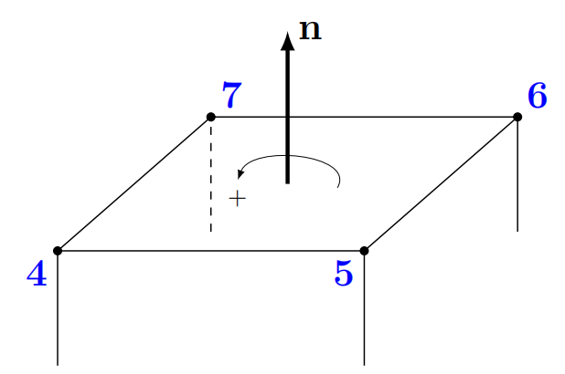

## 第III部分
### 前处理
本部分内容涉及到了所有与前处理工作相关的问题，即设置一个有效模拟案例的所有必须工作。接下来章节的重点在网格，最后部分介绍了简单的基本操作和初始化。
### 13 网格基础知识
#### 13.1 网格入门
##### 13.1.1 网格文件
OpenFOAM定义网格需要使用多个文件，所有文件均保存在constant/polyMesh路径下。这些文件的名字都是不言自明的，详细解释可以参考OpenFOAM User Guide。

 **boundary** 包含了组成边界的所有面的列表，此文件通常以ASCII格式保存。

 **faces** 包含所有网格面的定义，一个网格面是由组成面的多个点来定义的。

 **neighbour** 包含各个面相邻网格单元的列表。

 **owner** 包含各个面内所拥有单元的列表。

 **points** 包含所有点的坐标值的列表。

网格是基于面来描述的，几何被离散成有限体积块，即网格单元，每个网格单元被有限数量的面分割，例如一个正六面体就有6个面。面可以被划分成两类。边界面只与一个单元相邻，这些面组成了边界面。所有其余的面作为两个单元的连接面，称作交界面。一个面作为两个单元的边界是不可能的。因为根据定义，一个交界面是被一个单元所有而被另一个单元相邻。这样被同一个面连接的两个单元就可以区分开了。

无论网格起初是如何被创建的，上述五个文件都必须用来描述网格。然而，某些创建网格的方式会产生额外的文件。列表81展示了由Gambit创建并由 _fluentMeshToFoam_ 转化的所有文件列表。

列表81：constant/polyMesh内容
```
user@host:~/OpenFOAM/user-2.1.x/run/twoPhaseEurlerFoam/columnCase$ ls constant/polyMesh/
boudary cellZones faces faceZones neighbour owner points pointZones
```
##### 13.1.2 相关定义
 **Face** 

一个面由组成这个面的顶点或点来定义。各个点需要按照指向单元外部的法向向量的方向顺序来声明，这种定义面的方式对网格单元和几何分块来说都是一样的。

为了详细说明，我们可以观察图5所示的图7正方块的顶部面。数字4，5，6，7标识的是面的顶点。n代表面的法向向量，指向块的外部并且与z轴平行。因此我们需要按照从顶部看块时逆时针的方向来指定定义这个面的顶点。旋转的方向以图5中+符号来标识。起点可以随机选择，但不能在列表中出现两次。

如上述讨论，边界面的法向定义直接明了，但内部面的法向就不是那么明显了。内部交界面连接两个相邻单元，内部交界面由OpenFOAM网格功能生成的，并美誉有效的手动指定内部面的方法，只有在后处理时确认内部交接面设置的时候，内部交界面的法向方向才显得重要。用户手册中指出，内部交界面的法向方向这样定义，即面的法向由较小的单元标识数字指向较大的单元标志数字。由于所有单元由从0到N的连续数字标识，N是单元的数量，因此这个方法可用于定义交界面的面法向方向。



表3 有效及无效的面定义
|  正确定义  |
|  :----:  | 
| (4 5 6 7) (7 4 5 6) (6 7 4 5) (5 6 7 4) |
|  **错误定义**  |
| (7 6 5 4) (4 7 6 5) (5 4 7 6) (6 5 4 7) |
|  **非圆形**  |
| (7 5 6 4) |
| **起点重复** |
|  (4 5 6 7 4) |

##### 13.1.3 实际使用中的注意事项

 **使用二进制格式写入或足够的writePrecision** 

无论何时，如果没有特殊的使用ascii格式的原因，都应该使用二进制写入格式。由于points文件包含一系列坐标点，为了防止精度丢失，例如几何精度，因此使用二进制格式。如需使用ascii格式写入，至少对网格生成和操作要设置一个较大的writePrecision。

**二进制格式可能不兼容OpenFOAM的多种变量**

对OpenFOAM-6生成的二进制的网格运行checkMesh后，会出现如列表82所示的错误。因此，为确保网格能在OpenFOAM变量与ASCII格式之间转换，详细了解27.6.4部分关于如何将网格文件从二进制转化为ASCII格式的方法。

列表82：使用不同的OpenFOAM变量读取二进制网格时可能出现的错误
```
-->FOAM FATAL IO ERROR:
unexpected class name faceCompactList expected faceList
    while reading object faces
file : /home/user/foam/run-4.0/meshTesting/constant/polyMesh/faces at line 15.

    From function regIOobject::readStream(const word&)
    in file db/regIOobject/regIOobjectRead.C at line 108.

FOAM exiting
```
#### 13.2 针对网格生成和网格/算例操作的通用建议
##### 13.2.1 独立操作：保持网格生成操作与场定义分离
OpenFOAM的工具盒中包含许多工具，都是特别针对某一类操作。OpenFOAM非常适合创建网格案例，这些案例都是按照生成网格然后操作网格的顺序来创建目的网格，最基本的创建网格和操作网格的顺序是先执行 _blockMesh_ ,接着执行 _renumberMesh_ 。

因此，我们应该追求组织我们的案例以某种方式，这种方式就是独立操作的分离，即创建网格，运行算例和后处理分离。通过每种任务创建下标，可以使分离转化成实际工作的分工。列表83展示了Allrun脚本的布局，体现了任务的分离。代替直接调用工具和求解器，我们可以调用下标为创建某些操作。

列表83：在Allrun脚本中的分工操作

```
#！/bin/sh

# this script contains all steps for mesh-creation and mesh-manipulation
./createMesh

# now, that the mesh is in its final form, we instate the initial tiem step 0
cp -r 0.org 0

# beyond this point, calls to initialization tools, such as setFields,
# or case-decomposition for parallel running, are the only remaining pre-precessing steps
./runCase

# run post-processing
./runPostProcessing
```

如果我们过早引入计算域，可能还未创建，就会引起碎面丢失而造成前处理工具失效。通过在网格创建阶段消除计算域，就可能消除一个错误来源。更进一步，通过网格生成操作拉取计算域，同时创建补丁碎面，增加或移除网格单元，或者其他非常规网格操作，也是在消耗计算资源，引起没必要的错误。因此，建议参照如下步骤操作：

1.创建网格，而不引入任何场域

2.对最终的网格形式设置场域
