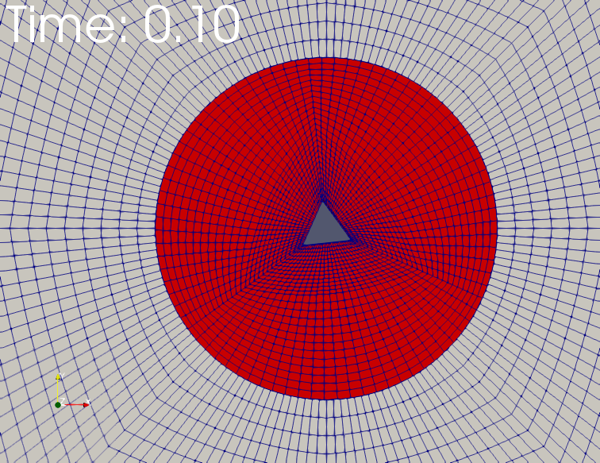

## 第III部分
# 前处理
本部分内容涉及到了所有与前处理工作相关的问题，即设置一个有效模拟案例的所有必须工作。接下来章节的重点在网格，最后部分介绍了简单的基本操作和初始化。
### 13 网格基础知识
#### 13.1 网格入门
#### 13.1.1 网格文件
OpenFOAM定义网格需要使用多个文件，所有文件均保存在constant/polyMesh路径下。这些文件的名字都是不言自明的，详细解释可以参考OpenFOAM User Guide。

 **boundary** 包含了组成边界的所有面的列表，此文件通常以ASCII格式保存。

 **faces** 包含所有网格面的定义，一个网格面是由组成面的多个点来定义的。

 **neighbour** 包含各个面相邻网格单元的列表。

 **owner** 包含各个面内所拥有单元的列表。

 **points** 包含所有点的坐标值的列表。

网格是基于面来描述的，几何被离散成有限体积块，即网格单元，每个网格单元被有限数量的面分割，例如一个正六面体就有6个面。面可以被划分成两类。边界面只与一个单元相邻，这些面组成了边界面。所有其余的面作为两个单元的连接面，称作交界面。一个面作为两个单元的边界是不可能的。因为根据定义，一个交界面是被一个单元所有而被另一个单元相邻。这样被同一个面连接的两个单元就可以区分开了。

无论网格起初是如何被创建的，上述五个文件都必须用来描述网格。然而，某些创建网格的方式会产生额外的文件。列表81展示了由Gambit创建并由 _fluentMeshToFoam_ 转化的所有文件列表。

列表81：constant/polyMesh内容
```
user@host:~/OpenFOAM/user-2.1.x/run/twoPhaseEurlerFoam/columnCase$ ls constant/polyMesh/
boudary cellZones faces faceZones neighbour owner points pointZones
```
#### 13.1.2 相关定义
 **Face** 
一个面由组成这个面的顶点或点来定义。各个点需要按照指向单元外部的法向向量的方向顺序来声明，这种定义面的方式对网格单元和几何分块来说都是一样的。

为了详细说明，我们可以观察图5所示的图7正方块的顶部面。数字4，5，6，7标识的是面的顶点。n代表面的法向向量，指向块的外部并且与z轴平行。因此我们需要按照从顶部看块时逆时针的方向来指定定义这个面的顶点。旋转的方向以图5中+符号来标识。起点可以随机选择，但不能在列表中出现两次。

如上述讨论，边界面的法向定义直接明了，但内部面的法向就不是那么明显了。内部交界面连接两个相邻单元，内部交界面由OpenFOAM网格功能生成的，并美誉有效的手动指定内部面的方法，只有在后处理时确认内部交接面设置的时候，内部交界面的法向方向才显得重要。用户手册中指出，内部交界面的法向方向这样定义，即面的法向由较小的单元标识数字指向较大的单元标志数字。由于所有单元由从0到N的连续数字标识，N是单元的数量，因此这个方法可用于定义交界面的面法向方向。



#### 13.1.3 实际使用中的注意事项
 **使用二进制格式写入或足够的writePrecision** 
无论何时，如果没有特殊的使用ascii格式的原因，都应该使用二进制写入格式。由于points文件包含一系列坐标点，为了防止精度丢失，例如几何精度，因此使用二进制格式。
    