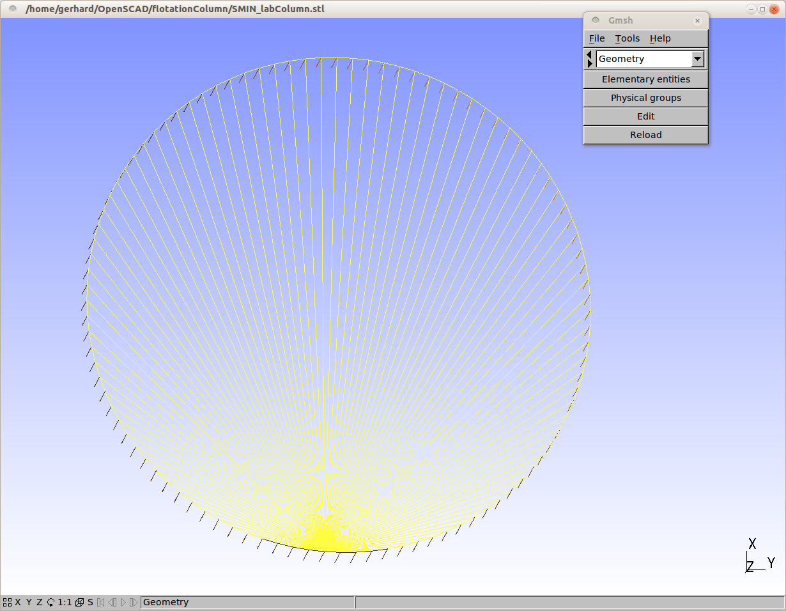

### 14 几何生成及其他前处理软件
创建几何体的方式多种多样，许多CAD软件和CFD前处理功能都可以建模，还包括之前应用很好的blockMeshDict功能。本章节介绍了不同的用于生成有限体积网格建模方法。

#### 14.1 blockMesh

 _blockMesh_ 是OpemFOAM自有的前处理工具，可以创建几何域和对应的网格。详见15章了解更多 _blockMesh_， 为了简洁，将_blockMesh_各方面内容放在了第15章。

#### 14.2 CAD软件

CAD软件五花八门，每种CAD程序都使用了自己的文件格式。然而，大多数CAD软件都支持以不同格式导出几何文件，例如STL,IGES,SAT等。如果CAD用来创建几何体，那导出的数据应保证能被网格程序使用。通用的文件格式是STL,snappyHexMesh可以根据STL几何定义来使用。

##### 14.2.1 OpenSCAD

OpenSCAD是一个开源CAD工具，可以创建3D固体CAD模型，一个CAD模型通过主要的形状（圆管，圆柱等）或者通过2D拉伸来创建。模型不像其他CAD软件交互式的创建，用户编写输入脚本，由OpenSCAD解释，这样使得很容易创建参数化模型。

#### 陷阱：STL网格质量

OpenSCAD是一个创建CAD模型的工具，因此对生成的STL网格要求不同于CFD仿真的网格。OpenSCAD生成正确定义几何的STL网格，但是从CFD角度来讲网格的质量可能很差。

图6展示了圆形的STL网格，所有定义圆形的三角形共用同一个顶点，这个顶点可能是OpenSCAD创建网格的基点，从CFD的角度看，这些三角形面单元高度扭曲且纵横比很高，但从CAD角度来看，这些三级形足够来表现圆形面。

如果一个有限体积网格由STL面网格导出（例如GMSH），可能会出现问题，如果STL网格的主要目的是表现几何，像snappyHexMesh的一些案例，那质量问题可以忽略。

图6 OpenSCAD生成的STL圆面网格

#### 14.3 Salome

Salome是由EDF开发的一个功能强大的开源前处理软件，Salome可以交互式的创建几何或通过python脚本编译生成，Salome具有很多内部和外部的网格功能，也有相应的后处理模块。

Salome是EDF开发的开源软件的一部分，主要为Code_Aster和Code_Saturne提供前处理和后处理功能。

##### 14.3.1 几何

Salome只能用来生成几何，通常的做法是，使用Salome网格模块创建CAD几何的面网格，然后导出STL格式，这样就可以被其他类似snappyHexMesh网格工具使用。

##### 14.3.2 网格

Salome也能用来一次创建几何和网格，网格需要导出UNV格式，然后可以被OpenFOAM的ideasUnvToFoam工具转化。

##### 14.4 GMSH

GMSH是一个具有前处理和后处理功能的网格工具，GMSH生成的网格可以由OpenFOAM的gmshToFoam工具转成OpenFOAM可用格式。
