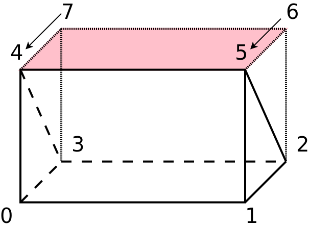

### 15 blockMesh

_blockMesh_ 用来创建网格。几何体是在 _blockMeshDict_ 中定义的。这个文件中也包括所有的创建网格的必要参数，例如单元数量。因此， _blockMesh_ 是一个可以定义几何体及为几何体生成网格的组合工具，与其他网格软件通过导入CAD文件来生成网格相比较。

#### 15.1 block

_blockMesh_ 创建的几何体基于通用六面体块，图7所示为一个方块。



图中，蓝色数字代表块的顶点数字，顶点在x-y平面逆时针编号，以当地坐标原点作为起点，接着高于x-y平面的顶点以位于z轴上的顶点作为起点逆时针编号。

当地顶点编号数字对块的定义很重要。blockMeshDict的第一个部分通常是顶点的列表。根据这些顶点构建块，块需要按照匹配当地顶点的顺序由列表中的8各顶点来定义。因此顶点列表的第一个入口就是当地0号顶点，然乎紧跟1号顶点。当地顶点的编号定义了依次传递构建块的顺序。

以0号顶点起始的坐标系称为当地坐标，在确认单元数量或网格级别的时候当地坐标是很重要的（详见15.4节 _simpleGrading_ ）。当地坐标轴不需要和全局坐标轴平行。

块的边也编号并有方向性，首先从平行于x轴的边开始编号，并以从原点发出的边起始逆时针依次编号，接着是平行于y轴的边，最后是平行于z轴的边。在确认每条边的级别时边的编号很重要（详见15.4节 _edgeGrading_ ）。

由图7所示，块的边并不需要平行或是直线。15.2.4节讨论了如何定义曲线边。

#### 15.2 blockMeshDict

 _blockMeshDict_ 文件定义和控制 _blockMesh_ 的网格进程。列表84展示了blockMeshDict的简易版例子，文件来自帮助案例 _cavity_ 。


```
FoamFile
{
    vesion    2.0;
    format    ascii;
    class     dictionary;
    object    blockMehsDict;
}
// * * * * * * * * * * * * * * * * * * * * * * * * * * * * * * * * * * * * * * * * * * //

convertToMeters 0.1;

vertices
(
    (0 0 0)    //0
   （0 0 0.1） //1
    ...
);

blocks
(
   hex (0 1 2 3 4 5 6 7) (20 20 1) simpleGrading (1 1 1)
);

edges
(
);

boundary
(
    movingWall
    {
        type wall;
        faces
        (
            (3 7 6 2)
        );
    }
    ...
);

mergePatchPairs
(
);

// * * * * * * * * * * * * * * * * * * * * * * * * * * * * * * * * * * * * * * * * * * //
```
列表84：一个最小blockMeshDict文件


#### 15.2.1 convertToMeters

 _convertToMeters _ 是一个尺度因子，可以将 _blockMeshDict_ 的顶点坐标转化成米制单位，如果顶点坐标输入时不是以米为单位，尺度因子的值就需要根据情况来修改。列表85展示如果顶点坐标以毫米单位输入时应如何设置。


```
convertToMeters 0.001;
```
列表85：convertToMeters

如果在blockMehsDict丢失了关键字convertToMeters，就不会缩放，默认值为1。

为确认是否使用了缩放因子，blockMesh的输出会进行检查。列表86显示了考虑了convertToMeters定义的缩放因子后blockMesh提示的信息。

```
Creating points with scale 0.1
```
列表86：convertToMeters设置为0.1时blockMesh的输出

 **convertToMesh** 是一个均匀统一的收缩因子，可以使用其他工具进行非均匀的缩放。见27.1和29.3.4节。

#### 15.2.2 顶点

 **vertices** 是包含顶点列表的子字典。每个顶点由它在全局坐标系的坐标来定义。OpenFOAM默认这些坐标单位都是米。然而，有了关键字 **convertToMeters** 可以以其他单位来指定。

某个顶点在列表中的索引值也是顶点的全局编号，这个编号在构建块的时候会用到。记住，从0开始计数，因此第一个顶点地址为0，一个提醒自己这种方式的方法是在顶点列表添加注释，例如列表84。


#### 15.2.3 块

在 **blocks** 子字典中唯一有效的入口是 **hex** 关键字。blocksMeshDict的blocks部分包含一系列的hex命令。列表87展示了一个使用hex关键字定义块的例子。

在hex单词后紧跟的是定义块8个顶点的8个数字。列表中入口的顺序与图7中块当地顶点编号的顺序一致。

接着是三个正数的列表。这些数字告诉 _blockMesh_ 在当地坐标轴上需要创建多少单元，比如，第一个数字就代表在x轴方向单元的数目。


下一个入口是指定边的分级的单词，这个入口实际上是冗余的，在OpenFOAM-2.1.x中只有最后的入口膨胀比的列表控制分级。第三个入口被省略了，然而，未来新的OpenFOAM版本可能会使用这个入口，因此作者并不提倡忽略此项参数。

块定义最后一个入口是一个三个或12个正数的列表，这些数字定义分级的膨胀比，三个数字的情况下， _simpleGrading_ 被使用，如果是十二个数字，则edgeGrading被使用。

如果列表只包含一个入口，那么所有边共享同样的膨胀比，列表中任何其他数字都会引起错误。


```
hex (0 1 2 3 4 5 6 7) (20 20 1) simpleGrading (2 4 1)
```
列表87：在blockMeshDict中的hex命令

### 设置单元域

通过在顶点列表和单元数量列表之间插入即将创建单元的名字，可以将属于块的单元分配给网格创建时的一个单元集。这个特征并没真正在OpenFOAM中说明，但曾经出现在OpenFOAM中。


```
hex (0 1 2 3 4 5 6 7) CELL_SET_NAME (20 20 1) simpleGrading(2 4 1)
```
列表88：带有单元集定义的hex命令

### 创建6面体块

hex命令可以用来创建三角形截面的棱柱，这样的块对使用轴对称的模拟很有用。在这种情况下，只用两个顶点就可以创建一个“轴破面”，如图8所示，这个破面。这个面是由顶点（4 5 5 4）创建，而不是（4 5 6 7）。


图8：为2D轴对称域创建楔形几何

这个破损的碎面会产生一个空面，即面域里不包含任何单元面。在列表89中，可以看到对面域的汇总信息，可以使用 **blockMesh** 打印到终端。其中有一个空面域 **axis** 。

```
Patches
----------------------
    patch 0 (start: 10159 size: 5) name: inletCH4
    patch 1 (start: 10164 size: 70) name: wallOutside
    patch 2 (start: 10234 size: 61) name: wallTube
    patch 3 (start: 10295 size: 5) name: inletPilot
    patch 4 (start: 10300 size: 60) name: inletAir
    patch 5 (start: 10360 size: 71) name: outlet
    patch 6 (start: 10431 size: 0) name: axis
    patch 7 (start: 10431 size: 5170) name: frontAndBack_pos
    patch 8 (start: 15601 size: 5170) name: frontAndBack_neg
```
列表89：OpenFOAM里的一个轴对称案例的面域列表

当设置一个二维算例的时候，重点放在速度边界条件上，尤其是用户提供的流量情况下。OpenFOAM并不知道进口面域只是实际进口的一部分，因此，进口的流量需要使用面积比来修正，面积比就是二维模拟计算域的进口面域与实际进口面积的比值。

### 误区：writePrecision和楔形几何体

当我们创建一个轴对称几何体时，我们有楔形类型的两个面域，如果我们使用了精度不足的数字来定义几何时，OpenFOAM可能会发出错误信息，提示用户存在空间面，类似下面。

```
--> FOAM Warning:
    From funciton virtual void Foam::wedgePolyPatch::calcGeometry(Foam::PstreamBuffers&)
in file meshes/polyMesh/polyPatches/constraint/wedge/wedgePolyPatch.C at line 70
wedge patch 'front' is not planar. At local face at (4.07936 -0.000130603 0.0149657) the 
    normal (0 -0.999962 -0.00872414) differs from the average normal (8.9576e-21 -0.999962
    -0.00872653) by 5.70802e-12
Either correct the patch or split it into planar parts
```
列表90：当创建2D轴对称模型时在 **controlDict** 中精度不足的 _writePrecision_ 的提示

如果我们创建一个单独的楔形块，我们在空间指定六个点。所有的中间点由blockMesh书写并填写。这种情况下controlDict中的书写精度就不足，默认情况下，blockMesh默认情况下写入精度至少10位。

```
// Set the precison of the points data to 10
IOstream::defaultPrecision(max(10u,IOstream::defaultPrecision()));
```
列表91：使用至少10位来写出points文件；除了OpenFOAM5.0的 **blockMesh.C** 文件

然而，一些网格使用工具，就是简单的使用controlDict中 **writePrecision** 的设置，如果设置了一个太小的位数同时以ascii格式写出，信息（几何精度）可能会丢失。丢失的信息足以触发我们前面提到的警告信息。

OpenFOAM在碰到处理错误信息的时候有时很包容，如下，上述例子再次重复，这次相关的位信息以红色高亮显示，在这个当地面法向量和平均面域法向量之间的小差别就是标识书写精度有问题。

```
--> FOAM Warning:
    From funciton virtual void Foam::wedgePolyPatch::calcGeometry(Foam::PstreamBuffers&)
in file meshes/polyMesh/polyPatches/constraint/wedge/wedgePolyPatch.C at line 70
wedge patch 'front' is not planar. At local face at (4.07936 -0.000130603 0.0149657) the 
    normal (0 -0.999962 -0.00872414) differs from the average normal (8.9576e-21 -0.999962
    -0.00872653) by 5.70802e-12
Either correct the patch or split it into planar parts
```
列表92：当创建2D轴对称模型时在 **controlDict** 中精度不足的 _writePrecision_ 的提示

这个提示也可能从两个向量列表中对比得到，但高亮显示的数字就表示这个差别的尺度，而且更容易读取。

### 误区：writePrecision和楔形几何II - 内联代码

使用内联代码计算顶点坐标创建轴对称几何域的时候，一个类似的问题也会被发现。显然，controlDict中writePrecision的设置会影响所计算的顶点坐标，因此，如果写入精度太低， _blockMesh_ 会警告提示非平面楔形面域，然而，这很容易修改通过使用10位以上的精度。注意，二进制格式并不会缓解这类问题。

#### 15.4 edges

 **edges** 子目录包括定义边的一系列顶点，默认边是直线，通过显示的指定边的形状，可以创建曲线边。这个子目录可以被省略，列表93展示了 _blockMesh_ 当边被省略的时候发出的信息。

```
No non-linear edges defined
```
列表93：当边被忽略时 _blockMesh_ 发出的信息

不然， _blockMesh_ 会发出列表94的信息，不管曲线边是否被创建或只有一个空边子目录的存在。

```
Creating curved edges
```
列表94：当edges存在时blockMesh的输出

### 创建弧线

使用关键字 **arc** 一个两顶点的圆弧会被创建，列表95显示了在顶点0和3之间的圆弧定义，为了定义一个圆弧，需要三个点，因此第三个点符合定义边的两个顶点的指数形式。

```
edges
(
    arc 0 3 (0 0.5 0.05)
);
```
列表95：在edges子目录一个圆弧边的定义

关键字 **arc**不能用来定义直线，如果两个顶点和额外的插值点是共线的， _blockMesh_ 会舍弃并发出列表96的错误信息。

```
--> FOAM FATAL ERROR:
Invalid arc definition - are the points co-linear? Denom =0

    From function cylindricalCS arcEdge::calcAngle()
    in file curvedEdge/arcEdge.C at line 55.

FOAM aborting
```
列表96：当定义圆弧的三个点是共线的blockMesh的输出

### 创建样条曲线

关键字spline定义一个样条曲线，在定义边的两个顶点后跟着一个插值点的列表。

```
edges
(
    splines 0 3 ((0 0.25 0.05) (0 0.75 0.05))
);
```
列表97：在 **edges** 子目录下一个样条曲线的定义

###  创建多线段

不同于样条曲线，多线段用直线连接各个端点。

```
edges
(
    polyLine 0 3 ((0 0.25 0.05) (0 0.75 0.05))
);
```
列表98： **edges** 子目录下多线段的定义

### 创建一个直线

为完整起见，有一个关键字 **line**，这个关键字采用两个顶点作为定义边的参数。直线由 _blockMesh _ 默认创建，因此对用户来说没有必要指定直线。

```
edges
(
    line 0 3
);
```
列表99：edges子目录下直线的定义

### 小结

 **blockMeshDict**下边的定义通常用于计算一个块内部节点的位置，然而边是近似线性的，如图9所示，沿着边上单元的数量决定了边的精度。
 
![通用块](images/7.PNG）

