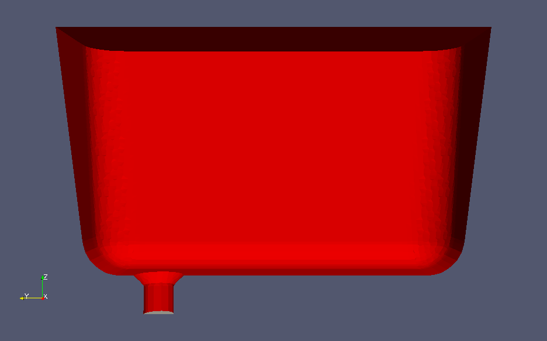
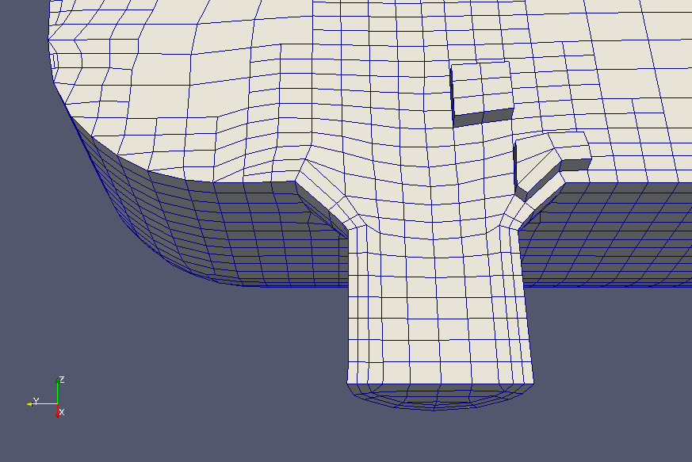
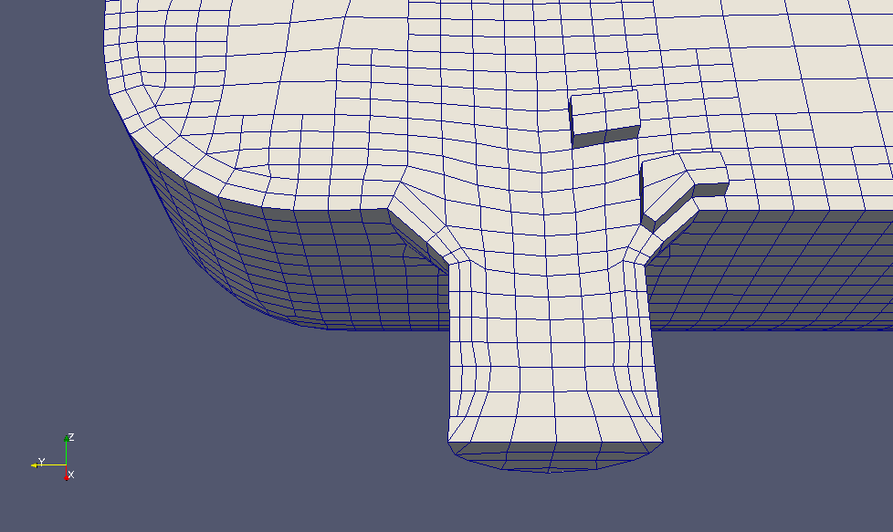
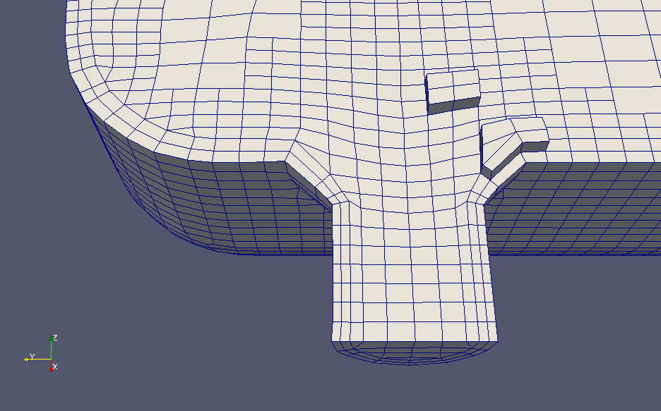
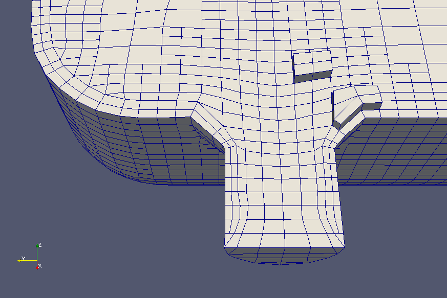

### 16 snappyHexMesh
snappyHexMesh，也称为snappy，是一种网格化工具，能够对任意三角形表面周围的空间进行网格化，例如STL表面网格。通常在外部空气动力学中这种情况比较多。snappyHexMesh只能与blockMesh结合使用，因为它需要背景网格。

#### 16.1 相关资料
不幸的是，snappyHexMesh的复杂性超出了官方文档的内容。官方文档（用户指南）可在本地OpenFOAM安装的doc/Guides-a4或doc/Guides-usletter中找到，也可以在http://www.openfoam.org/docs/user/ 在线找到。您可以在$FOAM_UTILITIES/mesh/generation/snappyHexMesh找到注释的snappyHexMeshDict。对于所有由特定的字典文件控制的程序（例如decomposePar，topoSet等），都是这种情况。

在某些情况下，snappy的个别功能在发布这些功能的发行说明中进行了讨论。相关的比较好的文档的另一个来源是在OpenFOAM研讨会上的演示。在互联网上搜索适当的关键字可以找到这些文档。
与任何其他工具一样，鼓励大家运行OpenFOAM提供的教程并进行练习。教程案例还为构建您自己的案例提供了良好的起点。

#### 16.2 工作流程
snappyHexMesh创建网格的过程分两步：
1. 首先利用blockMesh创建背景网格。这对于snappy的后续工作绝对必要，建议背景网格由纵横比为1的全六角形单元（即立方体形单元）组成。此外，背景网格的单元格边缘与三角形表面相交越多越好。
2. 然后snappyHexMesh执行三个基本步骤：

（a）Castellating

通过拆分和移除三角形表面外的像元来近似三角形表面。单元拆分可以细化对象表面附近的背景网格单元。单元移除可以移除对象内部的背景网格单元。

（b）单元捕捉

单元捕捉修改剩余的背景网格，以重建对象的表面。

（c）附加层

附加层将附加的六面体单元引入对象的边界表面，以确保良好的网格质量。

#### 16.3 示例：浴缸
在实际示例的帮助下，我们现在将讨论snappyHexMesh的一些功能，因为问题和见解通常是在实际使用中出现的。我们示例中的浴缸具有比较复杂的形状，因此我们不愿通过手工或通过脚本来痛苦地创建blockMeshDict。对于这种复杂的几何图形，可以使用复杂的网格划分工具（例如snappy）。


图17：一个浴缸，排水管的最底部的出口补丁标记为灰色。

##### 16.3.1 边界层
边界层是在snappy操作的最后阶段添加的。这些是通过patch添加的。因此，不可能仅将层仅仅添加成patch的一部分。在patch本身上，我们可以通过关键字featureAngle控制在其中的什么区域添加边界层。边界层添加阶段的操作由snappyHexMeshDict的addLayersControls字典控制。

addLayersControls词典的某些条目的意义是非常明确的，例如，layers词典指定了要在其上添加单元层的patch。但是，其他参数的含义却并不那么明显了。

**featureAngle**

featureAngle是两个连续面之间的角度。此参数控制拐角和折弯处的边界层添加阶段的行为。



图18. 选择不正确的featureAngle会导致snappy添加不完整的边界层。

**slipFeatureAngle**

在我们计算域的出口patch中，添加到避免patch中的层与出口patch相符，即需要将顶点添加到出口patch中，以在壁面patch上正确地生长一层单元。参见图19的左侧。为了实现这一点，即使我们不向出口patch本身添加层，我们也必须能够在添加图层时更改出口patch。

OpenFOAM-2.2.0的发行说明47中讨论了此功能。




图19. 由snappy添加的边界层。在左边，添加层按照我们的预期进行。在右侧，我们看到snappyHexMeshDict的addLayersControls词典的（缺失）关键字slipFeatureAngle的效果。

**Exclude patches**

我们必须有告诉snappyHexMesh不建立patch的自由。因此，在添加边界层时，这些patch可以保持不变。这使我们可以逆转使用slipFeatureAngle参数获得的效果。通过从任何边界层添加中专门排除出口（请参见列表134），我们最终在出口patch边界处实现了一个折叠的单元层，见图20。

```
layers
{
bathTub
{
nSurfaceLayers 2;
}
outlet
{
nSurfaceLayers 0;
} }
```
列表134：addLayersControl字典的layers子词典，从边界层添加中排除patch。

这个算例很可能不满足实际要求，但是它演示了snappy的工作方式。外部消息可能是nSurfaceLayers击败了slipFeatureAngle。

当我们稍后合并不同的网格时，可能会出现一个非学术性的理论用例，它不用于从边界层添加中排除patch。在这种情况下，我们可能需要保留一些patch以进行合并操作。



图20：塌陷的边界层。也许我们并不希望这样，但是，我们可以让snappy那样做。

##### 16.3.2 陷阱，错误源和故障提示
**运行时间**

如果snappyHexMesh在不到一秒钟的时间内完成，则肯定出问题了。一般来说snappyHexMesh要执行三个工作密集型步骤（城堡化，捕捉和边界层层添加），运行snappyHexMesh一般将花费几秒钟甚至更长的时间（数十秒）。

**单位**

使用snappyHexMesh创建网格时，背景网格和STL网格的不同比例（米与毫米）是常见的错误原因。请检查以下内容：

1. blockMeshDict中顶点坐标的单位
2. blockMeshDict中的convertToMeters关键字的值
3. 创建STL的单位