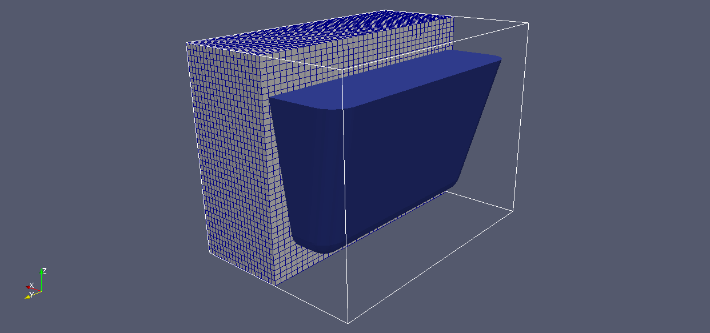

### 17 foamyHexMesh
OpenFOAM-2.3.048发布了新的网格划分工具foamyHexMesh，该工具在某种程度上类似于snappyHexMesh。foamyHexMesh和snappyHexMesh之间的主要区别是，通过不同的操作模式，foamyHexMesh的网格与边界曲面更好地进行了对齐。foamyHexMesh会生成适合边界的内部四面体网格，然后通过雕琢此内部的四面体网格生成双重网格。

#### 17.1  snappy方法和foamy方法的粗略比较
在本节中，我们将比较foamyHexMesh和snappyHexMesh在浴缸网格划分过程中的工作方式。为此，我们使用OpenSCAD创建了浴缸的STL表面。
图21显示了浴缸的轮廓和背景网格的一部分。

图21 浴缸的背景网格及包围浴缸的STL表面

##### 17.1.1  snappy方法生成的浴缸
首先，对浴缸使用snappyHexMesh进行了网格划分。图22显示了生成的网格，我们可以清楚地看到，内部单元与全局坐标轴进行了对齐，但在侧壁上，这导致了一些小的缺陷。

图22 snappy方法生成的浴缸

##### 17.1.2  foamy方法生成的浴缸
接下来，我们使用foameryHexMesh对浴缸进行了网格划分。在图23中，我们看到了单元格与边界进行了很好的对齐，但内部单元并未与全局坐标轴对齐。

图23 foamy方法生成的浴缸

