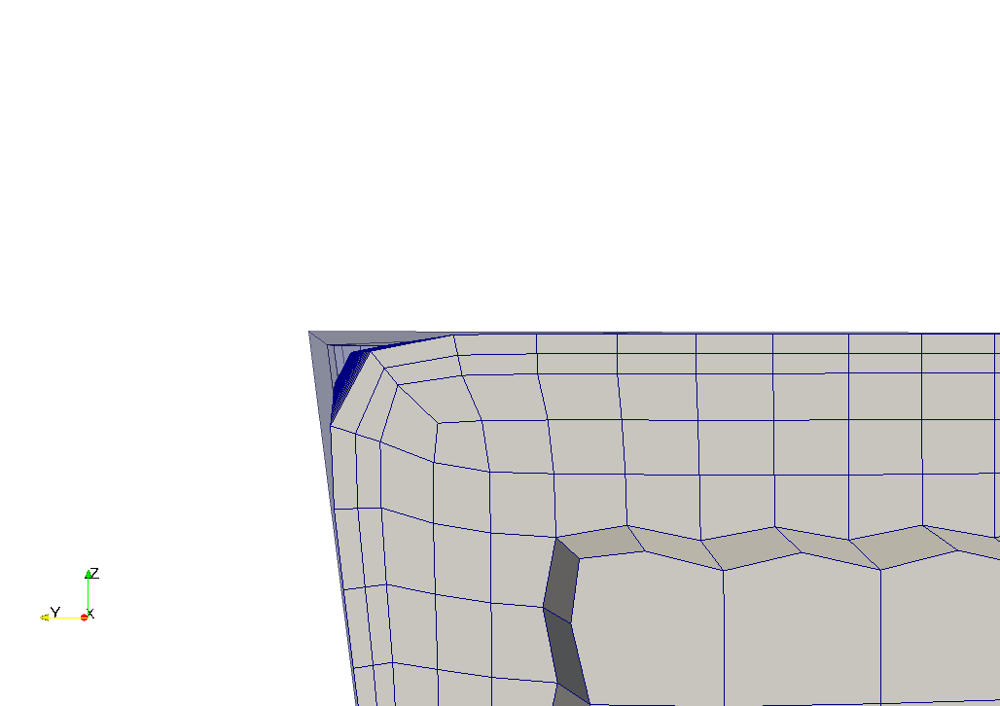
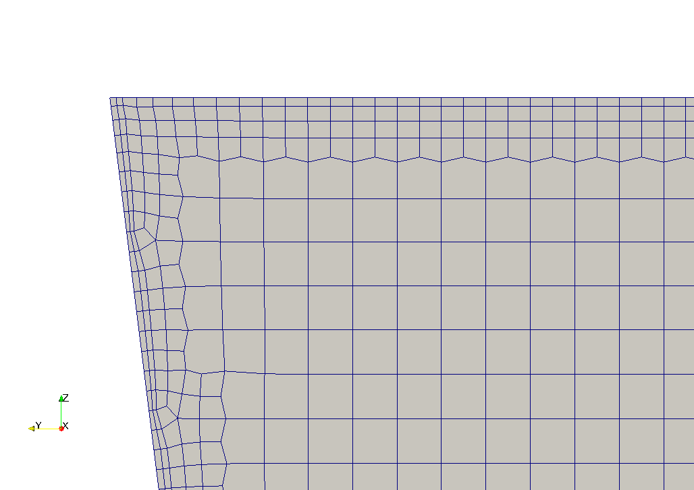

### 18 cfMesh
cfMesh是一个由Creative Fields公司提供的网格划分工具的集合。这家公司在GPL下免费提供了基本的cfMesh套件。在编写cfMesh时，cfMesh包含了四个网格工具，它们提供了一个可与snappyHexMesh和foamyHexMesh提供的工作流相媲美的工作流。
cfMesh的网格工具基于用户提供的三角化的几何曲面来生成网格。不需要类似于foamyHexMesh的背景网格。所有的工具都能够在所有或选定的表面上生成边界层。所有工具都由一个名为meshDict的字典控制，该字典位于系统目录中。一般来说，用户对这些网格工具的控制不像snappyHexMesh或foamyHexMesh那样严格。然而，与snappyHexMesh和foamyHexMesh相比，这种不那么严格的控制在控制字典中表现得更为轻量级。
cfMesh得网格划分工具有：
cartesian2DMesh：生成二维网格的工具
tetMesh：生成四面体网格
cartesianMesh：生成主要由六面体组成的网格，类似于snappyHexMesh
pMesh：生成多面网格
cfMesh还为各种任务提供了一系列实用程序(在撰写本文时是21个)。
#### 18.1 使用
##### 18.1.1 处理或不处理特征边
特征边必须由用户明确指定，让cfMesh遵守这些边。
以浴缸为例，它的边界只有一个patch，我们在图24中看到了不明确设置特征边的影响。在这种情况下，提供的STL面并没有被更好的网格完美拟合。如果我们想要刻画特征边，我们需要将几何图形的边界分割成多个patch。由于相邻patch之间的边默认由网格工具刻画，将浴缸的边界分成几个patch将解决图24所示的问题。

如果我们想要刻画一个不是两个patch边缘上的特征边，我们可以使用实用工具surfaceFeatureEdges从几何图形中提取特征边。这个工具检查三角化表面的邻近三角形的角度，并创建额外的patch。例如，如果指定的特征角导致面wall被划分为N个单独的区域，则将面wall划分为wall_0到wall_N的patch。默认情况下，cfMesh会刻画相邻patch之间的边缘。因此，该网格生成器不知道我们的特征边处理。在完成网格划分后，该网格划分器会重命名patch。这一特性允许我们将所有中间过程中patch合并到我们最初的patch中。

在图25中，我们注意到网格生成器插入的悬挂节点加入了不同的细化级别。这些悬挂节点从它们所插入的面上伸出。这可以防止连接不同细化级别的单元的面是共面的，这和使用snappyHexMesh的情况是一样的。
