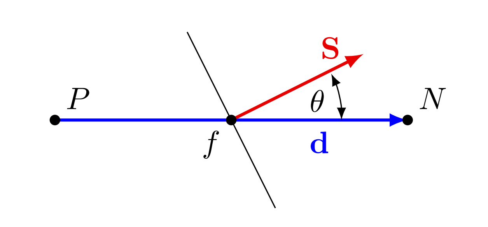
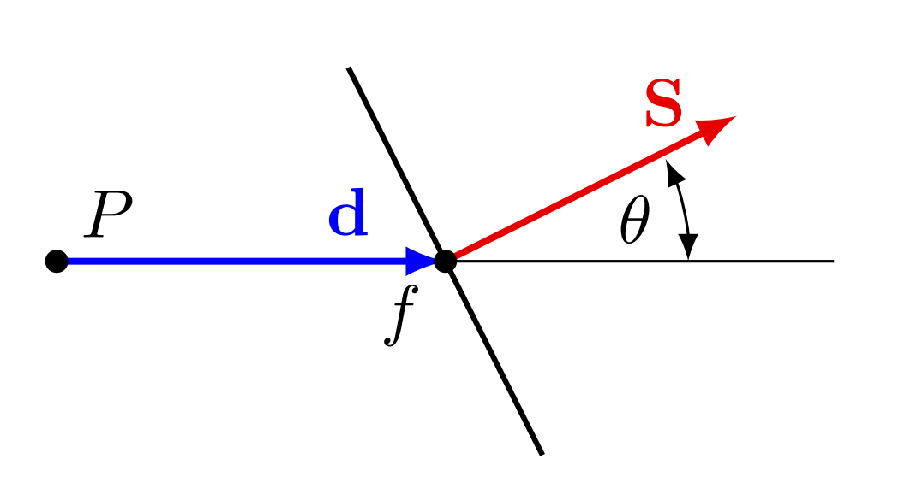
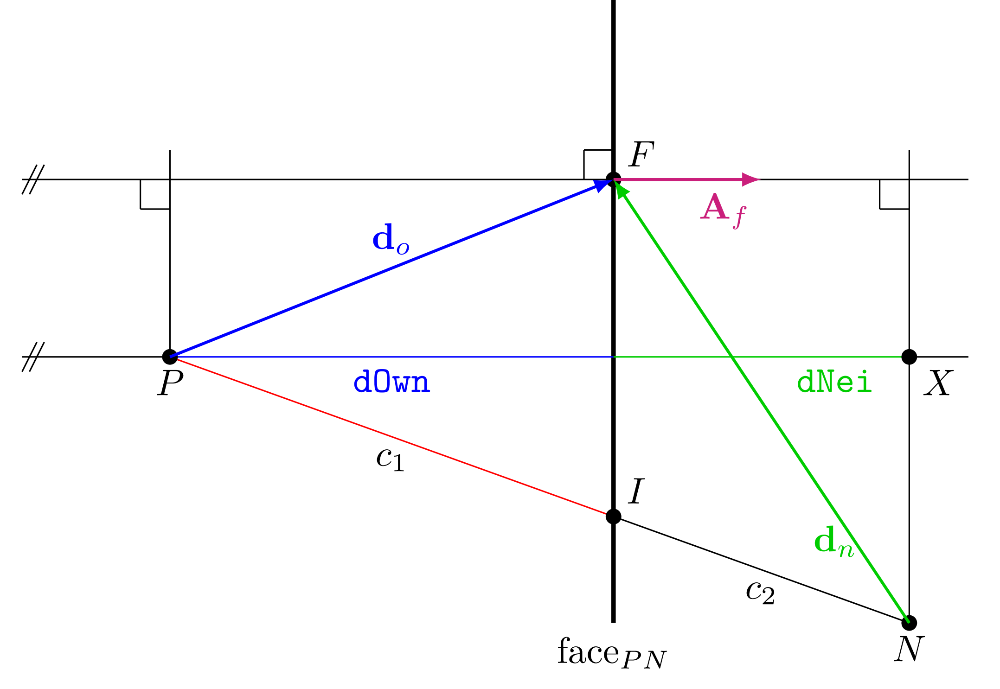
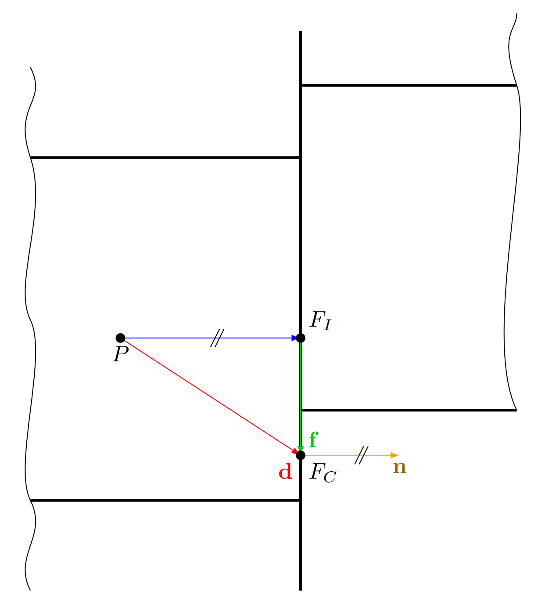
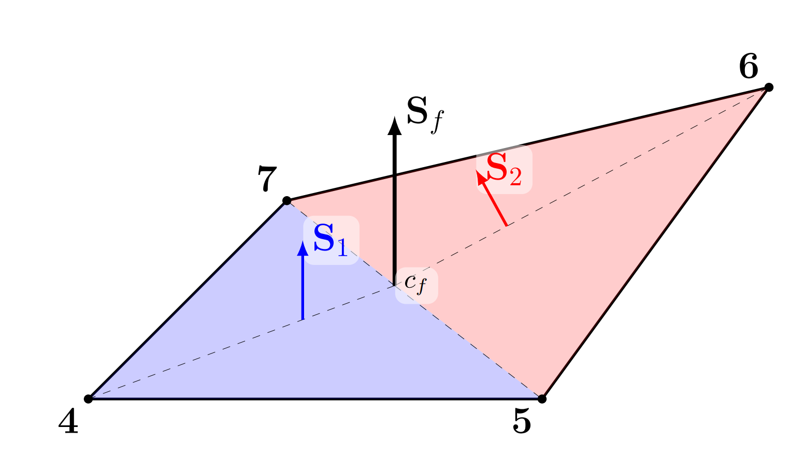
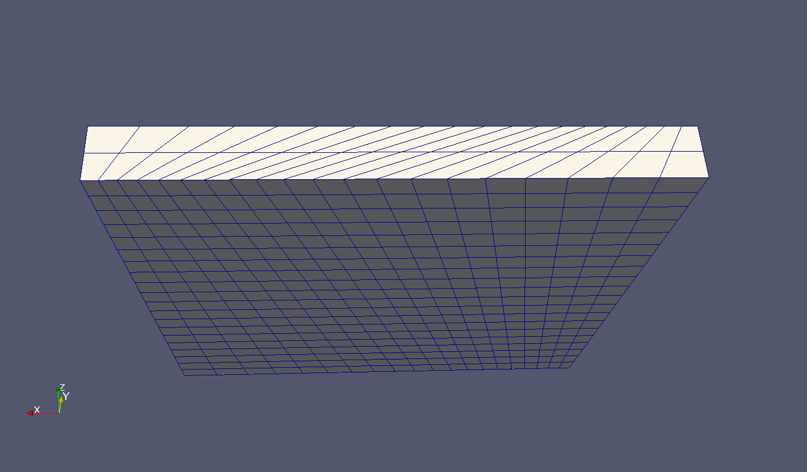
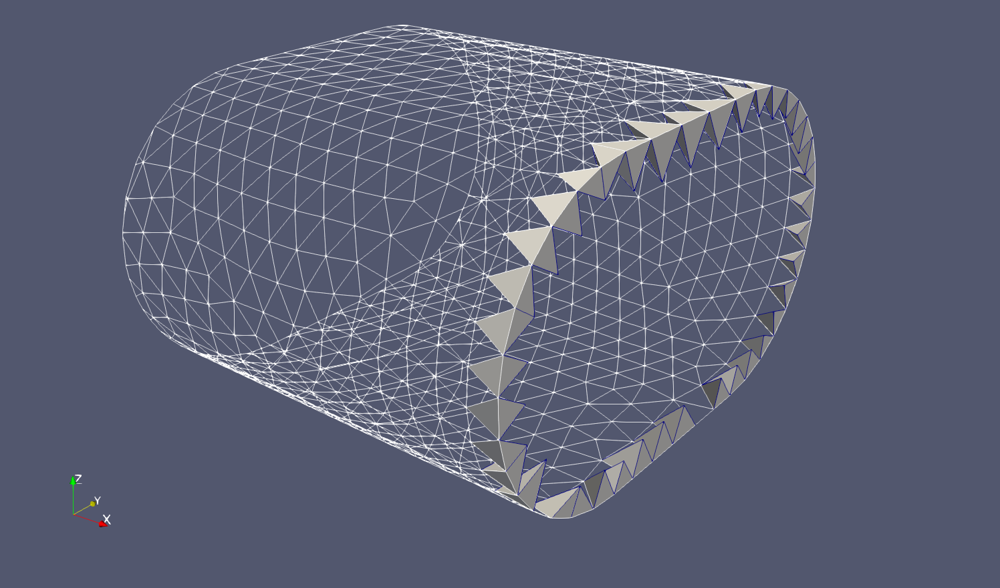
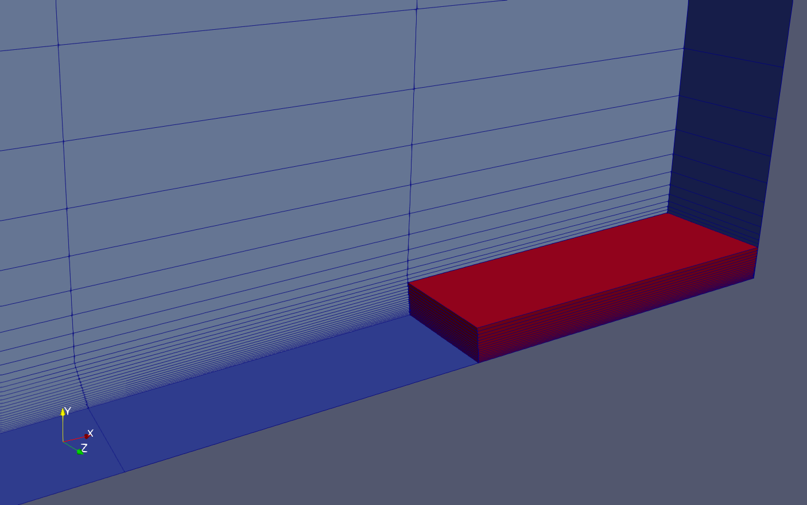
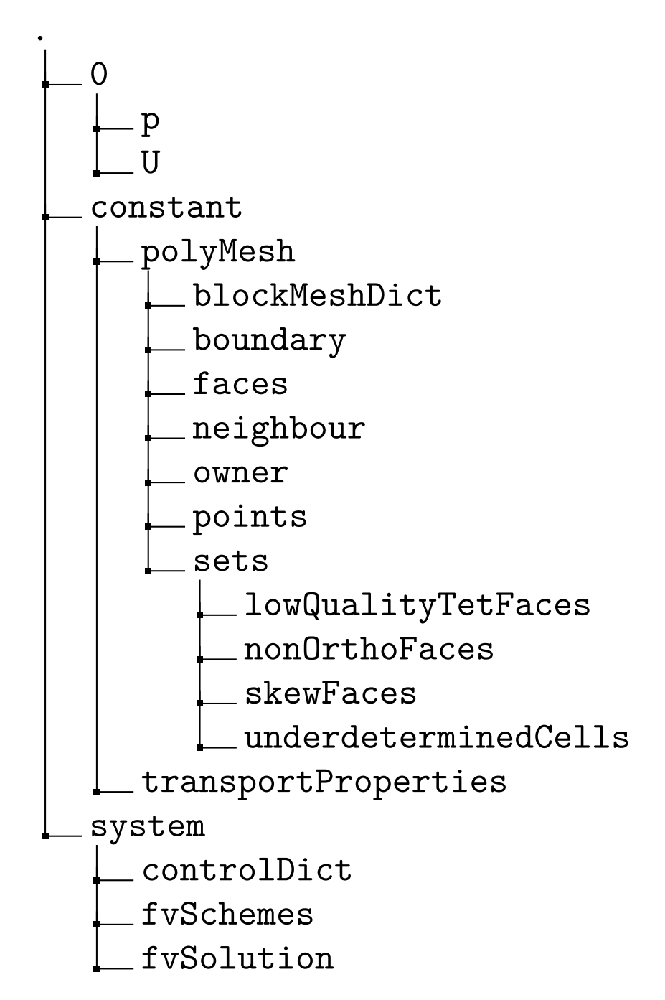

### 19 checkMesh
checkMesh is a tool to perform tests on an existing mesh. checkMesh is simply invoked by its name. Like other tools, checkMesh assumes to be called from the case directory. When checkMesh is to be called from an other location than the case directory, the path to the case directory has to be specified with the option -case.
Listing 135 shows an error message produced by checkMesh, if checkMesh has been called with no mesh present. In this case the tool can’t find the files specified in Section 13.1.
```
--> FOAM FATAL ERROR :
Cannot find file " points " in directory " polyMesh " in times 0 down to constant
From function Time :: findInstance ( const fileName &, const word &, const IOobject :: readOption ,
const word &)
in file db / Time / findInstance .C at line 188.
FOAM exiting
```
Listing 135: No mesh present

A more thorough testing is performed when checkMesh is called with two additional options. Then checkMesh performs some further tests.
```
checkMesh - allGeometry - allTopology
```
Listing 136: Do more checks

checkMesh has also the -latestTime option like many other OpenFOAM tools. This option is particularly useful when examining meshes created by snappyHexMesh. snappyHexMesh stores intermediate meshes if it is not told otherwise. By default, after a completed run of snappyHexMesh there are the background mesh and the results of the three basic stages of a snappyHexMesh run (castellation, snapping and layer addition). Depending on which of these steps are active up to four meshes may be present. Restricting checkMesh to the final mesh reduces runtime and avoids the unnecessary examination of an intermediate mesh.

#### 19.1 Definitions

In order to understand the output of checkMesh it is necessary to define some quantities calculated by checkMesh.

##### 19.1.1 Face non-orthogonality
Non-orthogonality is a property of the faces of the mesh. We need to discriminate between internal faces and boundary faces.
***Internal faces***
Each internal face connects two cells. The non-orthogonality is the angle between the vector connecting the cell centres and the face normal vector. In Figure 26 the vector connecting the cell centres is denoted d and the face normal vector50 S.

\
Figure 26: Definition of non-orthogonality for internal faces

In a perfectly orthogonal mesh the vectors d and S are parallel. If a mesh is non-orthogonal these vectors draw an angle as in Figure 26. This angle can be calculated from d and S by Eq. 10.

gongshi 8,9,10

Eq. 10 can also be found in the sources of OpenFOAM in the function faceNonOrthogonality in the file cellQuality.C51. Listing 137 shows a loop over all faces. For each face the non-orthogonality is computed. The vectors d and s are the connecting vector between the cell centres, and the face area vector, respectively. The scalar cosDDotS is the angle θ of Figure 26.
Note the two precautions that were taken to avoid numerical issues. First, the denominator is the sum of the product of the magnitudes and VSMALL. VSMALL is a number with a very small value to prevent division by zero. Second, the argument of the acos function is min(1.0, (d & s)/(mag(d)*magS + VSMALL)). Keeping the argument of the arc-cosine equal or below 1 makes perfectly sense, because the arc-cosine is defined only for values between -1 and 1. The limit of -1 is inherently ensured. The inner product of two vectors is always positive. VSMALL is also positive.
```
forAll ( nei , faceI )
2 { 3 vector d = centres [ nei [ faceI ]] - centres [ own [ faceI ]];
4 vector s = areas [ faceI ];
5 scalar magS = mag ( s);
67 scalar cosDDotS =
8 radToDeg ( Foam :: acos ( min (1.0 , (d & s) /( mag (d) * magS + VSMALL )) ));
9 result [ faceI ] = cosDDotS ;
10 }
```
Listing 137: A detail of the function faceNonOrthogonality in the file cellQuality.C

The non-orthogonality reported by checkMesh is the angle θ of Figure 26. Therefore the reported nonorthogonality lies in the range between 0 and 90. A non-orthogonality of 0 means the mesh is orthogonal and consists of hexahedra (cuboids) or regular tetrahedra. Listing 141 shows the output of checkMesh. In this case the mesh is orthogonal, the maximum and average non-orthogonality is 0.
Listing 143 shows the output of checkMesh in case of a non-orthogonal mesh. Listing 144 indicates that a non-orthogonality of above 70 triggers checkMesh to issue a warning message. 
***Boundary faces***
Non-orthogonality is also defined for boundary faces. Figure 27 shows a schematic boundary face with its face center f. Non-orthogonality of boundary faces is defined as the angle in degrees between the face area vector S and the vector d, which connects the cell center P and the face center f.

\
Figure 27: Definition of non-orthogonality for boundary faces

```
1 const labelUList & faceCells = mesh_ . boundaryMesh () [ patchI ]. faceCells () ;
2 const vectorField :: subField faceCentres = mesh_ . boundaryMesh () [ patchI ]. faceCentres () ;
3 const vectorField :: subField faceAreas = mesh_ . boundaryMesh () [ patchI ]. faceAreas () ;
45 forAll ( nei , faceI )
6 { 7 vector d = faceCentres [ faceI ] - centres [ faceCells [ faceI ]];
8 vector s = areas [ faceI ];
9 scalar magS = mag ( s);
10
11 scalar cosDDotS =
12 radToDeg ( Foam :: acos ( min (1.0 , (d & s) /( mag (d) * magS + VSMALL )) ));
13 result [ globalFaceI ++] = cosDDotS ;
14 }
```
Listing 138: A detail of the function faceNonOrthogonality in the file cellQuality.C

##### 19.1.2 Face skewness
OpenFOAM defines skewness in a mesh different than other tools, e.g. Gambit. The reason for this OpenFOAM-specific definition is that this definition is associated with the definition of a skewness error in [36] as part of mesh induced discretisation errors. Skewness is a property of the faces of the mesh. We need to discriminate between internal faces and boundary faces.
***Internal faces***
Each internal face connects two cells. Figure 28 shows the cell centres P and N of two adjacent cells. The face faceP N is the face connecting these two cells. The point F is the face centre of the face faceP N . The line c = P N connects the cell centres. This connecting line intersects with the face faceP N . This intersection point I divides the line c into the two parts c1 and c2.

\
Figure 28: Definition of skewness of internal faces

To calculate the location of I the length of c1 is of key interest because the skewness is defined in Eq. 11. The location (the vector to) the points P, N and F are easily obtained. From this three vectors do, dn and c is computed. With do and dn the inner product with the face area vector Af is computed to obtain dOwn and dNei52.

一堆公式

Note that both P~ and c are vectors. The reader hopefully excuses this lack of consistency in mathematical notation. P~ denotes the position vector of the point P. In this case the symbol P~ is prefered to P in order to use symbols that can be found in Figure 28.
Listing 139 shows a detail of the function faceSkewness from the file cellQuality.C53. There a loop over all internal faces is traversed. The loop body contains the calculation of the skewness. First dOwn and dNei are computed. Then the location of the point I is determined. The variable faceIntersection of the type point contains the position vector to the point I – the point at which the connection line between the cell centres intersects the face. Finally, the skewness is calculated (compare Eq. 21). Notice the precaution against a possible division by zero (adding VSMALL to the denominator).
```
1 forAll ( nei , faceI )
2 { 3 scalar dOwn = mag
4 ( 5 ( faceCtrs [ faceI ] - cellCtrs [ own [ faceI ]]) & areas [ faceI ]
6 )/ mag ( areas [ faceI ]) ;
78 scalar dNei = mag
9 (
10 ( cellCtrs [ nei [ faceI ]] - faceCtrs [ faceI ]) & areas [ faceI ]
11 )/ mag ( areas [ faceI ]) ;
12
13 point faceIntersection =
14 cellCtrs [ own [ faceI ]]
15 + ( dOwn /( dOwn + dNei )) *( cellCtrs [ nei [ faceI ]] - cellCtrs [ own [ faceI ]]) ;
16
17 result [ faceI ] =
18 mag ( faceCtrs [ faceI ] - faceIntersection )
19 /( mag ( cellCtrs [ nei [ faceI ]] - cellCtrs [ own [ faceI ]]) + VSMALL );
20 }
```
Listing 139: A detail of the function faceSkewness in the file cellQuality.C

Boundary faces
Skewness is also defined and checked for boundary faces. Figure 29 shows the sketch of a boundary face with its face center FC . The vector d from the cell center P to the face center FC is depicted in red. At the point FC we see the face normal vector n. If we project the vector d on the vector n we gain the face-intersection point FI . This is the point, where the face normal departing from the cell center intersects with the face. The face-intersection does not necessarily need to be part of the face, as it is the case in Figure 29.
We then compute the vector f, which is the connection between the points FI and FC . The ratio of the magnitudes of the vectors f and d defines the skewness of a boundary face. Listing 140 shows the code that computes the skewness of the boundary faces. The points P and FC are returned by the methods faceCells() and faceCentres(). The normal vector n is easily computed from the face-area vector given by the method faceAreas().

一堆公式

\
Figure 29: Definition of skewness of boundary faces

```
1 label globalFaceI = mesh_ . nInternalFaces () ;
23 forAll ( mesh_ . boundaryMesh () , patchI )
4 { 5 const labelUList & faceCells =
6 mesh_ . boundaryMesh () [ patchI ]. faceCells () ;
78 const vectorField :: subField faceCentres =
9 mesh_ . boundaryMesh () [ patchI ]. faceCentres () ;
10 const vectorField :: subField faceAreas =
11 mesh_ . boundaryMesh () [ patchI ]. faceAreas () ;
12
13 forAll ( faceCentres , faceI )
14 {
15 vector n = faceAreas [ faceI ]/ mag ( faceAreas [ faceI ]) ;
16
17 point faceIntersection = cellCtrs [ faceCells [ faceI ]]
18 + (( faceCentres [ faceI ] - cellCtrs [ faceCells [ faceI ]]) &n)* n;
19
20 result [ globalFaceI ++] = mag ( faceCentres [ faceI ] - faceIntersection )
21 /(
22 mag ( faceCentres [ faceI ] - cellCtrs [ faceCells [ faceI ]])
23 + VSMALL
24 );
25 }
26 }
```
Listing 140: A detail of the function faceSkewness in the file cellQuality.C

##### 19.1.3 Face concavity
pending

##### 19.1.4 Face warpage
A face is warped, when its vertices do not lie within a plane. Figure 30 shows a simplified situation of a warped face. Any three points, which do not fall onto a single line, span a plane. In Figure 30 the area vector S1 of the triangle ∆457 is parallel to the face area vector Sf . Thus, we identify point 6 as being out-of-plane.

\
Figure 30: Face warpage

If we decompose the face into individual triangles, we can compare the individual triangle area vectors to the face normal vector. In Figure 30 a crude decomposition is chosen for simplicity. In OpenFOAM’s internals, the individual triangles are defined by the face center and two consecutive vertices of the face. As, face vertices need to be stored consecutive, a simple loop over the vertices of a face is sufficient to generate all individual triangles. Thus, in OpenFOAM’s implementation of the test for warpage, the face of Figure 30 would be decomposed into four triangles, as indicated by the thin dashed lines.
We bear in mind, that in OpenFOAM a face area vector has two important properties. It is normal to the face’s plane and its magnitude is proportional to the face’s area54. By diving the face area vector by its magnitude we gain the face normal vector, see (29).
OpenFOAM checks for warpage by computing the inner product of the triangle area vectors with the face normal vector, and summing up the results, see (30). This sum is equal to the magnitude of the face area vector, when all vertices are in-plane. If the two vectors of an inner product are not parallel, then the magnitude of the inner product is smaller by the cosine of the enclosed angle.

gongshi

##### 19.1.5 Cell concavity
When a cell is concave


#### 19.2 Pitfalls
The results of checkMesh need to be taken with a grain of salt. Therefore, it is helpful to know how checkMesh defines the qualitity measures it tests for (Section 19.1) and also to know about the shortcomings of the tests performed by checkMesh (Section 19.2). 
The tests performed by checkMesh do not necessarily guarantee the mesh to be suitable for simulation. Furthermore, if a mesh fails a test, that does not necessariliy mean that it is unsuitable for calculation.


##### 19.2.1 Mesh quality - aspect ratio
checkMesh performs a number of quality checks. However, the user has to be careful. checkMesh does only check if a mesh makes a simulation impossible. There are some situations in which checkMesh does not issue an error or a warning, however, a mesh can nevertheless be unsuitable for a successful calculation.
The aspect ratio is the ratio of the largest and the smallest dimension of the cells. For the aspect ratio there are no limits. Listing 141 shows the output of checkMesh when a mesh with high aspect ratio cells is tested. Although checkMesh does not complain, the mesh is not suitable for simulation. Even with extremely small time steps numerical problems appear.

```
Checking geometry ...
Overall domain bounding box (0 0 0) (0.1 0.1 0.01)
Mesh ( non - empty , non - wedge ) directions (1 1 1)
Mesh ( non - empty ) directions (1 1 1)
Boundary openness ( -9.51633 e -17 1.17791 e -18 -4.51751 e -17) OK .
Max cell openness = 1.35525 e -16 OK .
Max aspect ratio = 100 OK .
Minimum face area = 2.5 e -07. Maximum face area = 2.5 e -05. Face area magnitudes OK .
Min volume = 1.25 e -09. Max volume = 1.25 e -09. Total volume = 0.0001. Cell volumes OK .
Mesh non - orthogonality Max : 0 average : 0
Non - orthogonality check OK .
Face pyramids OK .
Max skewness = 2e -06 OK .
Coupled point location match ( average 0) OK .
Mesh OK .
End
```
Listing 141: checkMesh output for a mesh with high aspect ratio

##### 19.2.2 Mesh quality - skewness
There are different ways to calculate the skewness of a finite volume cell. To test whether checkMesh complains about high skewness, a mesh is distorted by the use of edge grading. Figure 31 shows this mesh. Parallel edges are graded alternately – alternating between the expand ratio and its reciprocal value. Listing 142 shows the grading settings. The test case for this examination is the cavity case of icoFoam. This case can be found in the tutorials.
```
hex (0 1 2 3 4 5 6 7) (20 20 2) edgeGrading (3 0.33 3 0.33 1 1 1 1 1 1 1 1)
```
Listing 142: Block definition in blockMeshDict to achieve high skewness

\
Figure 31: A distorted mesh

checkMesh issues no warnings for the value pair 3 and 0.33. The values 4 and 0.25 cause a warning about severly non-orthogonal faces.
However, a simulation is impossible for much lower values. The simulation runs for the value pair 1.33 and 0.75. The values 1.4 and 0.714 cause the simulation to crash. The limits of stability of a simulation are therefore reached earlier than the limits of checkMesh.
To conclude this section, the user should bear the folling statement in mind. Numerical problems of a simulation may be caused by bad mesh quality. In some cases – like the one presented above – bad mesh quality is the root of the problem, but checkMesh issues no warnings. However, the values of the quality characteristics may give a hint. Some manuals of CFD software propose numerical ranges for characteristics like aspect ratio to ensure good quality.
```
Checking geometry ...
Overall domain bounding box (0 0 0) (0.1 0.1 0.01)
Mesh ( non - empty , non - wedge ) directions (1 1 1)
Mesh ( non - empty ) directions (1 1 1)
Boundary openness (4.23516 e -18 9.03502 e -18 1.60936 e -16) OK .
Max cell openness = 1.67251 e -16 OK .
Max aspect ratio = 3.63059 OK .
Minimum face area = 1.42648 e -05. Maximum face area = 7.1694 e -05. Face area magnitudes OK .
Min volume = 1.03854 e -07. Max volume = 1.69673 e -07. Total volume = 0.0001. Cell volumes OK
.
Mesh non - orthogonality Max : 69.4798 average : 32.8092 Non - orthogonality check OK .
Face pyramids OK .
Max skewness = 2.35485 OK .
Coupled point location match ( average 0) OK .
Mesh OK .
End
```
Listing 143: checkMesh output for the distorted mesh; grading ratios 3 and 0.33

```
Checking geometry ...
Overall domain bounding box (0 0 0) (0.1 0.1 0.01)
Mesh ( non - empty , non - wedge ) directions (1 1 1)
Mesh ( non - empty ) directions (1 1 1)
Boundary openness (4.23516 e -18 -6.21157 e -18 1.18585 e -16) OK .
Max cell openness = 2.37664 e -16 OK .
Max aspect ratio = 4.23706 OK .
Minimum face area = 1.23181 e -05. Maximum face area = 8.67874 e -05. Face area magnitudes OK .
Min volume = 1.00882 e -07. Max volume = 1.84055 e -07. Total volume = 0.0001. Cell volumes OK
.
Mesh non - orthogonality Max : 73.1635 average : 36.2131
* Number of severely non - orthogonal faces : 80.
Non - orthogonality check OK .
<< Writing 80 non - orthogonal faces to set nonOrthoFaces
Face pyramids OK .
Max skewness = 2.93978 OK .
Coupled point location match ( average 0) OK .
Mesh OK .
End
```
Listing 144: checkMesh output for the distorted mesh; grading ratios 4 and 0.25

##### 19.2.3 Possible non-pitfall: twoInternalFacesCells
If a mesh for a two-dimensional simulation is created and checked using checkMesh with the -allTopology option enabled55, then checkMesh will issue a message like in Listing 145. This message indicates, that there are cells present with only two internal faces. This message can be ignored when 2D meshes are concerned. The corner cells of a rectangular mesh have – by definition – only two internal faces.
```
Checking topology ...
Boundary definition OK .
Cell to face addressing OK .
Point usage OK .
Upper triangular ordering OK .
Face vertices OK .
Topological cell zip - up check OK .
Face - face connectivity OK .
<< Writing 4 cells with two non - boundary faces to set twoInternalFacesCells
Number of regions : 1 ( OK ).
```
Listing 145: checkMesh output for a 2D mesh with -allTopology option set.

If this message appears when a 3D mesh is examined, then there is probably some error in the definition of the mesh. A cell in a 3D mesh should have at least three internal faces. A message stating the presence of cells with two internal faces in a 3D mesh indicates non-connected regions. 
If there are, in a 3D mesh, cells present with only two internal faces – this is sometimes the case with tetrahedral meshes and the tet-cells in corners – then these cells will be written into a twoInternalFacesCells cell set, furthermore, these cells will also be written into a cell set named underdeterminedCells.
Listing 146 and Figure 32 show such an example. An all-tet, 3D-mesh has be checked by checkMesh, and it complained about cells with two internal faces, and underdetermined cells. In both cases the number of affected cells was the same. Comparing the actual cellSets, as shown in Listing 146, revealed that in-fact, all cells with two internal faces are considered under-determined, as the contents of the two files exactly match with the name of the cell set being the only exception.
```
gerhard@gerhardWork :/ home / user / OpenFOAM / user -6/ case - directory / constant / polyMesh / sets$ diff
twoInternalFacesCells underdeterminedCells
14 c14
< object twoInternalFacesCells ;
---
> object underdeterminedCells ;
```
Listing 146: Comparing the cell sets twoInternalFacesCells and underdeterminedCells in a case with an all-tet, 3D-mesh.

\
Figure 32: The cells with two internal faces in an all-tet, 3D-mesh.

##### 19.2.4 Non-pitfall: underdetermined cells & aspect ratio
In certain cases, checkMesh reports under-determined cells, which are apparently the result of them having a relatively large aspect ratio, yet these cells pass the test of checkMesh for aspect ratio itself. Here, we discuss an example the author encountered when creating an axi-symmetric mesh. Listing 147 shows the output of checkMesh, which reports one failed test, the test for under-determined cells.
```
Checking geometry ...
Overall domain bounding box ( -1.87738 e -14 -0.3105 -0.00628287) (0.359945 0.28176
0.00628287)
Mesh has 2 geometric ( non - empty / wedge ) directions (1 1 0)
Mesh has 3 solution ( non - empty ) directions (1 1 1)
Wedge back with angle 1 degrees
Wedge front with angle 1 degrees
All edges aligned with or perpendicular to non - empty directions .
Boundary openness (2.65459 e -17 -2.56868 e -15 -3.5724 e -14) OK .
Max cell openness = 6.00189 e -16 OK .
Max aspect ratio = 273.429 OK .
Minimum face area = 1.70066 e -08. Maximum face area = 0.000559933. Face area magnitudes OK
.
Min volume = 9.31147 e -12. Max volume = 6.7098 e -06. Total volume = 0.000535521. Cell
volumes OK .
Mesh non - orthogonality Max : 35.0627 average : 10.6127
Non - orthogonality check OK .
Face pyramids OK .
Max skewness = 0.997295 OK .
Coupled point location match ( average 0) OK .
Face tets OK .
Min / max edge length = 3.44218 e -05 0.0349612 OK .
All angles in faces OK .
Face flatness (1 = flat , 0 = butterfly ) : min = 1 average = 1
All face flatness OK .
Cell determinant ( wellposedness ) : minimum : 0.00012646 average : 2.46777
*** Cells with small determinant (< 0.001) found , number of cells : 16
<< Writing 16 under - determined cells to set underdeterminedCells
Concave cell check OK .
Face interpolation weight : minimum : 0.289549 average : 0.486008
Face interpolation weight check OK .
Face volume ratio : minimum : 0.328662 average : 0.931884
Face volume ratio check OK .
Failed 1 mesh checks .
End
```
Listing 147: checkMesh output for a 2D, axi-symmetric mesh with -allGeometry and -allTopology option set.

In Figure 33, wee see the under-determined cells, which were found by checkMesh. From Listing 147, we see that the cells have a high aspect ratio, with the maximum aspect ratio well above 250. However, checkMesh determined the test for the aspect ratio to be OK, yet checkMesh found under-determined cells. However, these cells, depicted in Figure 33 are regular hex cells, although quite thin ones.
As the simulation, this mesh was created for, runs perfectly fine, the reported under-determined cells pose no problem for the numerics of OpenFOAM. Most likely some threshold value was exceeded by these high-aspect ratio cells, which triggered checkMesh to report under-determined cells.

\
Figure 33: The under-determined cells, which were found by checkMesh in the mesh of an axi-symmetric simulation. These cells are on a far corner of the 2-D domain, and grading towards the more interesting regions led them to have a high aspect ratio. In fact, these cells have the highest aspect ratio of the whole mesh. The proximity to the lower wall results in these cells to be quite fine in the y-direction. Since, these cells are furthest from the axis of symmetry, they are relatively large in radial and tangential direction.

#### 19.3 Useful output
The output of checkMesh in Listing 145 also shows another interesting thing to know about checkMesh. The line «Writing 4 cells with two non-boundary faces to set twoInternalFacesCells tells the user that checkMesh created a set of cells that are found to have some problems.
Figure 34 shows the content of the case which resulted in Figure 31. There we see a directory named sets inside the polyMesh folder. The sets folder was created by checkMesh and inside this folder checkMesh stores any sets it creates. The file names are rather self-explanatory, e.g. the file skewFaces contains all faces which failed the test for skewness. All these cell or face sets can be viewed with paraView.

\
Figure 34: Sets created by checkMesh in the sets directory