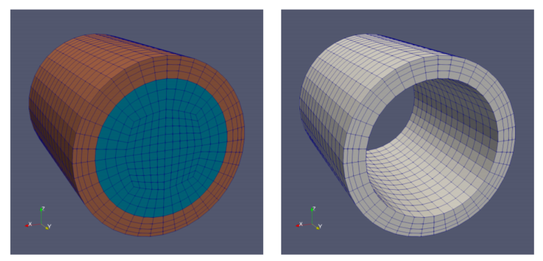
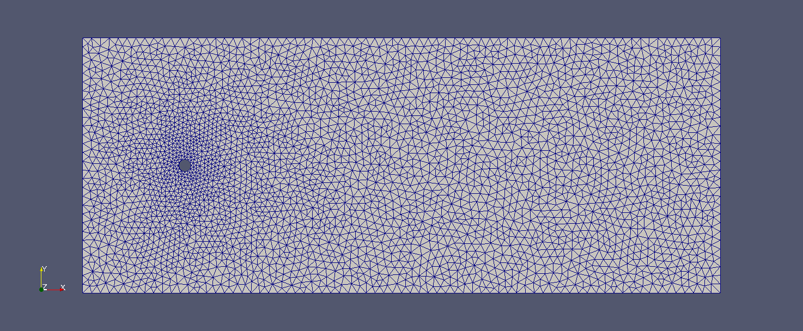
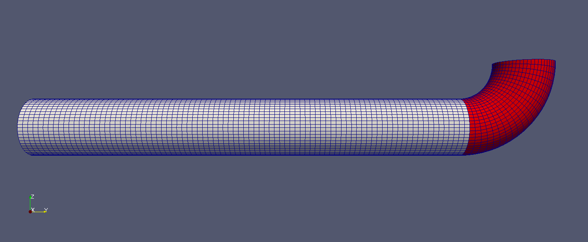
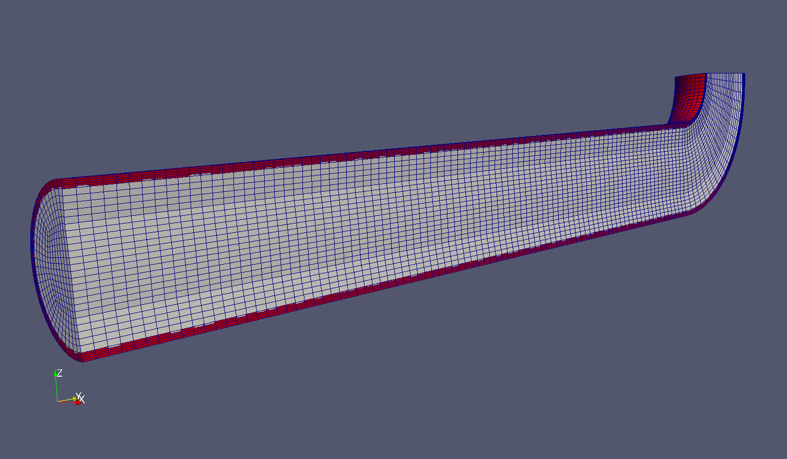
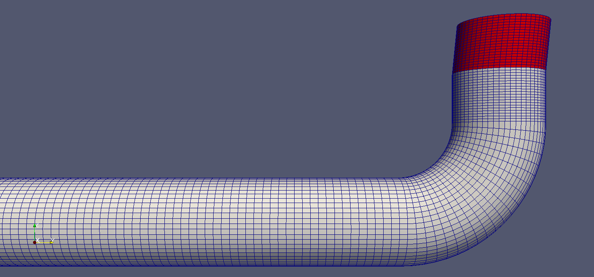
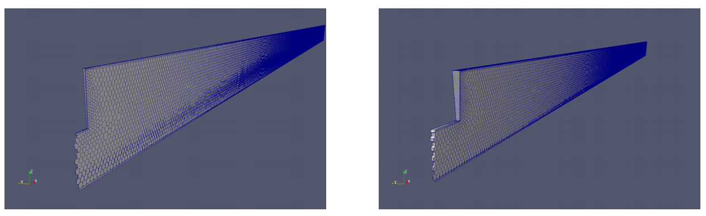

### 20 extrudeMesh
extrudeMesh是一个非常特殊的工具，OpenFOAM将其列在了网格生成工具下面，但其实extrudeMesh在网格生成和网格处理过程中都具有作用。我们可以利用其进行网格生成，例如从2D STL表面挤出一个单元层，以便为OpenFOAM中的2D研究准备网格；同时当我们在STL表面上“生长”单元层时，我们也可以利用其对网格进行处理，其本质上是一种网格扩展工具。

#### 20.1 使用方法
extrudeMesh由文件extrudeMeshDict控制，该文件包含使用该工具的所有必要设置，大致可分为以下几类：“在哪里增长”，“增长什么”和“如何增长”。

##### 20.1.1  constructFrom
ConstructFrom设置用于确定拉伸的来源。单元拉伸的基础可以是现有网格的边界或STL表面。在网格边界的情况下，拉伸源也可以是另一个算例的边界，例如：从算例Y拉伸出X以创建算例Z的网格。对于STL表面，需要使用surface关键字提供相应的STL文件。如果我们使用网格边界层，则可以选择保留源网格还是丢弃源网格。图35显示了从当前案例中拉伸边界时这两个选项之间的区别。
\
图35：从圆柱网格中拉伸出网格。 左：constructFrom网格，右：constructFrom边界。

##### 20.1.2  单元层控制
在“生成什么”的部分包括新网格单元层厚度方向上的单元数量、厚度和可选的膨胀比。

**膨胀比**

注意，膨胀比描述了网格单元的厚度从一层到另一层的膨胀量。这与我们在blockMesh的单元厚度渐变功能中使用的扩展率是类似的，那里的扩展率描述了块边界处最小和最大单元之间的厚度之。

##### 20.1.3  网格拉伸模型
挤出模型控制了网格“如何生长”。目前有许多可用的模型，下面将讨论其中一些模型。

**平面拉伸模型**

平面拉伸模型专门用于创建（近似）的2D网格。将单层网格沿法线方向拉伸到提供的表面上。默认情况下，前后边界的创建类型为“空边界（empty）”类型。

在图36中，我们可以看到一个由STL创建的网格，该网格由GMSH创建。在这种情况下，我们还可以使用GMSH来创建一个在厚度方向上具有单个单元的网格。

\
图36：从STL曲面生成的2D网格。

**扇形拉伸模型**
图37显示了扇形拉伸模型的一个效果图。对于此模型，用户需要指定空间中的一个点（axisPnt），旋转轴（axis）和旋转角度。在图37的这种情况下，原始网格的出口边界（以灰色显示）被挤出。原始网格是由blockMesh创建的，由5个块组成（可以轻松地用Python编写脚本）。axisPnt位于出口边界的平面中，但是该点恰好位于边界的外面。axisPnt与原始管道网格的中心线之间的距离决定了管道弯曲的半径。选择正x轴作为轴。默认情况下，新生成的单元格被添加到名为addedCells的单元格集中。

使用extrudeMesh开辟了一种相当方便创建良好的弯管网格的方式。直管的blockMeshDict很容易编写脚本，并且通过圆管的截面再进行拉伸，可以沿折弯生成弯管网格。如果直接为弯头编写blockMeshDict肯定会有点困难的。

扇形拉伸模型还具有2D的“表兄弟”，称为楔形拉伸。楔形拉伸模型的基础类是从扇形模型派生的。但是，楔形拉伸模型是平面拉伸模型的轴对称类似物。因此，该模型仅产生一个围绕源表面的单元层。

\
图37：90°弯管。原始网格的出口边界沿圆形截面进行扇形拉伸。

**线性拉伸模型**

在extrudeMesh中有两种线性拉伸模型。一种是线性法线拉伸，该方法从表面的法线方向向上拉伸出网格。这可用于在管道壁上生长网格层，请参见图39。此外，还有线性方向拉伸，它沿指定的方向拉伸出单元格。

在图38中，我们看到使用extrudeMesh的结果。不幸的是，在撰写本文时（使用OpenFOAM-4.0），extrudeMesh不提供-dict选项。因此，我们需要重复的编辑extrudeMeshDict，以便使用extrudeMesh。首先，使用扇形拉伸模型创建折弯；然后，使用法线拉伸创建直管段，然后使用线性拉伸创建倾斜的管段。

\
图38：网格拉伸模型使用：扇形，法线拉伸和线性方向拉伸。

\
图39：沿管壁拉伸！ 使用法线拉伸模型挤压出管道的壁面。

**陷阱：拉伸出过窄的2D切片**
用于轴对称仿真的网格是整个3D域的切片，整个3D域在圆周方向上为1个单元。图40显示了两个示例，它们的区别仅在于切片的角度。在ParaView中查看时，两者都看起来像有效的网格。

但是，在狭窄的角度下，OpenFOAM将警告楔形贴片不平坦。清单148显示了此类警告消息的示例。将角度从1度增加到5度可以解决此问题。这类问题无法通过提高写入精度来解决。

\
图40：拉伸的切片。左：1度的扇形拉伸结果，右：5度扇形拉伸结果。

```
--> FOAM Warning :
From function virtual void Foam :: wedgePolyPatch :: calcGeometry ( Foam :: PstreamBuffers &)
in file meshes / polyMesh / polyPatches / constraint / wedge / wedgePolyPatch .C at line 70
Wedge patch ’ front ’ is not planar .
At local face at (5.433932 e -05 -4.157483 e -07 4.764003 e -05) the normal (5.662783 e -19 -0.9999619
-0.008726535)
differs from the average normal ( -1.335286 e -10 -0.9999618 -0.008682201) by 1.965596 e -09
Either correct the patch or split it into planar parts
```
清单148：有关非平面楔形贴片的警告消息。