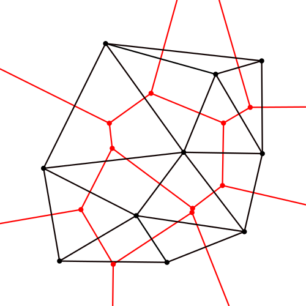
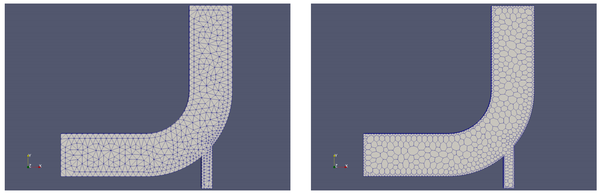
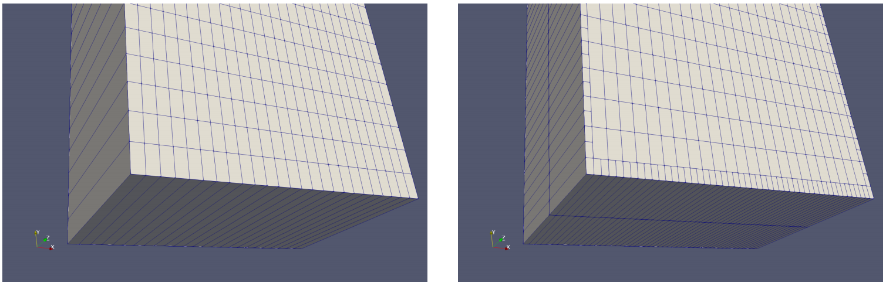
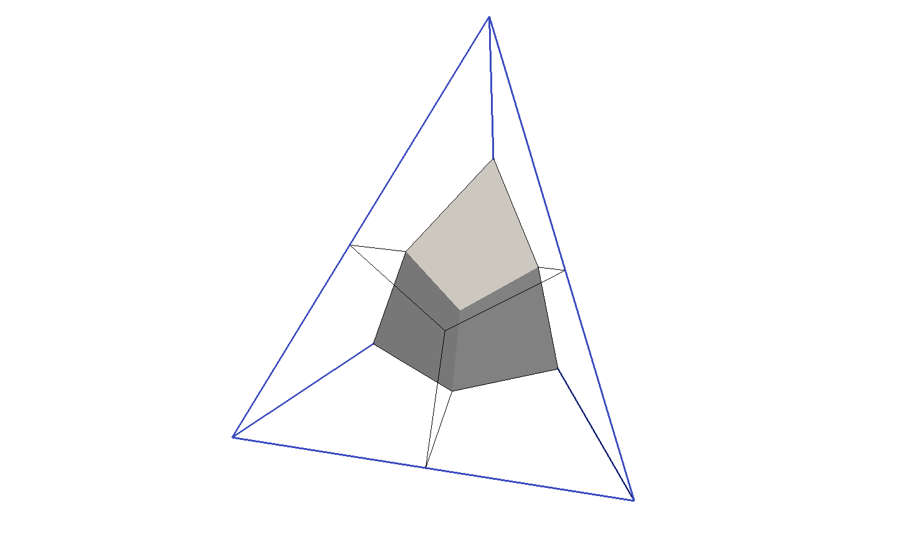
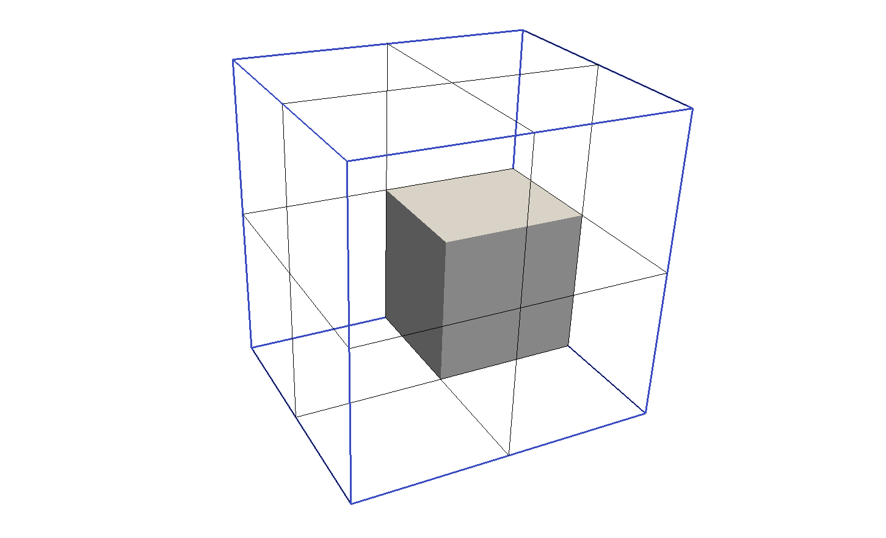

### 21 polyDualMesh

该工具与extrudeMesh比较类似。当在现有网格上运行该工具时，获得的结果与初始网格差异非常大，因此也可以将此工具视为一种网格生成工具。

polyDualMesh可以在任何有效的网格上进行计算，并生成对应的双重网格。由于双重网格是一个相当抽象的概念，因此最好用一个简单的例子来说明。在图41中，显示了Voronoi图。在此示例中，使用了三角形网格的外接圆的中心来创建Voronoi图。因此，可以从三角形网格中创建多边形网格。

polyDualMesh可将此方法应用于任何类型的网格。

\
图 41: 连接外接圆的中心会产生Voronoi图（红色）。
来源：https://commons.wikimedia.org/wiki/File:Delaunay_Voronoi.svg.

polyDualMesh是创建多面网格的重要工具。它可以将四面体（tet）网格作为输入，由于创建tet网格的工具很多，因此polyDualMesh是我们在多面网格上运行模拟的中间工具。通常我们可以认为，网格越复杂，网格生成软件就越稀少（在开放源代码解决方案的情况下）或更昂贵（在专有工具的情况下）。

**示例：弯头教程**

图42显示了弯头案例中运行polyDualMesh的结果。初始网格是三角形网格，而最终的网格是多边形网格。请注意，OpenFOAM将2D网格视为3D，并具有单个单元的厚度。由于polyDualMesh在所有空间维度上都起作用（包括厚度方向），因此生成的网格不再是有效的2D网格（厚度方向多出一层）。但是，如果我们在顶部网格上挤出一层单元格，并删除所有旧的单元格，那么我们将再次获得有效的2D网格。

\
图 42: 弯头案例的网格；在使用polyDualMesh之前（左）和之后（右）。

**示例：二维气泡教程**

polyDualMesh可以将任何有效的网格作为输入。在图43中，我们看到在2D全六面体网格上应用polyDualMesh的结果。此示例还显示了生成的网格为何不再是有效的2D网格，因为生成的网格的厚度为2个单元。生成的网格是以六面体网格为主的，但是在边界处也创建了多面体网格，类似于具有中间悬挂节点的六面体。

\
图 43: 气泡教程案例的网格；在使用polyDualMesh之前（左）和之后（右）。

**示例：单网格**

出于好奇，我们还将单个网格做成双重网格。
    
在图44中，我们看到了由单个四面体网格生成的双重网格的结果。从表面分解中可以看出，表面重心被用作双重网格的新像元的顶点，在加上体积重心，就可以用来构建新的单元格了。由于没有其他网格用来重组新创建的网格，因此我们最终得到了4个六面体网格。
    
在图45中，我们看到了由单个六面体单元生成的双重网格。在这里，我们最终得到8个六面体网格。

\
图 44: 单个四面体的双重网格：原始tet单元用蓝色表示，表面分解用黑色表示，所得单元之一用灰色表示

\
图 45: 单个六面体的双重网格：原始tet单元用蓝色表示，表面分解用黑色表示，所得单元之一用灰色表示