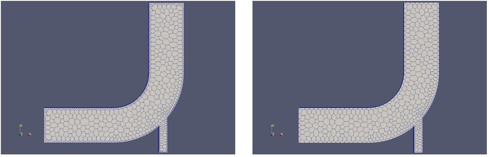

### 22 combinePatchFaces

该网格处理工具检查同一网格上的多个边界面，并将其组合。在同一网格上具有多个边界面的表面很可能是某些网格处理操作产生的，例如弯头教程示例中的polyDualMesh在域边界处就创建了此类网格。

**示例：弯头教程**

在图42中，我们看到了弯头教程案例的双重网格。看起来边界处的网格比内部的要小得多。但是，仔细检查后，我们发现边界处的网格单元具有属于同一边界的多个面。因此，如果我们运行CombinePatchFaces，则所有这些边界面均被组合在一起，如图46右所示。现在再来看边界处的单元格，就发现并没有比内部单元格小很多了。

\
图46: 弯头教程的双重网格：在应用CombinePatchFaces之前（左）和之后（右）。

