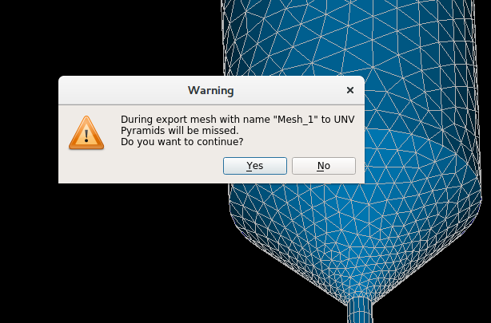
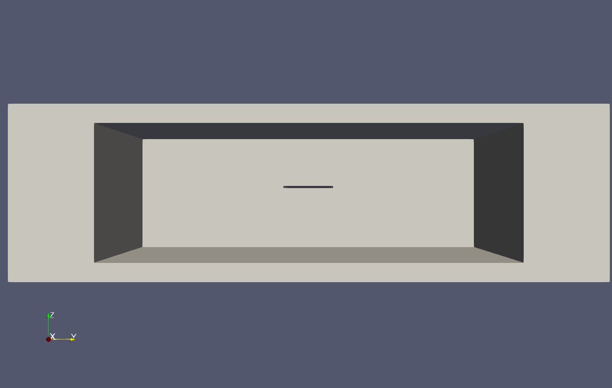
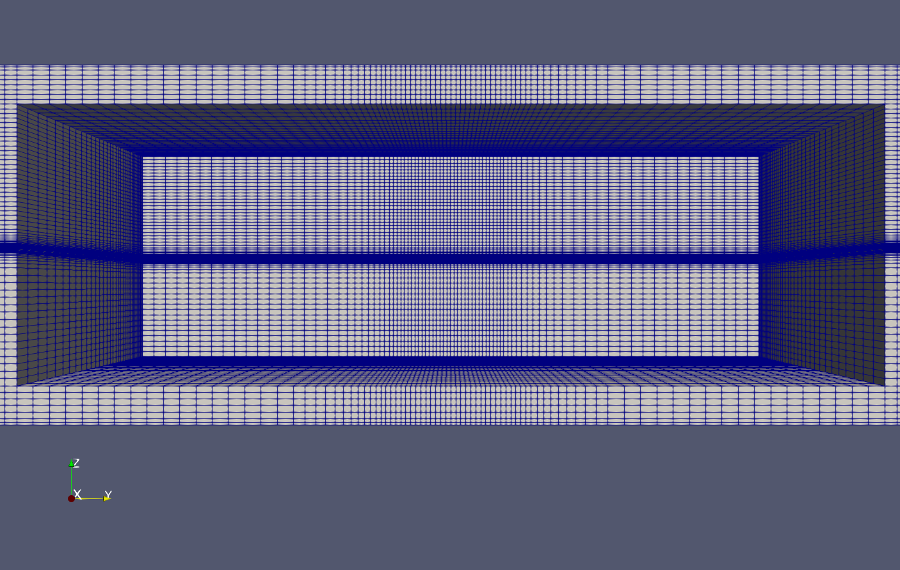
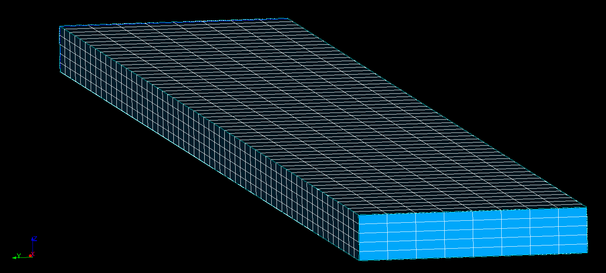
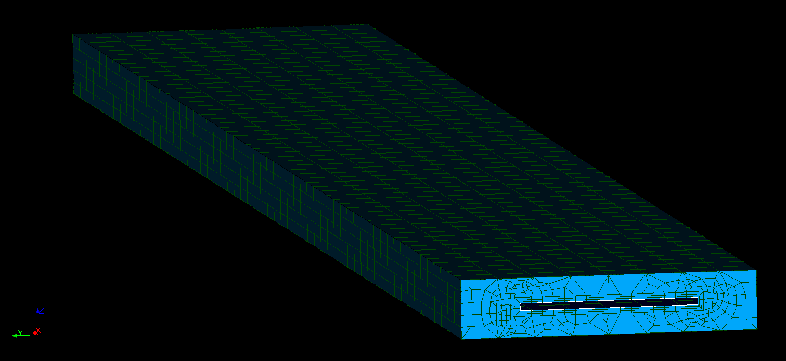
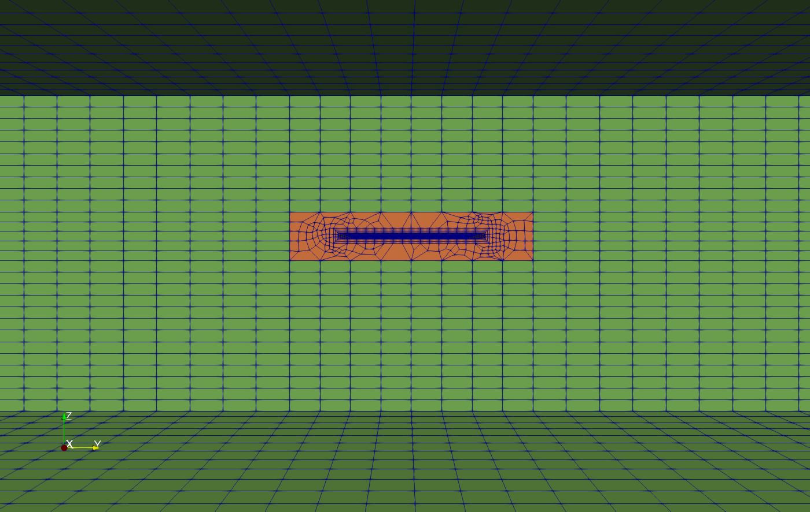

### 22  Salome

Salome平台是一个具有网格划分模块的功能强大的多功能工具，它的网格划分模块提供了许多网格划分工具。

#### 23.1 导出与转换

Salome可以将网格导出为多种格式。在使用OpenFOAM时，需要使用ideaUnvToFoam网格转换工具导入Salome导出的UNV格式的网格。

##### 23.1.1 Salome的原生UNV导出

但是在使用Salome导出UNV格式时会出现问题。如图47所示，Salome在导出UNV格式的网格时不兼容金字塔网格单元。

\
图47: Salome中UNV格式网格的导出问题。

##### 23.1.2 salomeToOpenFOAM

通过第三方Python脚本可将包含金字塔单元的网格导出到OpenFOAM。该脚本直接生成所需的基本文件。为了导出网格，只需在Salome的对象浏览器中选择它，然后执行salomeToOpenFOAM.py这个Python脚本，可以通过使用“加载脚本”的菜单来完成。

##### 23.1.3 陷阱：检查您的边界/边界类型

在Salome中，我们可以通过创建表面组来定义边界。在导出网格时，这些表面组将直接转换为边界。但是，Salome没有办法区分普通边界和壁面边界。因此，您可能需要去检查边界的类型（constant/polyMesh/boundary）看是否导出了正确的结果。

在Salome原生程序导出的UNV中，所有边界都是相同的，因此导入到OpenFOAM的ideasUnvToFoam转换器后，所有边界的类型都是patch类型。这时您需要注意，要将壁面 边界分配给壁面边界。这个操作可以手动完成，也可以使用changeDictionary工具来完成。有关changeDictionary的更多信息以及如何更改边界类型的示例，请参见30.1节。


第三方转换脚本salomeToOpenFOAM.py，在边界名称包含单词wall的情况下，会将这些边界设置为壁面边界。

```
1 if " wall " in gname . lower () :
2 fileBoundary . write (" wall ;\n") 
3 else : 
4 fileBoundary . write (" patch ;\n")
```

清单149：确定salomeToOpenFOAM.py中的边界类型。

#### 23.2 组合操作：blockMesh和salome

##### 23.2.1 动机

图48显示了具有相对较小几何特征的计算域，如果针对该几何特征创建BlockMesh网格，我们将在该精细特征旁边发现很多无用的细小网格，如图49所示。在图49中，我们甚至无法分辨出单个网格，甚至是中央的切槽都无法分辨了。

\
图48：具有较小几何特征的大计算域——几何尺寸

\
图49：具有较小几何特征的大计算域——blockMesh网格。

##### 23.2.2 工作流程

除了如图49所示的方法之外，我们还可以选择创建一个更大的网格块，这个网格块将包含中间的切槽，而不是用来表示这个切槽。这个切出的槽将保留为网格的一部分，然后将网格划分为切出的槽和剩余的网格两部分。

然后，我们用Salome中的切口槽来创建一个几何结构表示该切槽块。当我们对切出的网格进行网格划分时，我们遵循如下工作流程。

1. 在几何图形上创建组：包括侧面，正面和内边缘。

2. 从网格化后的切除块中导入表面网格，如图50所示。

3. 使用以下子网格对几何体进行网格划分，按如下顺序：

（a） 侧面利用“从另一个网格导入1D-2D元素”算法

（b） 内边缘使用合适的一维算法

（c） 正面使用合适的二维算法

（d） 几何结构使用“Extrusion 3D”算法

图51显示了我们在Salome中创建的网格。

\
图50：salome中需要切槽的块网格。

\
图51：Salome中的切槽块网格。

最后，我们需要将网格从Salome导出到OpenFOAM，并将其与其余域的网格合并，图52显示了最终的结果。通过这样的方式，我们能够围绕精细的几何特征创建一个相对精细的网格，而网格精细度不会像图49那样沿主要方向扩展开来。

\
图52：合并blockMesh和salome：将网格块与初始网格重新合并。