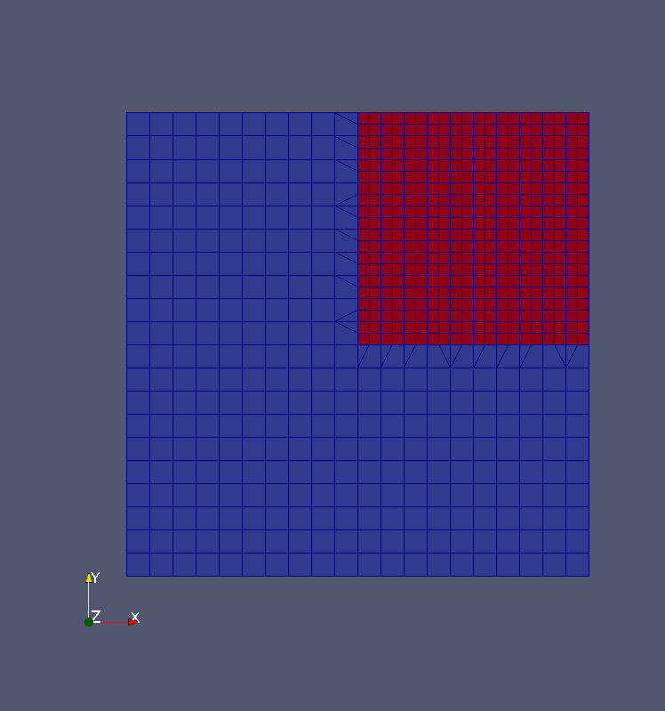

### 27  其他网格处理工具

#### 27.1 网格点转换（transformPoints）

转换网格点的工具transformPoints可用于缩放、平移或旋转网格点。第29.3.4节介绍了可以使用此工具的情况。

##### 27.1.1 旋转

几何旋转可以通过两种方式来表示：

**使用两个向量**

该方法通过旋转之前和之后的两个向量来定义这个旋转。根据这两个向量，可以计算出变换矩阵。

**偏航，俯仰和滚动角**

实际上有两种选择：rollPitchYaw和yawPitchRoll。在这里，旋转是通过指定三个角度（的度数）来定义的，随后将三个角度分别应用于x轴、y轴和z轴。

#### 27.2 拓扑集

拓扑集工具topoSet根据几何定义来创建点、面或单元集。有多种方法来定义包含预期点、面或单元的几何区域。

##### 27.2.1 使用方法

topoSetDict字典用于定义几何区域。使用以下命令在教程中可以找到示例。

```
find $FOAM_TUTORIALS - name topoSetDict
```
清单151：查找使用topoSet的示例

##### 27.2.2 技巧：将topoSet用于并行分解案例

与并行运行求解器相同的方式可以并行运行该工具，可以将工具topoSet应用于并行分解后的案例。

```
mpirun - np 4 topoSet - parallel
```
清单152：并行运行topoSet，即在分解后的情况下应用topoSet

可以将用于创建集和区域的所有定义应用于分解后的案例的子域。

这也可以通过当前正在运行的案例来完成，例如随着长时间的模拟运行，我们正在准备集和区域以用于后续的后处理。但是如果将topoSet应用于当时正在模拟的案例，则需要格外小心，不要以任何其他方式更改、删除或弄乱已经存在的集合或区域。

分解后案例的子域创建的集合和区域需要进行重构，以便在案例完成时显示它们，并在重构后的案例上进行后续的后处理。我们可以通过使用-constant命令行参数调用constructPar来重建分解后的案例创建的集合和区域。

##### 27.2.3 陷阱：几何区域的定义

为了演示topoSet的功能，为空腔教程中的案例定义了一个单元集。空腔的网格为1×1×0.1m，定义单元集的框为0.5×0.5×0.05m。此框的尺寸仅是网格尺寸的一半。但是，只有单元格中心位于框中的单元格才包含在单元格集中。由于网格的深度为一个像元，深度为0.1m，因此所有像元中心均位于z=0.05m处。由于在计算像元中心时不可避免的存在数值误差，数值误差决定了是否将像元包含在像元集中。

为避免此错误，请始终确保几何区域包含所有预期的像元。

\
图55：错误的单元集定义。红色集合是集合组的一部分。所有其他单元格均为蓝色。

##### 27.2.4 陷阱：内部面的法线

对于具有运行时后处理的仿真，我们可能需要一组内部面，例如用于在某些横截面上提取压力。借助topoSet，我们可以使用boxToFace选择几何切片中的所有面，并使用normalToFace选择面法线与横截面法线平行的所有面，以创建内部面集。最后执行布尔运算以消除所有未平行于横截面的面。

虽然此过程需要一点点的试错才能确定盒子的适当大小，以仅包括平行于横截面的单层表面，但该过程通常适用于所讨论的任务。然而，所讨论的过程中存在一个缺陷：内部面的法线向量的方向。

如果我们设想一个管道，其主轴线平行于x轴，则横截面所需的内表面的法线方向平行于x轴。但是，内表面的法线可能指向正x方向或负x方向。因此，我们需要通过使用normalToFace的第二次扩展来扩展我们的过程，这次使用相反的法向矢量。

##### 27.2.5 传统陷阱：重新编号的网格

在撰写本文时，使用OpenFOAM-2.x，程序renumberMesh不考虑单元集。如果在topoSet创建单元集之后调用renumberMesh，则该单元集无效。 这样做的原因是，当renumberMesh完全重新标记网格时，单元集的单元标签保持不变。因此，该单元集仍然存在，并且单元数不变，但是，由于其他单元带有该单元集原始成员的标签，因此该单元集无效。

若要解决此问题，需要在renumberMesh之后运行topoSet。这甚至可以并行工作在案例被分解之后。

#### 27.3 绑定到区域（setsToZones）

实用程序setToZones的作用是：

从类似命名的pointSets/faceSets/cellSets将pointZones/faceZones/cellZones添加到网格中。

当我们创建一些稍后要使用的cellSet时，需要此实用程序。与functionObject一起使用（cellSource functionObject作用于所有单元格或cellZone上）。可以使用topoSet创建cellSet。在运行topoSet之后，我们只需运行setsToZones即可，而无需任何其他参数或提供字典。setsToZones创建的cellZones包含与相应cellSet相同的单元格。

#### 27.4 细化网格

顾名思义，使用fineMesh工具细化网格。

##### 27.4.1 用法

首先必须定义一个单元集，这可以使用工具topoSet完成。
借助字典fineMeshDict，可以写明用于完善特定单元集的规则。当在fineMeshDict中定义了规则时，则必须使用命令行选项-dict。

\
图56：细化网格的示例，细化区域标记为红色。

##### 27.4.2 陷阱：无命令行参数

如果在没有任何命令行参数的情况下调用了refineMesh工具，则将优化整个网格。为了使refineMesh遵守refineMeshDict中设置的规则，在调用refineMesh时必须使用命令行选项-dict。 请参阅CFD在线论坛中的有用帖子http://www.cfd-online.com/Forums/openfoam-meshing-utilities/61518-blockmesh-cellset-refinemesh.html#post195725

注意工具topoSet和refineMesh的-dict命令行选项的不同含义。如果您对此差异有疑问，请查看-help选项打印命令行用法摘要。

#### 27.5 细化壁面

refineWallLayer是用于优化与用户指定的边界相邻单元格的工具。

##### 27.5.1 控制方法
边界列表由用户通过命令行参数提供。第二个参数是边缘的比例，将在优化中应用。清单153显示了如何调用此工具的示例。边界列表和边缘比例是必填参数。

```
refineWallLayer - overwrite ( top bottom sideLeft ) 0.4
```
清单153：对与三个边界相邻的单元格调用refineWallLayer。

Figures 57, 58 and 59 show the results of a successive application of this tool along with the base mesh. In this case, the patch of the inner void is refined. Figures 58 and 59 show the treatment of sharp, concave edges. Figure 60 shows the result of refineWallLayer when the cells belonging only one patch are refined.
图57、58和59显示了此工具与基础网格工具相继应用的结果。在这种情况下，内部空隙被细化。图58和59显示了锐利的凹形边缘的处理。图60显示了当只细化一个边界的单元时的refineWallLayer结果。

\
图57：细化壁面的基础网格。

\
图58：一次应用壁面细化。

\
图59：第二次应用壁面细化。

\
图60：在水平凹面的凹面边缘上对壁面细化两次。

图61和62显示了refineWallLayer如何处理凸边。如果边缘由两个不同的边界形成，则refineWallLayer可以分别应用于每个边界，这导致了不同的结果，请比较图61和63。

\
图61：在凸边的两个边界上两次应用壁面细化。

\
图62：在凸边的一个边界上两次应用壁层细化。

\
图63：在两个凸边边界上依次应用壁面细化处理，这种方法导致的结果不同于图61所示的结果。

#### 27.6 网格重新编号
##### 27.6.1 基本信息

工具renumberMesh修改网格单元的排列，以便为数值解创建较低的带宽。有关带宽在数值模拟中的作用和影响的更多信息，请参见有关大型方程组的数值解的书籍，例如[35]。

对网格重新编号可以减少计算时间，因为它可以重新排列数据，从而有利于所得方程组的数值解。重新编号网格的好处很大程度上取决于不同的因素。但是，建议进行测试。

对网格重新编号甚至在最简单的模拟情况下也有效果-本教程的空腔情况。该网格由单个块组成，并且近似为2D（即，深度仅为1个块）。网格分辨率选择为40×40×1，得到1600个像元。 icoFoam运行10s。通过renumberMesh，执行时间从6.18s减少到6.08s。

使用twoPhaseEulerFoam对包含120000个单元（由9个块定义）的网格进行持续5s的仿真，重新编号网格将执行时间从9383.81s减少到9273.13s。

尽管在此示例中执行时间的减少很小，但是这种减少是免费的。运行renumberMesh花费的时间很少，并且在模拟运行时无需执行其他工作。

\
图63. 在生成集或区域的任何其他工具之前运行renumberMesh。

##### 27.6.2 背景
离散的有限体积问题导致了线性方程组的求解，通常以矩阵形式表示。
Ax = b (31)  

向量x包含单元格中心的字段值。矩阵A包含每对相邻单元的非零元素。这是我们假设只有相邻单元相互作用的结果。如果我们使用某种高阶离散化或插值，则可能会遇到第二个邻居也相互作用的情况。但是，为简便起见，我们在讨论中只限于直接邻居。

无论我们的计算网格是一维，二维还是三维，我们都使用正整数来标记所有像元。因此，我们可以将标量字段的值存储到向量中。此向量的元素数（N）等于我们域中的单元数。因此，矩阵A的大小为N×N。但是，由于只有相邻的单元交互，所以A的大多数元素都是零项。

如果带有标签i和j的单元格相邻，则A的元素$a_ij$和$a_ji$将为非零。因为我们专注于A的一般结构，所以我们不在乎$a_ij$是否等于$a_ji$，或者两者实际上都不为零。

像元的排列-或更准确地说，标记-对矩阵A的结构（即非零元素的分布）有很大的影响。

**一个简单的例子**
在这里，我们通过一个非常简单的示例来检查单元标记的效果。图64显示了一个具有8个像元的简单网格。两种不同的单元标记方案由单元内部的数字表示。

在图65中，我们看到了单元之间的连接，并以图形表示。从交互的角度看，N×N矩阵可以看作是具有N个节点的图。节点i和j之间的边缘代表非零元素$a_ij$和$a_ji$。

\
图64：具有8个单元格和不同单元格标记方案的简单网格。

\
图65：网格的连接图。

图66显示了相应的矩阵结构。图64和65右侧的标记方案导致矩阵的带宽较低。

\

图66：矩阵结构。*表示非零元素。请注意，右侧矩阵的带宽较低。零项的数量相等，但是，不同的分布会导致不同的数值行为。

##### 27.6.3 陷阱：区域和集合会伤到我的骨头

使用renumberMesh具有一定的风险。在使用诸如topoSet和renumberMesh之类的工具模拟的情况下，这些工具的调用顺序非常重要。更新：某些时候已解决此问题。在OpenFOAM-4.0中，这不再是问题。

其背后的原因是OpenFOAM存储其网格信息的方式。唯一实际的几何信息存储在文件constant/polyMesh/points中的点列表中。通过定义网格的点的标签定义面。因此，如果点Pk，Pm，Pu和 Pw定义了一个面，则在常数/polyMesh/faces中该面的条目为（k m u w）。相同的原则适用于单元格的定义。在那里存储了定义单元格的面的标签。这样就不会存储任何冗余信息。如果我们用topoSet定义一个cellSet，例如在特定几何区域内的所有单元格，我们仅存储满足条件的所有单元格的单元格标签。因此，如果现在运行renumberMesh，我们将对网格内的单元进行混洗。网格中未应用任何实际更改，但是，带有标签A的单元在重编号之前位于位置（xA，yA，zA）上，可能或肯定会将位于B位置（xB，yB，zB）上的点重编号后为A。

图67显示了充气搅拌罐的模拟域。红色单元是cellZone的一部分，使用fvOptions机制act65在其上指定源词。创建cellZone之后运行renumberMesh导致cellZone被打乱。但是，仿真仍然有效，并且产生了一些意外的结果。

\
图67：左：带有转子（蓝色）和充气装置（红色）的搅拌槽壁的剖视图。充气设备是一个cellZone，通过OpenFOAM-2.3.x中的fvOptions机制在其上应用源项。右：使用并行模式模拟搅拌釜。 在分解域之后，对网格进行并行重编号。对子域进行重新编号会将cellZone扰乱到其各自的子域中。透明等体积线显示了0.25s的气相体积分数。cellZone的单元充当气相的来源，尽管已经不在其原始位置上。

##### 27.6.4 人生大招：将网格（和字段）从二进制转换为ASCII
你可能会遇到这样的情况，需要将OpenFOAM案例的网格数据从二进制格式转换为ASCII格式，或者进行相反操作，在这种情况下，我们需要的是一个可以读写网格的工具，而renumberMesh正是我们需要的工具。在这种情况下，我们只需要使用工具简单地进行输入/输出，而不是重新排序网格以改进数值解。


前一种情况，即将网格从二进制转换为ascii，是当你想要使用几种OpenFOAM变体的工具时，例如，foam-extend-4.0的checkMesh实用工具无法读取二进制格式的网格，而二进制格式是由OpenFOAM-6的网格转换工具（如fluentMeshToFoam）创建的。出于某种原因，foam-extend和OpenFOAM的二进制格式（基础版本）是不兼容的。不过，foam-extend对OpenFOAM以ASCII格式编写的网格是兼容的。这里介绍了renumberMesh网格工具的用法，使用该工具更改网格存储在磁盘上的格式。

该过程非常简单：

1. 创建一个新的案例目录，并在其中进行转换
2. 将相关文件夹（即常数和系统）复制到此新案例目录中。如果需要，还应复制时间步文件夹。
3. 将system/controlDict中的writeFormat设置从二进制更改为ascii。
4. 运行renumberMesh -overwrite

现在，所有网格文件（例如点或面）都以ASCII格式存储在磁盘上了。

**关于转换字段的说明**

由于renumberMesh并不是经典的预处理或后处理工具，因此无法对案例中存在的所有字段进行重新编号。因此，只有一个时间步长会被重新编号，通常是最小的时间步长（起始时刻）。

\
图68：重新编号Cavity案例：运行了案例，并删除了0.3之前的所有时间步。然后运行renumberMesh -overwrite。由于0.3是第一个时间步长，因此时间步长0.3中的字段与网格将一起被重新编号。 但是，后面时间步中的网格编号会保持不变。

因此，如果要将带有网格和字段的案例从二进制格式转换为ASCII格式，只需创建一个带有一个时间步长的案例的副本，然后执行重新编号。工具renumberMesh仅允许用户指定一个特定时间，但不能指定时间范围。 因此，不能将具有多个时间步长的案例从二进制转换为ASCII，反之亦然。


#### 27.7 subsetMesh
subsetMesh是从网格中移除某些单元的工具。该工具要求将单元格集的名称作为命令行参数。此单元集的单元将保留在生成的网格中，所有其他单元将被删除。

**陷阱：集合和区域会打断我的骨头**
在撰写本文时（OpenFOAM-4.0），subsetMesh不处理cellset或cellZones。因此，当我们使用subsetMesh删除网格的大部分时，单元集可能包含不再是网格一部分的单元。当与cellSet或cellZone关联的单元索引大于网格中的单元总数时，会出现错误。如果单元索引小于单元总数，从OpenFOAM的角度来看，单元集可能仍然有效，但它可能包含了不同的单元。

#### 27.8 createPatch

#### 27.9 stitchMesh

#### 27.10 tetDecomposition

网格操作工具tetDecomposition是OpenFox变体foam-extend的一部分，在撰写本文时，OpenFOAM的基础版本中没有类似的工具。

此工具获取OpenFOAM网格，计算 tet-decomposition，并将生成的网格写入磁盘。图69和图70说明了此工具的工作原理。初始单元的面被分解成三角形。有了这样一个三角形和单元格的质心，就可以创建一个亚四面体。

根据原始网格，生成的网格的单元数可能会急剧增加。图69中的单个四面体被分解为12个子四面体。图70的初始六面体被分解成24个四面体。

\
图69：四面体分解：原始的四面体单元用蓝色勾勒，面分解用黑色轮廓勾勒，所得子分支之一用灰色表示。

\
图70：六面体分解：原始的六边形单元用蓝色勾勒，面分解用黑色勾勒，得到的子六面体之一用灰色表示。

#### 27.11 decomposePar
工具decomposePar用于将并行仿真运行的域划分为较小的子域。

##### 27.11.1 Visualize the decomposition
工具decomposePar有命令行选项cellDist，它使decomposePar将单元格分布作为字段写入磁盘。这个单元分布随后可以通过手动分解方法重新使用，或者使用ParaView可视化。为此，decomposePar编写了一个volScalarField和一个带有子域索引的labelList。

\
图71：多区域案例的单元分布，有2个区域和4个子域用于并行处理。白色轮廓的小区域是固体区域，周围较大的区域是这种情况下的流体区域。每个子域（颜色编码从0到3）被分配一个区域块。

#### 27.12 mirrorMesh
mirrorMesh与extrudeMesh类似，是一种介于网格处理和网格创建之间的网格工具。此工具由文件system/mirrorMeshDict中的条目控制。参数集是非常有限的，因为我们只需要为作为镜像的平面提供一个定义和一个公差。

清单154显示了mirrorMeshDict的示例，它由一个平面定义（这里有三种可能的方法可供选择）和公差组成。

```
planeType pointAndNormal ;
// Overall domain boundingBox : (0 0 0) (0.1 0.1 0.01)
pointAndNormalDict
{
basePoint (0.0 0.0 0.01) ;
normalVector (0 0 1) ;
}
// plane equation : ax + by + cz + d = 0
planeEquationDict
{
a 0;
b 0;
c 1;
d -0.01;
}
embeddedPointsDict
{
point1 (0 0 0.01) ;
point2 (1 0 0.01) ;
point3 (0 1 0.01) ;
}
planeTolerance 1e -5;
```
清单154：文件mirrorMeshDict中的所有可能条目，以围绕z分量为z=0.01的xxy平面镜像初始网格。

**潜在陷阱：设置和区域可能会打断我的骨骼**

mirrorMesh不对网格的现有集和区域应用镜像操作。这可能是一个问题，这取决于现有的cellSet或cellZone是否也需要镜像。如果没有必要，用户应该在镜像之前删除所有集和或区域，以避免混淆。

在图72中，我们看到了以下操作序列的结果：使用blockMesh创建网格，挤出一个面以生长多个单元层，最后镜像网格。挤压操作创建了单元集addedCells，它没有被mirrorMesh镜像。

\
图72：运行mirrorMesh后的单元集使用x x y平面镜像网格。


