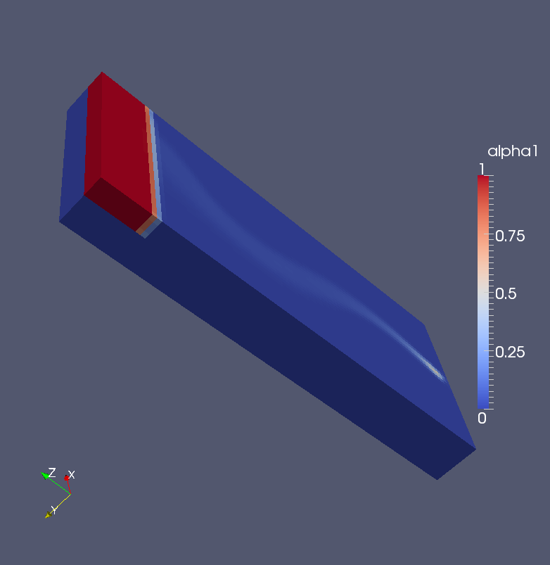

### 29 场的初始化

#### 29.1 基础

有两种方法定义场量的初始值。一种是设为统一的数值，列表161为cavity案例中的0/U，其中内流场的参数被设置为统一的数值。

如果需要非均匀初始化，就要列出所有单元格的数据，列表168展示了这种定义。 可是这样的数据由用户手工输入将是不可想象的。 为此，有一些工具可以提供帮助。

```
/* - - - - - - - - - - - - - - - - - - - - - - - - - - - - - - - -* - C ++ -* - - - - - - - - - - - - - - - - - - - - - - - - - - - - - - - - - -*\
| ========= | |
| \\ / F ield | OpenFOAM : The Open Source CFD Toolbox |
| \\ / O peration | Version : 2.1. x |
| \\ / A nd | Web : www . OpenFOAM . org |
| \\/ M anipulation | |
\* - - - - - - - - - - - - - - - - - - - - - - - - - - - - - - - - - - - - - - - - - - - - - - - - - - - - - - - - - - - - - - - - - - - - - - - - - - -*/
FoamFile
{
    version 2.0;
    format ascii ;    
    class volVectorField ;
    object U ;
}
// * * * * * * * * * * * * * * * * * * * * * * * * * * * * * * * * * * * * * //
dimensions [0 1 -1 0 0 0 0];
internalField uniform (0 0 0) ;
boundaryField
{
    movingWall
    {
        type fixedValue ;
        value uniform (1 0 0) ;  
    }
    fixedWalls
    {
        type fixedValue ;
       value uniform (0 0 0) ;
    }
    frontAndBack
    {
        type empty ;
    } 
}
// ************************************************************************* //
```

列表161：cavity案例中的0/U

#### 29.2 设置场 setFields

setFields将数值分配给计算几何域，参数定义位于文件setFieldsDict中。要将计算域初始化，就必须在划分网格后执行命令setFields。在列表162中，alpha1被定义为非均匀的场参数。

```
/* - - - - - - - - - - - - - - - - - - - - - - - - - - - - - - - -* - C ++ -* - - - - - - - - - - - - - - - - - - - - - - - - - - - - - - - - - -*\
| ========= | |
| \\ / F ield | OpenFOAM : The Open Source CFD Toolbox |
| \\ / O peration | Version : 2.1. x |
| \\ / A nd | Web : www . OpenFOAM . org |
| \\/ M anipulation | |
\* - - - - - - - - - - - - - - - - - - - - - - - - - - - - - - - - - - - - - - - - - - - - - - - - - - - - - - - - - - - - - - - - - - - - - - - - - - -*/
FoamFile
{
    version 2.0;
    format ascii ;
    class dictionary ;
    object setFieldsDict ;
}
// * * * * * * * * * * * * * * * * * * * * * * * * * * * * * * * * * * * * * //
defaultFieldValues
(
    volScalarFieldValue alpha1 1
);

regions
(
    boxToCell
    {
        box ( -0.3 -0.3 0) (0.3 0.3 0.26) ;
        fieldValues
        (
            volScalarFieldValue alpha1 0
        );
    }
);
// ************************************************************************* //
```

列表162：setFieldsDict。

##### 29.2.1 定义域

在列表162中，regions一列包含有设置场量的定义。boxToCell文件很想我们在topoSetDict文件中看到的东西。事实上，setFields內部地调用来创建单元格集，就像是topoSet做的那样。快速浏览setFields和topoSet，会发现他们都使用了topoSetSource类。在头文件中，topoSetSource类是这么描述的：Base class of a source for a topoSet. 所有单元格都是直接继承自topoSetSource的，例如boxToCell和cylinderToCell。因此，topoSet可用的，在setFields中也可用。这便是面向对象编程的美了。

##### 29.2.2 易错点

一个易错点的合集如下：

###### 几何不包含于计算域

如果要初始化的几何区域位于计算域之外，则setFields不会发出任何警告或错误消息。

###### 几何覆盖了整个计算域

如果几何区域是在blockMeshDict中的顶点坐标定义的，则可能发生这种情况。 当以毫米为单位输入顶点坐标，然后以1000为比里因子，将其转换为米，然后可能基于以毫米为单位的顶点坐标的几何区域太大。

列表163和列表164展示了这种情况的原因。 创建一个box并初始化它，域中有一半充满了物质。 setFieldsDict中仅依靠顶点坐标即可定义box，而错误的坐标缩放因子就会导致box尺寸失控。执行命令steFields后，计算域被完全填充。

```
convertToMeters 1e -3;
vertices
(
    (0 0 0)
    (50 0 0)
    (50 0 250)
    (0 0 250)
    (0 50 0)
    (50 50 0)
    (50 50 250)
    (0 50 250)
);
```

列表163：在blockMeshDict中创建50 × 50 × 250 mm的box

```
regions
(
    boxToCell
    {
        box (0.0 0.0 0.0) (50.0 50.0 125.0) ;
        fieldValues
        (
            volScalarFieldValue alpha1 0
        );
    }
);
```

列表164：在setFieldsDict中创建50 × 50 × 125 m的box

###### 找不到场

如果setFieldsDict定义了一个不存在的场，那么OpenFOAM将发出类似于列表165的错误信息。在这种情况下，setFieldsDict是从twoPhaseEulerFoam中旧的命名方案复制的，即，alpha instead of alpha1。 有关命名方案的进一步信息，请参见第45.2节。

```
Setting field default values
--> FOAM Warning :
    From function void setCellFieldType ( const fvMesh & mesh , const labelList & selectedCells ,
    Istream & fieldValueStream )
    in file setFields . C at line 103
    Field alpha not found
--> FOAM FATAL IO ERROR ： 
wrong token type - expected word , found on line 19 the label 1
file : / home / user / OpenFOAM / user -2.1. x/ run / twoPhaseEulerFoam / bubbleColumn / system /     setFieldsDict :: defaultFieldValues at line 19.
    From function operator > >( Istream & , word &)
    in file primitives / strings / word / wordIO .C at line 74.
FOAM exiting
```

列表165：丢失场

#### 29.3 场的映射

mapFields是一个网格转化工具，它可以保留数据的格式，如果源网格以二进制格式存储，则目标网格也将是二进制数据。

为了能够使用mapFields工具，mapFieldsDict必须要被放进case中。mapFields是唯一的强制参数，指向源案例的路径。假设当前目录是目标case的case目录。如果没有规定时间，两个case被处理的是最后一个时间步。 就是说，源案例的最后一个时间步映射到目标案例的最后一个时间步。

列表166展示了mapFileds输出的最后一行。即使源网格和目标网格相等，且不需要插值，mapFileds都会像interpolating alpha这样输出信息。

```
Source time : 0.325
Target time : 0
Create meshes

Source mesh size : 81000 Target mesh size : 273375

Mapping fields for time 0.325

    interpolating alpha
    interpolating p
    interpolating k
    interpolating epsilon
    interpolating Theta
    interpolating Ub
    interpolating Ua
End
```

列表166：mapFields工具的输出信息

##### 29.3.1 丢失文件

当源case不包含数据时，mapFields不会发出警告或错误消息。在列表167中，mapFields的输出信息，就像是就像目标case所包含的那样，没有0目录。只有包含像interpolating alpha这样的语句，才能表示是有报错的，并且mapFields没有进性处理。

```
Source time : 0.325
Target time : 0
Create meshes

Source mesh size : 81000 Target mesh size : 273375

Mapping fields for time 0.325
```

列表167：丢失0目录时mapFields的输出信息

##### 29.3.2 不适用的文件

在包含场数据的文件中，边界及内部的数值可以均一输入（uniform输入)或不均一输入(nonuniform输入）。 非均匀场的数值必须以包含单元数量及其性质的列表形式输入。列表168中可见非均匀向量场定义的前几行行，一般语法如下：

```
nonuniform List<TYPE> COUNT ( VALUES )
```

一个COUNT的数值错误导致了读取的错误。

如果要从源case映射数据，则源case的数据将始终存储为非均匀列表，因为统一场很容易直接定义。如果目标case的数据是均匀的，映射也不会出问题。

如果目标case的数据是不均匀的，无理论什么原因，非均匀列表都必须具有相同的单元数。 否则map Fields将报错，并给出列表169中的信息。 为了避免此类错误，目标case可以终设置为均匀场，最简单的方法是删除内部场的定义。 在tutorals中，有时可以找到.org文件。 这是一种在0目录中保存均匀场数据而不会带来任何问题的方法。

```
dimensions [0 1 -1 0 0 0 0];

internalField nonuniform List < vector >
1600
(
(0.000174291 -0.000171512 0)
(0.000171022 -0.000143648 0)
(-0.000259297 0.000305772 0)
(-0.000380671 0.000374937 0)
(-0.00182755 0.000930701 0)
```

列表168：0/U文件中的非均匀内部场

```
Mapping fields for time 0.325

    interpolating alpha

--> FOAM FATAL IO ERROR :

size 81000 is not equal to the given value of 10125

file : / home / user / OpenFOAM / user -2.1. x/ run / twoPhaseEulerFoam / Case /0/ alpha from line 18 to line 39.

    From function Field < Type >:: Field ( const word & keyword , const dictionary & , const label ) in file / home / user / OpenFOAM / OpenFOAM -2.1. x / src / OpenFOAM / lnInclude / Field .C at line 236.

FOAM exiting
```

列表169：数值不相等时mapFields的报错信息

##### 29.3.3 问题：将数据从二维映射到三维

在这一部分中，我们要解决一些实现mapFields的困难。现在，假设我们已经完成了一个二维模拟，其几何参数为20 cm × 2 cm × 45 cm。

现在我们希望将二维网格映射成三维网格，并对其初始化。目标三维网格的几何参数为20 cm × 5 cm × 45 cm。注意y方向的参数不同。

列表170展示了使用的mapFieldsDict，因为几何有非常大相似性，所以不需要接口。

```
/* - - - - - - - - - - - - - - - - - - - - - - - - - - - - - - - -* - C ++ -* - - - - - - - - - - - - - - - - - - - - - - - - - - - - - - - - - -*\
| ========= | |
| \\ / F ield | OpenFOAM : The Open Source CFD Toolbox |
| \\ / O peration | Version : 2.1. x |
| \\ / A nd | Web : www . OpenFOAM . org |
| \\/ M anipulation | |
\* - - - - - - - - - - - - - - - - - - - - - - - - - - - - - - - - - - - - - - - - - - - - - - - - - - - - - - - - - - - - - - - - - - - - - - - - - - -*/
FoamFile
{
version 2.0;
format ascii ;
class dictionary ;
location " system ";
object mapFieldsDict ;
}
// * * * * * * * * * * * * * * * * * * * * * * * * * * * * * * * * * * * * * //

patchMap ( );

cuttingPatches ( );

// ************************************************************************* //
```

列表170：mapFieldsDict文件

###### 问题提出

由图73可见执行mapFields之后的结果，这样的结果显然是不能令人满意的。



图73：映射后的case

###### 问题排除

解决这个问题的一种方法是选择与三维几何大小相似的二维几何。 但是如果二维已经完成了，那么用重新定义的几何图形，再重新模拟这个case是需要一些时间的。

其他的解决方法有：

1. 将三维与二维计算域的尺寸定义为相同的。
2. 映射这个场。
3. 在不改变单元格总数的情况下，将三维几何定义为预期的大小。

##### 29.3.4 解决：将数据从二维映射到三维

二维网格与三维网格，具有相同的y方向长度，但是只离散一个单元会带来非常差的纵横比。

一个好的解决方案是在二维模拟完成后转换网格。 在我们的case中，二维网格的尺寸是20cm × 2cm ×45cm，三维网格是20 cm ×  5 cm × 45 cm。

使用工具transformPoints，网格可以在空间的三个维度中有选择性地缩放。列表171展示了transformPoints如何被用于二维网格在y方向2.5系数的缩放。之后这个二维网格变成了所需要的20 cm ×  5 cm × 45 cm。

```
transformPoints - scale ’(1.0 2.5 1.0) ’
```

列表171：transformPoints在y方向上缩放二维网格

网格转换之后，可以通过mapFields将二维网格映射成三维网格。

##### 29.3.6 问题：二进制文件

如果源case有二进制数据文件，那么在映射场之前需要在ascii文件中定义边界条件。  但是使用文本编辑器编辑二进制文件可能会出现问题。
