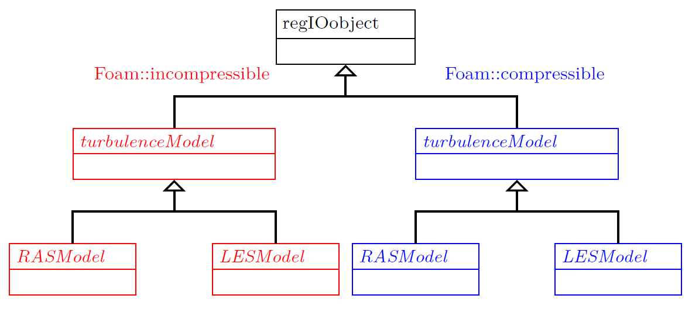
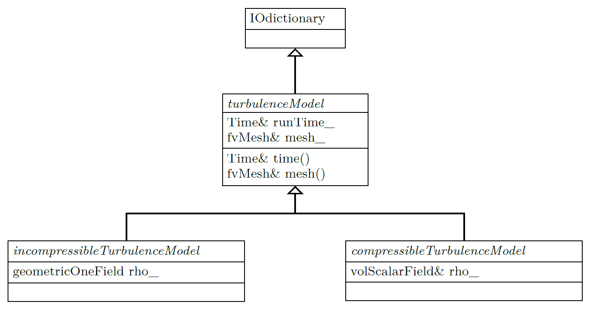
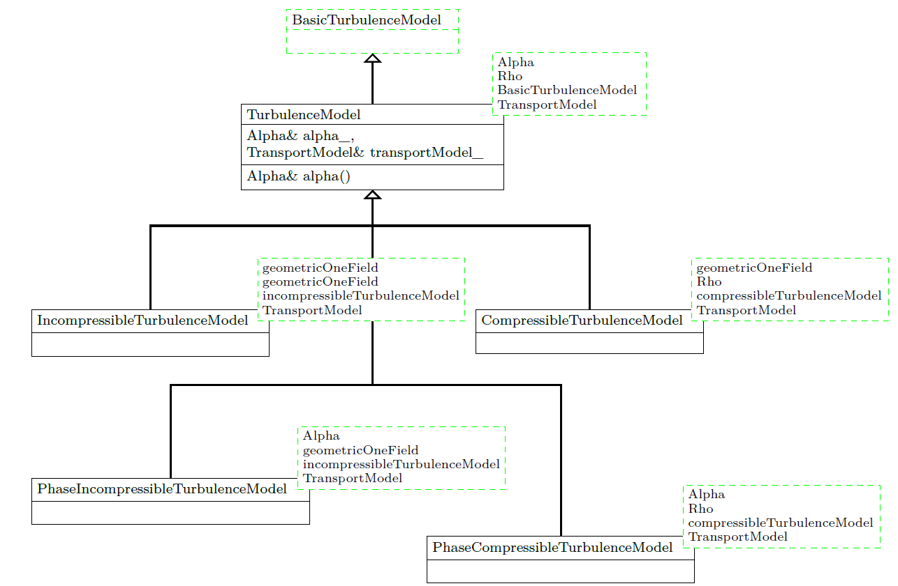
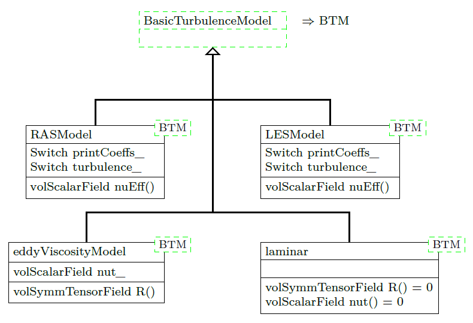
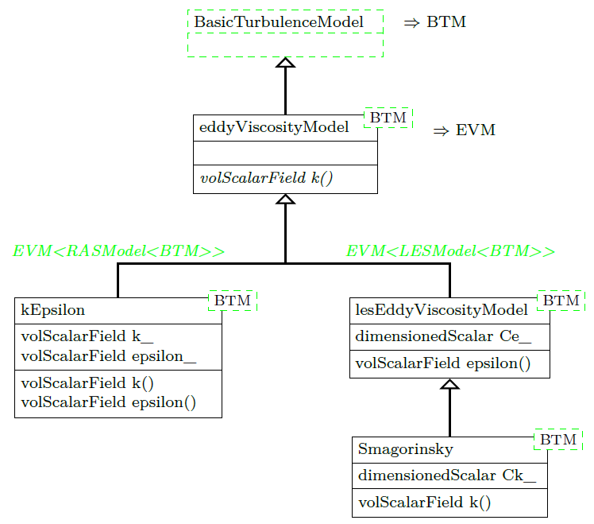

### 32 湍流模型

#### 32.1 组织方式

作者在使用OpenFOAM的这段时间内<sup>79</sup>，湍流模型源代码的组织方式发生了改变。 OpenFOAM-2.3.0<sup>80</sup>的发布推出了一种新的、（甚至）更通用的代码组织方式。

旧方式实质上依靠命名空间和继承来实现通用性和抽象性，新方式则基于模板、继承和从模板的继承。本节将对这两种代码组织方式进行讨论。尤其，新方式中模板被疯狂使用，以致于初看时可能会有代码理解的困难。因此，作者希望能够解开新方式实现功能的谜团。

随着OpenFOAM-3.0的发布，向新湍流模型框架的过渡正式完成<sup>81</sup>。源文件中不再有`$FOAM_SRC/turbulenceModels`的文件夹。因此，对旧方式的讨论仅出于历史意义。然而，作者希望，在这个不断扩展的资料集中，即使其过时的部分也可以为读者提供一些领悟。

##### 32.1.1 旧组织方式

虽说，本节的目的并不是要批评新事物，但旧组织方式更易于理解。您可以在`$FOAM_SRC/turbulenceModels`中对其进行查看。旧湍流模型框架基于命名空间来区分可压缩模型和不可压缩模型。

在该旧框架内，多相求解器要么使用混合物的湍流模型（*multiphaseEulerFoam*或*interFoam*），要么仅在连续相中应用湍流模型（*twoPhaseEulerFoam*）。在旧框架内，仅有一种湍流模型被应用于多相流模拟。

图像76显示了旧湍流模型框架的组织方式。类层次结构在某种程度上是重复的，命名空间`Foam::compressible`和`Foam::incompressible`中的类大致相同或等效。对比命名空间`Foam::compressible`和`Foam::incompressible`中的文件`RASModel.H`和`RASModel.C`发现，代码相同的行数多于不同的行数。

在新湍流模型框架的发布说明书中，甚至用更迫切的方式来阐述了这个问题：

>多年来，我们一直通过使用两个不同的湍流模型框架来解决可压缩性问题，一个用于恒定密度流，另一个用于可变密度流。然而，这两个框架均不适用于多相系统。因为，在守恒形式中，相分数必须包含在湍流方程的所有输运项和源项中。这两个框架中的代码大部分是重复的，这与OpenFOAM代码开发策略不一致。OpenFOAM代码开发策略是最大程度地减少代码重复量，从而提高代码的可维护性和可持续性。如果要把当前的代码架构扩展到多相流动，层次结构的数量将会从两个增加到四个，每个层次结构均是相分数和密度表达形式的两两组合。

\
图像76：旧湍流模型框架的基础类层次结构。命名空间`Foam::incompressible`和`Foam::compressible`分别由红色和蓝色表示。

##### 32.1.2 新组织方式

包含所有湍流模型的新框架位于`$FOAM_SRC/TurbulenceModels`，注意T字母大写<sup>82</sup>。模板的使用是必要的，因为计划在未来该框架将被所有OpenFOAM求解器使用。所有求解器意味着可压缩流和不可压缩流求解器，以及单相流和多相流求解器。这一点很有意义，因为湍流是个通用的概念，它与问题中的特定情况无关。发布说明书很好地解释了这种方式的优点：

>该新框架十分强大，它支持目前为止所有的湍流模型需求。在未来的OpenFOAM版本中，新框架将进一步增强和扩展，以包含多种模型和子模型，并期望能取代现行的湍流模型双重层次结构，从而提高代码的可维护性和可持续性。

新湍流模型框架最初是随着多相求解器的更新而被引入的。在OpenFOAM-2.3.0版本中，仅*twoPhaseEulerFoam*和*DPMFoam*使用该新框架。随时间推移，越来越多的求解器更新后使用新框架取代了旧框架。在撰写本段落时（2015年10月），OpenFOAM-dev存储库中已有数十个求解器完成了移植。

###### 一统天下

每当某个概念化为多种形式出现时<sup>83</sup>，OpenFOAM的开发人员都会牢记住《指环王》中的这句话。单一的湍流模型类就这样被建立起来了，它适用于OpenFOAM所实现的任意物理过程。为此，这个最基本的湍流模型仅包含能被充分抽象化以应用于一切情况的内容。湍流模型的纯粹存在<sup>84</sup>，即是（不依赖于可压缩性或相数这一特征）最简单的例子。

图像77显示了新湍流模型框架的基础类层次结构。除了这种基础的、非模板化的类层次结构以外，还存在实现类的模板化层次结构。基本类所表现的正是抽象化。继承树的顶部是`IOdictionary`类，该类提供输入输出功能。在OpenFOAM的使用中，我们得知有一个控制湍流模型的字典。从`IOdictionary`派生出的湍流模型类就是湍流模型的字典。

`turbulenceModel`类从`IOdictionary`派生而来。注意首字母小写。`turbulenceModel`类不是湍流模型唯一的基类，我们还将遇到首字母大写的类。如前所述，OpenFOAM极度依赖文件系统的大小写敏感性。因此，我们需要对字母大小写多加注意（`turbulenceModel`≠`TurbulenceModel`）。`turbulenceModel`类声明了大量纯虚函数，其后的派生类则不可避免地要给出这些纯虚函数的实现。该类是存在湍流模型这一事实在源代码层面上的体现。到目前为止，除了这是湍流模型外，没有更多关于湍流模型的已知信息。因此，该类的资料匮乏。该类的最重要的数据成员是对运行时对象和对网格的引用。更多信息可以在`$FOAM_SRC/TurbulenceModels/turbulenceModels/turbulenceModel.H`文件中获取。

从`turbulenceModel`类派生出两个子类：`incompressibleTurbulenceModel`和`compressibleTurbulenceModel`。这两个子类的存在体现了以下事实：流动可以是不可压缩的或是可压缩的。这种差别的重要性可以在这两个子类对于密度的处理中看出。在图像77中可见，不可压湍流模型具有密度数据成员`geometryOneField`，相反，可压缩模型则引用了实际的密度场。

\
图像77：新湍流模型框架的基础类层次结构

关于祖先类的一点说明：在旧方法的类层次结构中，见图像76，湍流模型的基类是从`regIObject`派生的。因此，允许通过OpenFOAM的注册表访问湍流模型。

而在这个复杂的新组织方式的类层次结构中，见图像77，所有湍流模型的基类均从`IOdictionary`类派生而来。在57.7节图像133中，可见`IOdictionary`类是从`regIOobject`<sup>85</sup>派生的。从而，湍流模型的基类是间接从`regIOobject`派生的。因此，允许通过OpenFOAM的注册表访问湍流模型。

随着新模型框架祖先列表的增长，这一事实（派生自`regIOobject`）即可从继承树中得出，而仅仅比较图像76和图像77则可能会得出相反的结论。

###### 各自为政

将合适的模板参数传递给基类`TurbulenceModel`，可以区分不可压缩和可压缩湍流模型，以及单相和多相湍流模型。注意`TurbulenceModel`是从模板参数`BasicTurbulenceModel`派生的。在图像78中可见新湍流模型框架的（模板化）类层次结构。该类层次结构通过模板参数`BasicTurbulenceModel`与图像77所示的类相关联，该模板参数可为`incompressibleTurbulenceModel`或`compressibleTurbulenceModel`，注意首字母小写。

通过模板参数`Rho`和`BasicTurbulenceModel`,可以区分不可压缩模型和可压缩模型。在不可压缩模型中，对参数`Rho`传递`geometricOneField`<sup>86</sup>。通过模板参数`Alpha`，可以区分单相模型和多相模型。在单相模型中，对参数`Alpha`传递`geometricOneField`。

`TurbulenceModel`从其模板参数`BasicTurbulenceModel`派生而来，该模板参数可为`incompressibleTurbulenceModel`或`compressibleTurbulenceModel`，而它们又是从公共基类派生的。该方法体现了高级编程语言（如C++）巨大的灵活性。但是，如同在OpenFOAM中所见，模板的存在及其大量而复杂的使用，提高了阅读源代码和理解原理的门槛。

\
图像78：基类`TurbulenceModel`具有四个模板参数，并从它的其中一个模板参数派生而来。注意，四个派生类——湍流模型的四个形式，具有不同的模板参数。

###### 继承树的分支

对于湍流模型，我们有三个基本选择：将流动视为层流、应用RAS湍流模型或应用LES湍流模型。见图像79，该基本选择反映在从模板参数派生的三个类中。由于RAS和LES湍流模型属于湍流模型<sup>87</sup>，所以这两个基本类是从通用模板参数`BasicTurbulenceModel`派生的。上文已经对`BasicTurbulenceModel`的本质进行了讨论。

通过将层流视为一种湍流模型，OpenFOAM的开发人员避免了层流这种特殊情况。在图像79中，`laminar`湍流模型的行为由方法`R()`和`nut()`指示。`laminar`模型对所有湍流特征量返回零值（具有相应的维数）。因此，计算雷诺应力张量的方法`R()`返回一个对称张量的体积场<sup>88</sup>，其分量全为零<sup>89</sup>。图像79在方法名称后附加了（= 0）以表示该行为。

`eddyViscosity`类实现了Boussinesq假设的构想，将在下文进行讨论。

\
图像79：新湍流模型框架中基本湍流模型的类层次结构。注意缩写BTM表示`BasicTurbulenceModel`类。

###### 继承树的延伸

大量湍流模型基于所谓的*Boussinesq假设*建立。该假设通过*涡粘系数*$\mu_t$计算雷诺应力和平均应变率张量，由Boussinesq[11][64]提出。

$$
\mathbf{R} = \mu_t ({\nabla \overline{\mathbf{u}}} + {\nabla \overline{\mathbf{u}}}^T) - \frac{2}{3} \rho \mathbf{I} k
$$
$$
k = \frac{1}{2} \sum_{i} \overline{u^\prime_i u^\prime_i} = \frac{1}{2} \sum_i \overline{\mathbf{u^\prime} \cdot \mathbf{u^\prime}}
$$

物理量$k$为湍流波动的比动能。一大部分文献将$k$称为*湍流动能*[53, 35, 7, 8]，很可能是为了保持词汇简短。单位张量$\mathbf{I}$在文献中常用克罗内克delta函数$\delta_{ij}$表示。

Boussinesq假设为RAS和LES湍流模型所共有。这可以转换成类关系。图80显示了`kEpsilon`和`Smagorinsky`湍流模型的派生过程。由于这两种模型被广泛使用，我们将对其进行讨论。`eddyViscosityModel`类实现了Boussinesq假设的一般思想，因此，它是这两种湍流模型的共同基类。对于LES模型，中间类（`lesEddyViscosityModel`）存在于`eddyViscosityModel`类和实际的湍流模型之间。该中间类用于保存数据，以及使用Boussinesq假设来定义LES模型的特有方法。

通过在`eddyViscosityModel`中插入模板参数，可区分RAS模型和LES模型。在RAS模型中，`eddyViscosityModel`模板参数是`RASModel<BasicTurbulenceModel>`，如`kEpsilon`模型便派生自该模板参数。由于`RASModel`是从`BasicTurbulenceModel`派生的，所以`RASModel`类属于`BasicTurbulenceModel`。因此，该操作是完全可行的。在LES模型中，插入`LESModel<BasicTurbulenceModel>`作为`eddyViscosityModel`的模板参数。

听起来很复杂，可能也的确如此。尽管这样，我们还是要称赞新湍流模型框架的通用性，并忍受所有模板和继承的魔法所引起的精神痛苦。

\
图像80：新湍流模型框架中一些湍流模型的类层次结构。注意缩写BTM表示`BasicTurbulenceModel`类，EVM表示`eddyViscosityModel`类。

`eddyViscosityModel`类中的斜体方法名称表示这是个纯虚函数。该方法必须由`eddyViscosityModel`的派生类实现。`kEpsilon`类直接派生自`eddyViscosityModel`，该类给出了`k()`的实现。`Smagorinsky`类则通过`lesEddyViscosityModel`继承了该纯虚函数。包含纯虚函数的类不可被实例化，因此，`lesEddyViscosityModel`不是可用的湍流模型，而只能作为中介。

#### 32.2 雷诺平均模型（RAS）

##### 32.2.1 kEpsilon模型和低雷诺数流动

标准壁面函数要求`yPlus`值处于某个范围内。如果`yPlus`值超出该范围，模拟结果可能会有误。因此，使用kEpsilon模型时，壁面处网格分辨率具有一个有效上限[19]。当我们要精细地求解壁面及近壁处流动时，例如在求解传热问题时，这将成为一个问题。
对于`yPlus`值过小的情况（即小于标准壁面函数的有效范围下限），则有所谓的*低雷诺数*公式。

###### 壁面函数

OpenFOAM-5.0之后，不再有`epsilon`的低雷诺数壁面函数，其标准公式和低雷诺数公式已被合并为单个壁面函数<sup>89</sup>。然而，在使用低雷诺数模型时，其它的物理场，例如`k`和`nut`，仍需要特殊的壁面函数。

###### 免责声明

第32节的所有后续内容已写成了一段时间。当您阅读本文时，以下小节中的一些内容可能已经过时。

#### 32.3 类别

The desired category of turbulence models can be specified in the file `turbulenceProperties`. There are three possible entries.
选择的湍流模型类别可以在文件`turbulenceProperties`中指定。有三个可选条目。

**laminar** 层流模型

**RASModel** 雷诺平均模型（RAS模型)

**LESModel** *大涡*模型

文件`turbulenceProperties`仅包含一个条目。在大涡模拟中，该条目为：
```
simulationType LESModel ;
```
清单187：*turbulenceProperties*

#### 32.4 RAS模型

文件`turbulenceProperties`中的条目仅指定湍流模型的类。确切的湍流模型在文件`RASProperties`中进行指定。该文件须包含所有必要的参数。
清单272显示了`RASProperty`的内容。该案例使用k-ε模型，并且不需要其他参数。
```
RASModel kEpsilon ;
turbulence on;
printCoeffs on;
```
清单188：*RASProperties*

根据确切的模型，可能需要更多参数。

##### 32.4.1 关键词

**RASModel** 湍流模型的名称。该处亦可选择层流。banana测试（见11.2.1节）提供了一系列可选的模型。
```
--> FOAM FATAL ERROR :
Unknown RASModel type banana
Valid RASModel types :
17
(
LRR
LamBremhorstKE
LaunderGibsonRSTM
LaunderSharmaKE
LienCubicKE
LienCubicKELowRe
LienLeschzinerLowRe
NonlinearKEShih
RNGkEpsilon
SpalartAllmaras
kEpsilon
kOmega
kOmegaSST
kkLOmega
laminar
qZeta
realizableKE
)
```
清单189：*RASProperties*中可选的RAS模型条目

**turbulence** 激活或禁用湍流模型的开关。允许值：*on*/*off*、*true*/*false*或*yes*/*no*。若禁用此开关，则进行层流模拟。不推荐使用这种方法来选择层流模型，参见32.6.1节。

**printCoeffs** 若启用此开关，则求解器将显示所选湍流模型的系数。即使禁用了`turbulence`开关，求解器也会在模拟开始时显示系数，见清单196。仅在选择了`RASModel laminar`时不显示系数。

**可选参数** Some models accept optional parameters to override the default values of the model. Listing 190 shows how the coefficients of the k- model can be overridden. 一些模型允许用可选参数覆盖模型的默认值。清单190显示了如何覆盖k-ε模型的系数。
```
kEpsilonCoeffs
{
Cmu 0.09;
C1 1.44;
C2 1.92;
C3 -0.33;
sigmak 1.0;
sigmaEps 1.11; // Original value :1.44
}
```
清单190：*RASProperties*中的模型参数定义

##### 32.4.2 陷阱：无意义的参数

上一节展示了如何覆盖模型常量的默认值。该过程中有一个隐藏的错误来源。这并非一个实际的错误，但它可能导致徒劳的错误搜索。

如果在`kEpsilonCoeffs`词典中添加无意义的参数，这些参数将被读取和输出。清单191显示了文件`RASProperties`中的`kEpsilonCoeffs`字典。该字典用于覆盖模型常量的默认值。一个无意义的模型常量被添加到了该字典中。

清单192显示了在模拟中使用该字典时的一部分求解器输出。字典的所有常量都被读取并输出。看着就像常量`banana`是湍流模型的一部分。更改该参数不会产生任何结果，这没有错。

出现这种现象的原因是，程序不会检查字典中定义的常量是否有意义。
```
kEpsilonCoeffs
{
Cmu 0.09;
C1 1.44;
C2 1.92;
C3 -0.33;
sigmak 1.0;
sigmaEps 1.11; // Original value :1.44
banana 0.815; // nonsense parameter
}
```
清单191：*RASProperties*中的模型参数定义

```
Selecting RAS turbulence model kEpsilon
kEpsilonCoeffs
{
Cmu 0.09;
C1 1.44;
C2 1.92;
C3 -0.33;
sigmak 1.0;
sigmaEps 1.11;
banana 0.815;
}
Starting time loop
```
清单192：求解器输出

#### 32.5 LES模型

##### 32.5.1 关键词

The keywords turbulence and printCoeffs have the same meaning with LES models. There is also the
possibility – depending on the selected model – of defining optional parameters.

**LESModel** The name of the turbulence model. At this place laminar can also be chosen. The banana test (see
Section 11.2.1) delivers a list of available models. Listing 193 shows the result of such a banana test. The
model dynamicSmagorinsky was loaded from an external library. See Section 11.3.3 for how to include
external libraries.
```
--> FOAM FATAL ERROR : Unknown LESModel type banana
Valid LESModel types :
16
(
DeardorffDiffStress
LRRDiffStress
Smagorinsky
SpalartAllmaras
SpalartAllmarasDDES
SpalartAllmarasIDDES
dynLagrangian
dynOneEqEddy
dynamicSmagorinsky
homogeneousDynOneEqEddy
homogeneousDynSmagorinsky
kOmegaSSTSAS
laminar
mixedSmagorinsky
oneEqEddy
spectEddyVisc
)
```
清单193：*LESProperties*中可选的LES模型条目 

##### 32.5.2 代数子网格模型

Algebraic sub-grid models introduce no further transport equation to the simulation. The turbulent viscosity
is calculated from existing quantities.

##### 32.5.3 动态子网格模型

The dynamic sub-grid models calculate the model constant CS from known quantities instead of prescribing a
fixed value. The way how CS is calculated is determined by the sub-grid model.

##### 32.5.4 一方程模型

A further class of LES turbulence models are one equation models. These models add one further equation to
the problem. Usually, an additional equation for the sub-grid scale turbulent kinetic energy is solved.

#### 32.6 陷阱

##### 32.6.1 层流模拟

As already mentioned – see Section 32.4 – turbulence modelling can be deactivated in a some ways.
In the following, different ways to conduct a laminar simulation are listed. This list applys only to solvers
that utilize the generic turbulence modelling of OpenFOAM:

1. **turbulenceProperties**：`simulationType laminar`
This is the most general way to turn turbulence modelling off. turbulenceProperties controls the generic
turbulence class. The generic turbulence class can take the form of the laminar, RASModel or LESModel
class, see Figure 134. This is controlled by the parameter simulationType.
```
Selecting turbulence model type laminar
```
Listing 194: `simulationType laminar`的求解器输出

2. **RASProperties**：`RASModel laminar`
**LESProperties**:·LESModel laminar·
In this case, a certain turbulence modelling strategy is chosen (RASModel or LESModel). However, there
is a dummy turbulence model for laminar simulation. This dummy turbulence model is derived from the
base class RASModel but it implements a laminar model. See Figure 135. Therefore, RASModel laminar
selects the laminar RAS turbulence model. In this point RASModel and LESModel behave similar.
```
Selecting turbulence model type RASModel
Selecting RAS turbulence model laminar
```
清单195: `RASModel laminar`的求解器输出

3. **RASProperties**：`turbulence off`
The switch turbulence can be used to enable or disable turbulence modelling. When the calculation is
started, the turbulence model specified is used. However, in the source code of the solver, there is the test
whether turbulence modelling is active or not. See Listing 264.
```
Selecting turbulence model type RASModel
Selecting RAS turbulence model kEpsilon
kEpsilonCoeffs
{
Cmu 0.09;
C1 1.44;
C2 1.92;
sigmaEps 1.3;
}
```
清单196：`turbulence off`的求解器输出

**求解器输出**

The last two prossibilities to conduct a laminar simulation can lead to confusion because the solver output
contains word like RASmodel or RAS turbulence model. See Listings 195 and 196. In both cases the simulation
is laminar. In order to avoid this source of confusion, the user should use the parameter simulationType to
perform a laminar calculation.
Independent from all other settings, printCoeffs prints the model constants of the selected turbulence
model. This may also lead to confusion, when e.g. turbulence off is chosen to conduct a laminar simulation.

**Exceptions**
The above explanation only applies to solvers that utilize the generic turbulence models of OpenFOAM. However,
there is no rule without its exceptions.

***simpleFoam*** This solver uses only RAS turbulence models. Therefore, the entries of the file turbulenceProperties
are redundant and the only ways to control turbulence modelling are items 2 and 3 of the list above.

***twoPhaseEulerFoam*** This solver has the k- turbulence model hardcoded. Only item 3 of the list above
applies to this solver. See Section 32.6.2 for a detailled discussion.

***bubbleFoam*** The same as twoPhaseEulerFoam.

***multiphaseEulerFoam*** This solver only uses LES turbulence models. Items 2 and 3 of the list above apply.

##### 32.6.2 *twoPhaseEulerFoam*中的湍流模型

In the solver twoPhaseEulerFoam, the use of the k- turbulence model is hardcoded. This means that the solver
does not use the generic turbulence modelling ususally used by OpenFOAMs solvers. The only choice the user
of twoPhaseEulerFoam has is whether to enable or disable the k- turbulence model.
For this reason, the file constant/turbulenceProperties is not needed any more. This file can savely be
deleted.
Another consequence of the k- turbulence model being hardcoded into twoPhaseEulerFoam is that the
keyword turbulenceProperties in the file RASproperties is also not needed any more. This entry is only
read if the generic turbulence modelling is used and if there is any choice of which RAS-model to use. The
only mandatory keyword in RASproperties is the switch turbulence. This switch is the only way to decide
whether to use turbulence modelling or not with twoPhaseEulerFoam. Solvers which use the generic turbulence
modelling offer three possible ways to disable turbulence modelling, see Section 32.6.1.

##### 32.6.3 使用*twoPhaseEulerFoam*的层流模拟

If twoPhaseEulerFoam is used and a laminar simulation is conducted, then the presence of the files like 0/k or
0/epsilon is mandatory. The solver read this files regardless of the fact, that a laminar simulation is conducted.
This is due to the fact that the use of the k- model is hardcoded into twoPhaseEulerFoam.
Other solvers read this files based on the condition if and which turbulence model is used. Otherwise there
would be the need for all possible files (0/k, 0/epsilon, 0/omega, etc.) to be present in any case, which would
be utter madness.

##### 32.6.4 初始条件和边界条件

All turbulence models can be divided into classes depending on their mathematical properties.

**代数模型** These models add an algebraic equation to the problem. The turbulent viscosity is computed from known quantities using an algebraic equation (e.g. the Baldwin-Lomax model)

**一方程模型** These models introduce an additional transport equation to the problem. The eddy viscosity is computed from this additional quantity (e.g. the Spalart-Allmaras model)

**双方程模型** These models introduce two additional transport equations to the problem. The eddy viscosity is computed from these additional quantities (z.B. k-, k-!)
Every field quantity of a turbulence model needs its initial and boundary conditions. Consequently, there may be the need for additional files in the 0 -directory. One way to find out which files are needed is to look at the tutorials. There, a case may be found which utilises the needed turbulence model.
If a simulation is started and the solver is missing files – i.e. the solver tries to read files which are not present – then OpenFOAM will issue a corresponding error message. Listing 197 shows an error message of a case with a missing 0/k file.
```
Selecting turbulence model type RASModel
Selecting RAS turbulence model kEpsilon
--> FOAM FATAL IO ERROR : cannot find file
file : / home / user / OpenFOAM /user -2.1. x/ run / pisoFoam / cavity /0/ k at line 0.
From function regIOobject :: readStream ()
in file db/ regIOobject / regIOobjectRead .C at line 73.
FOAM exiting
```
清单197：求解器错误信息：文件缺失

##### 32.6.5 附加文件
RAS turbulence models produce additional files. Most RAS models calculate the turbulent viscositiy from
certain quantities. These quantities are usually field quantities and depend on the used turbulence model.
However, the aim of all RAS turbulence models is to calculate the turbulent viscosity. The turbulent viscosity
itself is a field quantity.

Listing 198 shows the folder contents before and after a simulation with pisoFoam. The 0 -directory contains
only the mandatory files, in this case pressure and velocity as well as the turbulent quantities k and .
After the simulation has finished, the 0 -directory contains more files. The reason for creating the *.old files
is not known. However, the turbulence model created the file nut for storing the turbulent viscosity.
The file phi as well as the folder uniform is created by the solver.
```
user@host :~/ OpenFOAM /user -2.1. x/ run / pisoFoam / ras / cavity$ ls
0 constant system
user@host :~/ OpenFOAM /user -2.1. x/ run / pisoFoam / ras / cavity$ ls 0/
epsilon k p U
user@host :~/ OpenFOAM /user -2.1. x/ run / pisoFoam / ras / cavity$ pisoFoam > /dev / null
user@host :~/ OpenFOAM /user -2.1. x/ run / pisoFoam / ras / cavity$ ls
0 0.5 1 constant system
user@host :~/ OpenFOAM /user -2.1. x/ run / pisoFoam / ras / cavity$ ls 0/
epsilon epsilon . old k k. old nut p U
user@host :~/ OpenFOAM /user -2.1. x/ run / pisoFoam / ras / cavity$ ls 0.5/
epsilon k nut p phi U uniform
user@host :~/ OpenFOAM /user -2.1. x/ run / pisoFoam / ras / cavity$
```
清单198：模拟开始和结束时的文件夹内容

The 0 -directories of some tutorial cases may already contain such additional files, e.g. nut. In some cases
the 0-directory may also contain several of such files due to a change in the naming scheme. Listing 199 shows
the contents of the 0 -directory of the pitzDaily tutorial case of simpleFoam. The case has not been run, so the
files nut and nuTilda have not been generated by the solver. None of these two files is necessary to run the
case with the k- turbulence model.
```
epsilon k nut nuTilda p U
```
清单199：*simpleFoam*教程案例*pitzDaily*的*0*文件夹内容

##### 32.6.6 Spalart-Allmaras
The Spalart-Allmaras is a one-equation turbulence model. Although it introduces only one additional equation
to the problem it needs two additional files in the 0-directory. Listing 200 shows the content of the 0 -folder
of the airFoil2D tutorial case of simpleFoam. The files nut and nuTilda are both necessary to run the case.
The former contains the turbulent viscosity and the latter contains the transported quantity of the turbulence
model. Therefore, the rule one additional transport equation entails one additional data file is not violated.
Because the viscosity is not constant it has to be defined in a file in the 0 -directory. And, because the
viscosity is not the transported quantity of the Spalart-Allmaras model another file is added to the 0 -directory.
```
nut nuTilda p U
```
清单200：*simpleFoam*教程案例*airFoil2D*的*0*文件夹内容
