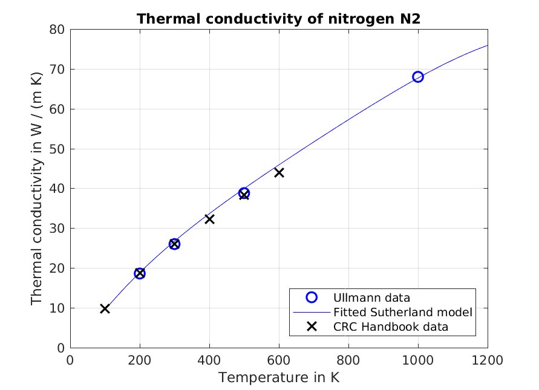
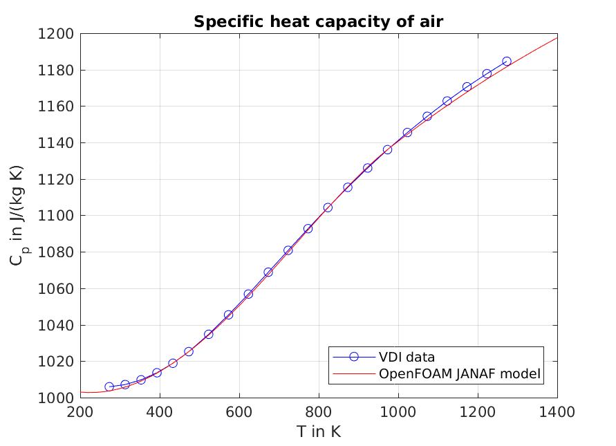
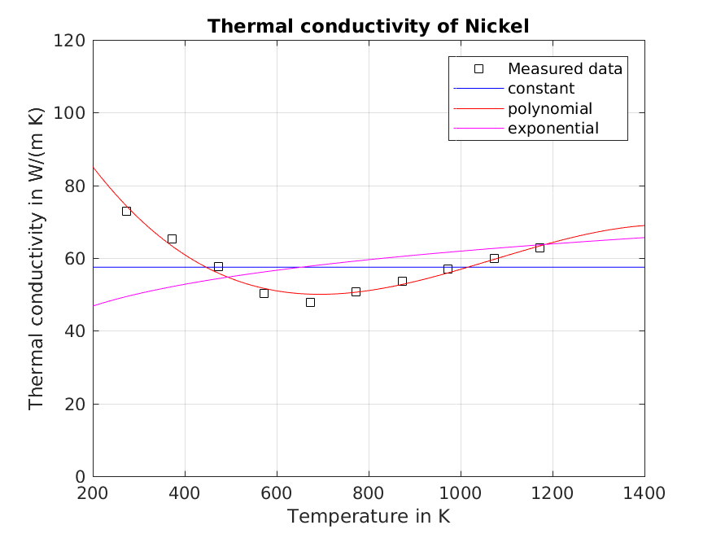
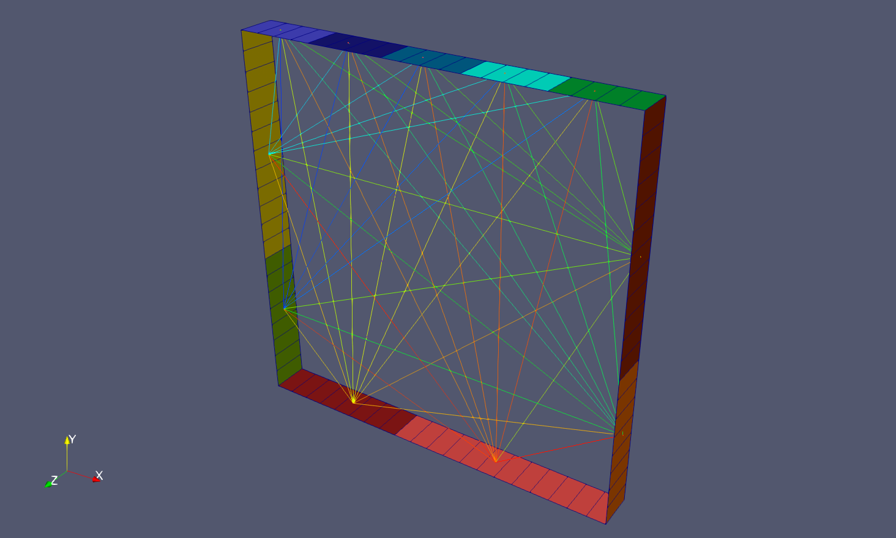
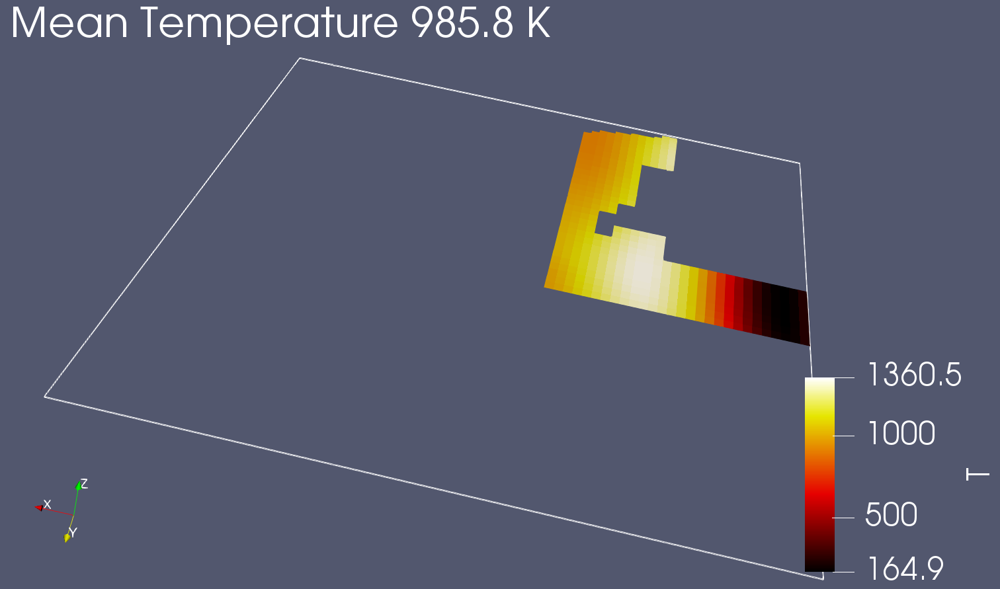

### 32  湍流模型

#### 32.1 组织框架

The way the source for the turbulence models is organized changed over the time<sup>79</sup> the author is dealing with OpenFOAM. With the release of OpenFOAM-2.3.0<sup>80</sup> a new, (even) more general, way of code organisation was rolled out.
作者在使用OpenFOAM的这段时间内，湍流模型源代码的组织框架发生了改变。 随着OpenFOAM-2.3.0的发布<sup>80</sup>，一种新的（甚至更通用的）代码组织框架被推出。

The old way relied essentially on namespaces and inheritance to achieve generality and abstraction. The new way to do stuff is based on templates, inheritance and inheritance from templates. This section discusses both ways of code organisation. Especially the new way – with all its template madness – may lead to difficulties to understand the code at first glances. Thus, the author hopes to be able to shed some light into the mysteries of the new way to do things.
旧框架实质上依赖于命名空间和继承来实现通用性和抽象性。新框架则是基于模板、继承和从模板的继承。本节将对两种代码组织框架进行讨论。 尤其是这种新方法-尽管具有模板疯狂性-乍一看可能会导致难以理解代码。 因此，作者希望能够阐明新的做事方式的奥秘。

With the release of OpenFOAM-3.0, the transition to the new turbulence modelling framework has been completed<sup>81</sup>. There is no $FOAM_SRC/turbulenceModels directory anymore in the sources. Thus, the discussion of the old ways is on its way to be of purely historical interest. However, the author hopes, that even the outdated sections of this ever-growing collection of stuff may provide some insights.
随着OpenFOAM-3.0的发布，已经完成了向新湍流建模框架的过渡<sup>81</sup>。源文件中不再有$FOAM_SRC/turbulenceModels目录。因此，对旧方法的讨论仅出于历史意义。但是，作者希望，即使这个不断增长的资料集的过时部分也可以提供一些见解。

##### 32.1.1 旧框架

Although, this section is not intended as a rant against everything new, the organisation was easier to understand. You can inspect it at $FOAM_SRC/turbulenceModels. The old turbulence modelling framework is based on namespaces to draw the distinction between compressible and incompressible models.
尽管本节并不是要针对所有新内容，但该组织更易于理解。您可以在$FOAM_SRC/turbulenceModels中对其进行检查。旧的湍流建模框架基于名称空间，以区分可压缩模型和不可压缩模型。


The multiphase solvers within this old framework either use a turbulence model on mixture quantities (multiphaseEulerFoam or interFoam), or the turbulence model was applied to the continuous phase only (twoPhaseEulerFoam). Within the old framework, only one turbulence model was applied in multiphase simulations

在这个旧框架内的多相求解器要么使用混合量湍流模型（multiphaseEulerFoam或interFoam），要么仅将湍流模型应用于连续相（twoPhaseEulerFoam）。在旧框架内，多相仿真中仅应用了一种湍流模型

图76显示了旧的湍流建模框架的组织。在每个命名空间中，类层次结构在某种程度上与很大程度上相同或等效的类重复，即Foam :: compressible和Foam :: incompressible。对命名空间Foam :: compressible和Foam :: incompressible中的RASModel.H和RASModel.C文件的比较显示，这些文件共享的行多于不同的行。
Figure 76 shows the organisation of the old turbulence modelling framework. The class hierarchy is duplicated to some degree with largely identical or equivalent classes in each namespace, i.e. Foam::compressible and Foam::incompressible. A comparison of the files RASModel.H and RASModel.C in the namespaces Foam::compressible and Foam::incompressible reveals that these files share more common lines than they have differing lines.

This issue is also addressed in the release notes of the new turbulence framework in even more pressing terms:新湍流框架的发行说明中也以更为紧迫的方式解决了这个问题：

>The issue of compressibility has been managed for many years using two distinct turbulence modelling frameworks, one for constant density flows and another for variable density flows. However, neither framework is appropriate for multiphase systems, in conservative form, for which the phasefraction must be included into all transport and source terms of the turbulence property equations. Code is largely duplicated between the two frameworks, which is inconsistent with the OpenFOAM code development policy to minimise code duplication to promote code maintainablity and sustainability. Extension of the current code architecture to multiphase flows would increase the number of hierarchies from two to four, one for each combination of phase-fraction and density representation.可压缩性问题已经使用两个不同的湍流建模框架进行了多年的管理，一个用于恒定密度流，另一个用于可变密度流。 但是，这两种框架都不适用于保守形式的多相系统，对于该系统，必须将相分数包括在湍流特性方程的所有输运项和源项中。 这两个框架之间的代码大部分是重复的，这与OpenFOAM代码开发策略不一致，该策略无法最大程度地减少代码重复，从而提高代码的可维护性和可持续性。 将当前代码体系结构扩展到多相流将使层次结构的数量从两个增加到四个，每个相分数和密度表示的组合一个。



##### 32.1.2 新方式
The new framework for all turbulence models is located at $FOAM_SRC/TurbulenceModels, notice the capital T<sup>82. The use of templates is necessary, since this framework is meant to be used by all solvers of OpenFOAM at some point of time. All solvers means compressible and incompressible, as well as single- and multiphase. This makes sense, since the concept of turbulence is general, and not related to the specific sitation in question. The advantages of this approach is best said by the release note itself:所有湍流模型的新框架位于$FOAM_SRC/TurbulenceModels，请注意大写字母T <sup> 82。 模板的使用是必要的，因为该框架打算在某个时间点被所有OpenFOAM求解器使用。 所有求解器都意味着可压缩和不可压缩以及单相和多相。 这是有道理的，因为湍流是笼统的概念，与所讨论的特定位点无关。 发行说明本身可以最好地说明这种方法的优点：

>This new framework is very powerful and supports all of the turbulence modelling requirements needed so far. It will be enhanced and extended in future OpenFOAM releases to include a wide range of models and sub-models, with the expectation to replace the current dual hierarchies of turbulence models, to aid code maintainability and sustainability.这个新框架非常强大，并支持到目前为止所需的所有湍流建模要求。 它会在将来的OpenFOAM版本中进行增强和扩展，以包括各种模型和子模型，以期取代现有的湍流模型的双重层次结构，以帮助代码保持可维护性和可持续性。

Initially the new turbulence modelling framework was introduced with an update of the multiphase solvers. In the OpenFOAM-2.3.0 release only twoPhaseEulerFoam and DPMFoam. As time progresses more and more solvers are updated to use the new framework instead of the old. By the time of writing this paragraph (October 2015) dozens of solvers in the OpenFOAM-dev repository were already ported.最初，随着多相求解器的更新，引入了新的湍流建模框架。 在OpenFOAM-2.3.0版本中，仅两个PhaseEulerFoam和DPMFoam。 随着时间的流逝，越来越多的求解器被更新为使用新框架而不是旧框架。 在撰写本段时（2015年10月），已经移植了OpenFOAM-dev存储库中的数十个求解器。

**One to rule them all**

Whenever, a certain concept manifests itself in a variety of incarnations<sup>83, the developers of OpenFOAM take this rough quote from Lord of the Rings by heart. A single turbulence model class was created to be applied to whatever physics OpenFOAM implements. For this to work, this most basic turbulence model contains only the things which can be abstracted enough to apply everything. The most trivial example of this (a feature independent of compressibiltiy or the number of phases involved), is the sheer existence of a turbulence model<sup>84</sup>. 

Figure 77 shows the basic class hierarchy of the new turbulence framework. Besides this basic, non-templated class hierarchy, there is the templated hierarchy of the implementing classes. The basic classes represent the very abstraction. On top of the familiy tree is the class IOdictionary, which provides the IO facilities. From using OpenFOAM, we know, that there is a dictionary controlling the turbulence modelling. By deriving the turbulence model class from IOdictionary, the turbulence model is its dictionary.

From IOdictionary the class turbulenceModel is derived. Note the lower case letter at the beginning. This is not the only base class for turbulence models, we will also encounter a capital letter class. As already mentioned, OpenFOAM makes heavy use of the file system’s case sensitivity. Thus, we need to pay attention to the letter (turbulenceModel 6= TurbulenceModel). The class turbulenceModel declares a large number of pure virtual functions which the derived classes down the family tree inevitably need to implement. This class is the source-code-wise incarnation of the fact that there is a turbulence model. No further information is as of this point known to the turbulence model, except that it is a turbulence model. The data of this class is consequently sparse. The most important data members of this class are references to the run-time object and the mesh. More information can be found in the file $FOAM_SRC/TurbulenceModels/turbulenceModels/turbulenceModel.H. From the class turbulenceModel two classes are derived: incompressibleTurbulenceModel and compressibleTurbulenceModel. These two classes represent the fact, that flow can be considered incompressible or compressible. The consequence of this difference can be seen in the treatment of the density by these two classes. In Figure 77 we see, that the incompressible turbulence model has a geometricOneField as density data member, in contrast to the compressible model, which has a reference to the actual density field.



A little note on ancestry: in the class hierarchy of the ye olden ways, see Figure 76, we saw that the base
classes for the turbulence models, were derived from regIObject. Thus, allowing access to the turbulence model
via OpenFOAM’s registry.

In the class hierarchy of the fancy new order, see Figure 77, we see that the base class for all turbulence
models is derived from the class IOdictionary. In Figure 133, all the way down in Section 57.7, we see that the
class IOdictionary is derived from regIOobject85. Thus, the turbulence model base class is derived indirectly
derived from regIOobject. Thus, allowing access to the turbulence model via OpenFOAM’s registry.

A mere comparison of Figures 76 and 77 might have suggested otherwise, however, as the list of ancestors
got longer for the new modelling framework, this fact (the derivation from regIOobject) has travelled up the
family tree.

**Many to rule the many**

The distinction between incompressible and compressible, as well as, single-phase and multi-phase, turbulence
modelling is made by passing appropriate template parameters to the base class TurbulenceModel. Note that
TurbulenceModel is derived from the template parameter BasicTurbulenceModel. In Figure 78 we see the
(templated) class hierarchy of the new turbulence modelling framework. This class hierarchy is related to the
classes depicted in Figure 77 by the use of the template parameter BasicTurbulenceModel, which is either
incompressibleTurbulenceModel or compressibleTurbulenceModel, note the lower case first letter.

The distinction between incompressible and compressible modelling is made by the template parameters
Rho and BasicTurbulenceModel. In the case of incompressible models a geometricOneField86 is passed for
the parameter Rho. The distinction between single-phase and multi-phase modelling is made by the template
parameter Alpha. In the case of single-phase modelling a geometricOneField is passed.

The approach, that TurbulenceModel is derived from its template parameter BasicTurbulenceModel, which
is either an incompressibleTurbulenceModel or compressibleTurbulenceModel, which in turn are derived
from a common base class, demonstrates the great flexibility a high-level programming language, such as C++.
However, the presence of templates and their heavy, sophisticated use – as demonstrated in OpenFOAM – raises
the bar when it comes to reading the source code and finding out what is happening.



**Branching the family tree**

In turbulence modelling, we can identify three elementary choices: we can treat a fluid flow as laminar, or
apply a RAS or LES turbulence model. This basic choice is reflected in the three classes derived from the
template parameter in Figure 79. Since RAS and LES turbulence models are turbulence models87, those
two base classes are derived from the common template parameter BasicTurbulenceModel. The nature of
BasicTurbulenceModel has been discussed above.

By treating the laminar case as a turbulence model, the OpenFOAM developers got rid of the special case
laminar flow. In Figure 79, the behaviour of the laminar turbulence model is indicated by the methods R()
and nut(). The laminar turbulence returns zero (with the appropriate dimension) for all turbulent quantities.
Thus, the method R(), which computes the Reynolds stress tensor, returns a volumetric88 field of symmetric
tensors will all-zero components89. This behaviour is indicated in Figure 79 with the (= 0) appended to the
method’s names.

The class eddyViscosity is a class which implements the ideas behind the Boussinesq hypothesis, which is
discussed below.



**Further down the family tree**

A great number of turbulence models are based on the so-called Boussinesq hypothesis which computes the Reynolds stresses from an eddy viscosity μt and the mean strain-rate tensor, and was proposed by Boussinesq [11] [64].

$$
\mathbf{R} = \mu_t ({\nabla \overline{\mathbf{u}}} + {\nabla \overline{\mathbf{u}}}^T) - \frac{2}{3} \rho \mathbf{I} k
$$
$$
k = \frac{1}{2} \sum_{i} \overline{u^\prime_i u^\prime_i} = \frac{1}{2} \sum_i \overline{\mathbf{u^\prime} \cdot \mathbf{u^\prime}}
$$

The quantity k is the specific kinetic energy of the turbulent fluctuations. A great part of literature refers
to k as turbulent kinetic energy [53, 35, 7, 8], most probably for reasons of keeping the vocabulary short. The
unit tensor I is often denoted with the Kronecker delta ij in literature.

The Boussinesq hypothesis is common to both RAS and LES turbulence models. This can be translated into
a class relationship. In Figure 80 we see how the kEpsilon and the Smagorinsky turbulence models are derived.
Those two models are discussed since these are widely used. The class eddyViscosityModel implements the
general idea of the Boussinesq hypothesis, thus, it is the common base for both turbulence models. In the case
of LES models, an intermediate class (lesEddyViscosityModel) is in between the class eddyViscosityModel
and the actual turbulence model. This class serves to hold data and define methods specific to LES models
using the Boussinesq hypothesis.

The distinction between RAS models and LES models is made by the template parameter inserted in
eddyViscosityModel. In the case of RAS models, the template parameter of eddyViscosityModel from which
e.g. the kEpsilon model is derived is RASModel<BasicTurbulenceModel>. Since RASModel is derived from
BasicTurbulenceModel, the class RASModel is a BasicTurbulenceModel. Thus, this operation is perfectly
valid. In the case of LES models, LESModel<BasicTurbulenceModel> is inserted as the template parameter of
eddyViscosityModel.

Sounds complicated, which it probably also is. Nevertheless, we admire the versatility of generality of the
new turbulence modelling framework and stomach the mental pain caused by all the template and inheritance
wizardry.



The method signature in italics of the class eddyViscosityModel indicates a pure virtual function. This
method has to be implemented by the classes derived from eddyViscosityModel. In the case of the kEpsilon
class it is the class derived directly from eddyViscosityModel which implements k(). In the case of the
Smagorinsky class, the pure virtual function was inherited via lesEddyViscosityModel. A class containing a
pure virtual function can not be instantiated, thus, there can be no usable turbulence model lesEddyViscosityModel.
This class can only serve as an intermediary.

#### 32.2 Reynolds averaged models (RAS)雷诺平均模型（RAS）
##### 32.2.1 kEpsilon and low-Reynolds flows kEpsilon模型和低雷诺数流动

The standard wall functions require the yPlus value to fall into a certain range. If the yPlus value is outside
of that range, the simulation’s results can become quite wrong. Thus, the use of the kEpsilon model creates an
effective upper limit on the mesh resolution at the walls [19]. This becomes a problem, when we want to finely
resolve the flow at and near the wall, e.g. when solving heat-transfer problems.

For cases, when the yPlus value is too small, i.e. it is smaller than the lower bound of the standard
wall-function’s validity range, there are the so-called low Reynolds formulations.

**Wall functions壁面函数**

From OpenFOAM-5.0 onwards, there are no special low-Reynolds wall-functions for epsilon, as the standard
and low-Reynolds formulation have been merged into a single wall-function90.
However, other fields, such as k and nut, still require special wall-functions when a low-Reynolds model is
used.

**Disclaimer**

Everthing of Section 32 after this point has been created a while ago. The some of the content of the sub-sections
below might be outdated by the time you read this.

#### 32.3 Categories类别

The desired category of turbulence models can be specified in the file turbulenceProperties. There are three
possible entries.

**laminar** 层流模型The flow is modelled laminar
**RASModel** 雷诺平均模型（RAS模型)A Reynolds averaged turbulence model (RAS-model) is used.
**LESModel** 大涡模型Turbulence is modelled by a large-eddy model.

The file turbulenceProperties contains only one entry. In case of a large eddy simulation, this entry reads:
```
simulationType LESModel ;
```
清单187: turbulenceProperties

#### 32.4 RAS-Models RAS模型

The entry in the file turbulenceProperties specifies only the class of turbulence models. The exact turbulence
model is specified in the file RASProperties. This file must contain all necessary parameters.
Listing 272 shows the content of RASProperties. In this case a k- model is used and no further parameters
are necessary.
```
RASModel kEpsilon ;
turbulence on;
printCoeffs on;
```
Listing 188: RASProperties

Depending on the exact model more parameters can be necessary.

##### 32.4.1 Keywords 关键词

**RASModel** The name of the turbulence model. At this place laminar can also be chosen. The banana test
(see Section 11.2.1) delivers a list of available models.
```
--> FOAM FATAL ERROR :
Unknown RASModel type banana
Valid RASModel types :
17
(
LRR
LamBremhorstKE
LaunderGibsonRSTM
LaunderSharmaKE
LienCubicKE
LienCubicKELowRe
LienLeschzinerLowRe
NonlinearKEShih
RNGkEpsilon
SpalartAllmaras
kEpsilon
kOmega
kOmegaSST
kkLOmega
laminar
qZeta
realizableKE
)
```
Listing 189: Possible RAS-model entries in RASProperties

**turbulence** This is a switch to activate or deactivate the turbulence modelling. Allowed values are: on/off,
true/false or yes/no.
If this switch is deactivated, then a laminar simulation is conducted. This way of choosing a laminar
model is not recommended, see Section 32.6.1.
**printCoeffs** If this switch is enabled, then the solver will display the coefficients of the selected turbulence
model.
Even if the switch turbulence is disabled, the solver will display the coefficients at the beginning of the
simulation, see Listing 196. The coefficients are not displayed only when RASModel laminar is chosen.
**optional parameters** Some models accept optional parameters to override the default values of the model.
Listing 190 shows how the coefficients of the k- model can be overridden.
```
kEpsilonCoeffs
{
Cmu 0.09;
C1 1.44;
C2 1.92;
C3 -0.33;
sigmak 1.0;
sigmaEps 1.11; // Original value :1.44
}
```
Listing 190: Definition of model parameters in RASProperties

##### 32.4.2 Pitfall: meaningless Parameters 陷阱：无意义的参数
In the above section it was shown how to override default values of the model constants. In this procedure,
there is one source of error hidden. This is not an actual error, but it can lead to a fruitless search for an error.
If nonsensical parameters are added to the kEpsilonCoeffs dictionary, these will be read and also printed.
Listing 191 shows the kEpsilonCoeffs dictionary of the file RASProperties. This dictionary is used to override
default values of the model constants. A fake model constant has been added to this dictionary.
Listing 192 shows parts of the solver output, when this dictionary is used in a simulation. All constants of
the dictionary are read and printed again. It seems as if the constant banana is part of the turbulence model.
Varying this parameter yields no results, which is no error.
The reason for this behaviour is, there is no check whether the defined constants in the dictionary make
sense or not.
```
kEpsilonCoeffs
{
Cmu 0.09;
C1 1.44;
C2 1.92;
C3 -0.33;
sigmak 1.0;
sigmaEps 1.11; // Original value :1.44
banana 0.815; // nonsense parameter
}
```
Listing 191: Definition of model parameters in RASProperties

```
Selecting RAS turbulence model kEpsilon
kEpsilonCoeffs
{
Cmu 0.09;
C1 1.44;
C2 1.92;
C3 -0.33;
sigmak 1.0;
sigmaEps 1.11;
banana 0.815;
}
Starting time loop
```

#### 32.5 LES-Models LES模型
##### 32.5.1 Keywords 关键词
The keywords turbulence and printCoeffs have the same meaning with LES models. There is also the
possibility – depending on the selected model – of defining optional parameters.
**LESModel** The name of the turbulence model. At this place laminar can also be chosen. The banana test (see
Section 11.2.1) delivers a list of available models. Listing 193 shows the result of such a banana test. The
model dynamicSmagorinsky was loaded from an external library. See Section 11.3.3 for how to include
external libraries.
```
--> FOAM FATAL ERROR : Unknown LESModel type banana
Valid LESModel types :
16
(
DeardorffDiffStress
LRRDiffStress
Smagorinsky
SpalartAllmaras
SpalartAllmarasDDES
SpalartAllmarasIDDES
dynLagrangian
dynOneEqEddy
dynamicSmagorinsky
homogeneousDynOneEqEddy
homogeneousDynSmagorinsky
kOmegaSSTSAS
laminar
mixedSmagorinsky
oneEqEddy
spectEddyVisc
)
```
Listing 193: Possible LES-model entries in LESProperties

##### 32.5.2 Algebraic sub-grid models
Algebraic sub-grid models introduce no further transport equation to the simulation. The turbulent viscosity
is calculated from existing quantities.

##### 32.5.3 Dynamic sub-grid models
The dynamic sub-grid models calculate the model constant CS from known quantities instead of prescribing a
fixed value. The way how CS is calculated is determined by the sub-grid model.

##### 32.5.4 One equation models
A further class of LES turbulence models are one equation models. These models add one further equation to
the problem. Usually, an additional equation for the sub-grid scale turbulent kinetic energy is solved.

#### 32.6 Pitfalls
##### 32.6.1 Laminar Simulation
As already mentioned – see Section 32.4 – turbulence modelling can be deactivated in a some ways.
In the following, different ways to conduct a laminar simulation are listed. This list applys only to solvers
that utilize the generic turbulence modelling of OpenFOAM:

1. turbulenceProperties: simulationType laminar
This is the most general way to turn turbulence modelling off. turbulenceProperties controls the generic
turbulence class. The generic turbulence class can take the form of the laminar, RASModel or LESModel
class, see Figure 134. This is controlled by the parameter simulationType.
Selecting turbulence model type laminar
Listing 194: Solver output for simulationType laminar
2. RASProperties: RASModel laminar
LESProperties: LESModel laminar
In this case, a certain turbulence modelling strategy is chosen (RASModel or LESModel). However, there
is a dummy turbulence model for laminar simulation. This dummy turbulence model is derived from the
base class RASModel but it implements a laminar model. See Figure 135. Therefore, RASModel laminar
selects the laminar RAS turbulence model. In this point RASModel and LESModel behave similar.
Selecting turbulence model type RASModel
Selecting RAS turbulence model laminar
Listing 195: Solver output for RASModel laminar
3. RASProperties: turbulence off
The switch turbulence can be used to enable or disable turbulence modelling. When the calculation is
started, the turbulence model specified is used. However, in the source code of the solver, there is the test
whether turbulence modelling is active or not. See Listing 264.
```
Selecting turbulence model type RASModel
Selecting RAS turbulence model kEpsilon
kEpsilonCoeffs
{
Cmu 0.09;
C1 1.44;
C2 1.92;
sigmaEps 1.3;
}
```
Listing 196: Solver output for turbulence off

**Solver output**

The last two prossibilities to conduct a laminar simulation can lead to confusion because the solver output
contains word like RASmodel or RAS turbulence model. See Listings 195 and 196. In both cases the simulation
is laminar. In order to avoid this source of confusion, the user should use the parameter simulationType to
perform a laminar calculation.
Independent from all other settings, printCoeffs prints the model constants of the selected turbulence
model. This may also lead to confusion, when e.g. turbulence off is chosen to conduct a laminar simulation.

**Exceptions**
The above explanation only applies to solvers that utilize the generic turbulence models of OpenFOAM. However,
there is no rule without its exceptions.

***simpleFoam*** This solver uses only RAS turbulence models. Therefore, the entries of the file turbulenceProperties
are redundant and the only ways to control turbulence modelling are items 2 and 3 of the list above.

***twoPhaseEulerFoam*** This solver has the k- turbulence model hardcoded. Only item 3 of the list above
applies to this solver. See Section 32.6.2 for a detailled discussion.

***bubbleFoam*** The same as twoPhaseEulerFoam.

***multiphaseEulerFoam*** This solver only uses LES turbulence models. Items 2 and 3 of the list above apply.

##### 32.6.2 Turbulence models in twoPhaseEulerFoam
In the solver twoPhaseEulerFoam, the use of the k- turbulence model is hardcoded. This means that the solver
does not use the generic turbulence modelling ususally used by OpenFOAMs solvers. The only choice the user
of twoPhaseEulerFoam has is whether to enable or disable the k- turbulence model.
For this reason, the file constant/turbulenceProperties is not needed any more. This file can savely be
deleted.
Another consequence of the k- turbulence model being hardcoded into twoPhaseEulerFoam is that the
keyword turbulenceProperties in the file RASproperties is also not needed any more. This entry is only
read if the generic turbulence modelling is used and if there is any choice of which RAS-model to use. The
only mandatory keyword in RASproperties is the switch turbulence. This switch is the only way to decide
whether to use turbulence modelling or not with twoPhaseEulerFoam. Solvers which use the generic turbulence
modelling offer three possible ways to disable turbulence modelling, see Section 32.6.1.

##### 32.6.3 Laminar simulation with twoPhaseEulerFoam
If twoPhaseEulerFoam is used and a laminar simulation is conducted, then the presence of the files like 0/k or
0/epsilon is mandatory. The solver read this files regardless of the fact, that a laminar simulation is conducted.
This is due to the fact that the use of the k- model is hardcoded into twoPhaseEulerFoam.
Other solvers read this files based on the condition if and which turbulence model is used. Otherwise there
would be the need for all possible files (0/k, 0/epsilon, 0/omega, etc.) to be present in any case, which would
be utter madness.

##### 32.6.4 Initial and boundary conditions
All turbulence models can be divided into classes depending on their mathematical properties.
**Algebraic models** These models add an algebraic equation to the problem. The turbulent viscosity is computed
from known quantities using an algebraic equation (e.g. the Baldwin-Lomax model)
**One equation models** These models introduce an additional transport equation to the problem. The eddy
viscosity is computed from this additional quantity (e.g. the Spalart-Allmaras model)
**Two equation models** These models introduce two additional transport equations to the problem. The eddy
viscosity is computed from these additional quantities (z.B. k-, k-!)
Every field quantity of a turbulence model needs its initial and boundary conditions. Consequently, there may
be the need for additional files in the 0 -directory. One way to find out which files are needed is to look at the
tutorials. There, a case may be found which utilises the needed turbulence model.
If a simulation is started and the solver is missing files – i.e. the solver tries to read files which are not
present – then OpenFOAM will issue a corresponding error message. Listing 197 shows an error message of a
case with a missing 0/k file.
```
Selecting turbulence model type RASModel
Selecting RAS turbulence model kEpsilon
--> FOAM FATAL IO ERROR : cannot find file
file : / home / user / OpenFOAM /user -2.1. x/ run / pisoFoam / cavity /0/ k at line 0.
From function regIOobject :: readStream ()
in file db/ regIOobject / regIOobjectRead .C at line 73.
FOAM exiting
```
Listing 197: Solver error message: missing file

##### 32.6.5 Additional files
RAS turbulence models produce additional files. Most RAS models calculate the turbulent viscositiy from
certain quantities. These quantities are usually field quantities and depend on the used turbulence model.
However, the aim of all RAS turbulence models is to calculate the turbulent viscosity. The turbulent viscosity
itself is a field quantity.

Listing 198 shows the folder contents before and after a simulation with pisoFoam. The 0 -directory contains
only the mandatory files, in this case pressure and velocity as well as the turbulent quantities k and .
After the simulation has finished, the 0 -directory contains more files. The reason for creating the *.old files
is not known. However, the turbulence model created the file nut for storing the turbulent viscosity.
The file phi as well as the folder uniform is created by the solver.
```
user@host :/ OpenFOAM /user -2.1. x/ run / pisoFoam / ras / cavity$ ls
0 constant system
user@host :/ OpenFOAM /user -2.1. x/ run / pisoFoam / ras / cavity$ ls 0/
epsilon k p U
user@host :/ OpenFOAM /user -2.1. x/ run / pisoFoam / ras / cavity$ pisoFoam > /dev / null
user@host :/ OpenFOAM /user -2.1. x/ run / pisoFoam / ras / cavity$ ls
0 0.5 1 constant system
user@host :/ OpenFOAM /user -2.1. x/ run / pisoFoam / ras / cavity$ ls 0/
epsilon epsilon . old k k. old nut p U
user@host :/ OpenFOAM /user -2.1. x/ run / pisoFoam / ras / cavity$ ls 0.5/
epsilon k nut p phi U uniform
user@host :/ OpenFOAM /user -2.1. x/ run / pisoFoam / ras / cavity$
```
Listing 198: Folder contents at the begin and the end of a simulation

The 0 -directories of some tutorial cases may already contain such additional files, e.g. nut. In some cases
the 0-directory may also contain several of such files due to a change in the naming scheme. Listing 199 shows
the contents of the 0 -directory of the pitzDaily tutorial case of simpleFoam. The case has not been run, so the
files nut and nuTilda have not been generated by the solver. None of these two files is necessary to run the
case with the k- turbulence model.
```
epsilon k nut nuTilda p U
```
Listing 199: The content of the 0 -directory of the pitzDaily tutorial case of simpleFoam

##### 32.6.6 Spalart-Allmaras
The Spalart-Allmaras is a one-equation turbulence model. Although it introduces only one additional equation
to the problem it needs two additional files in the 0-directory. Listing 200 shows the content of the 0 -folder
of the airFoil2D tutorial case of simpleFoam. The files nut and nuTilda are both necessary to run the case.
The former contains the turbulent viscosity and the latter contains the transported quantity of the turbulence
model. Therefore, the rule one additional transport equation entails one additional data file is not violated.
Because the viscosity is not constant it has to be defined in a file in the 0 -directory. And, because the
viscosity is not the transported quantity of the Spalart-Allmaras model another file is added to the 0 -directory.
```
nut nuTilda p U
```
Listing 200: The content of the 0 -directory of the airFoil2D tutorial case of simpleFoam