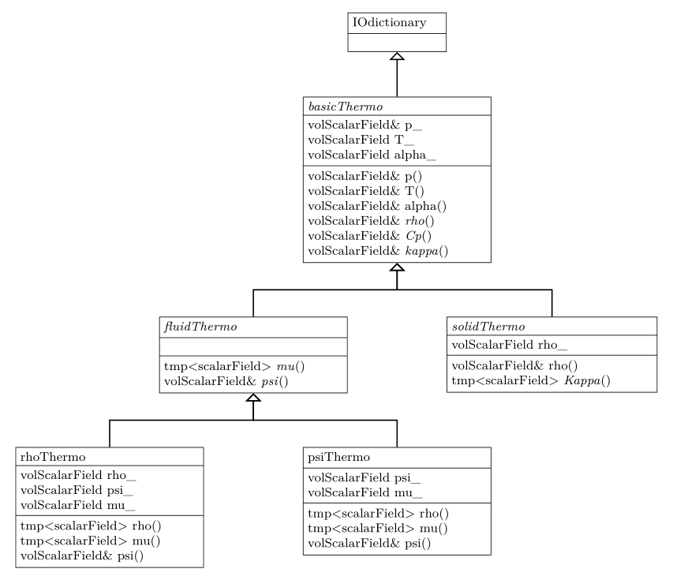
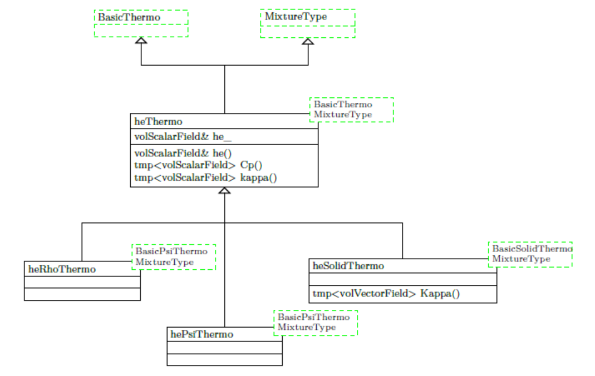
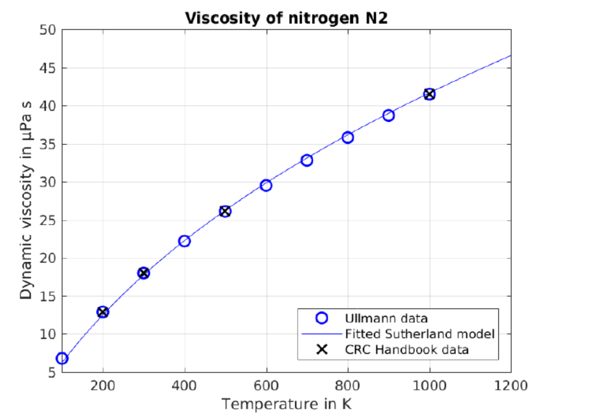
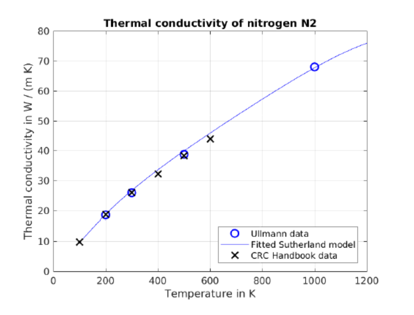
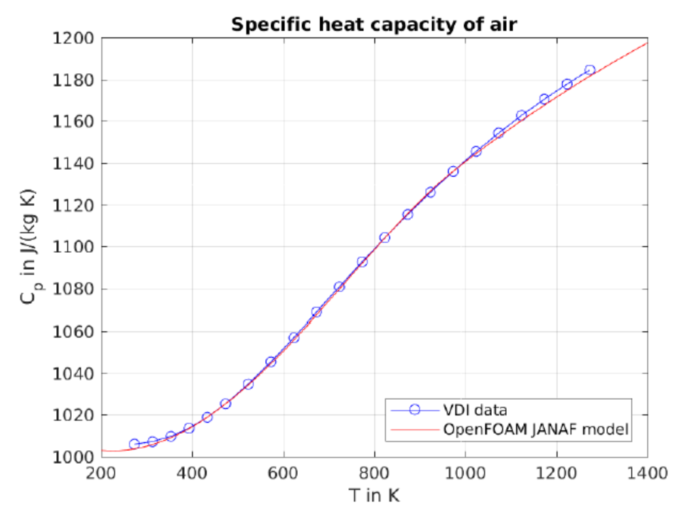
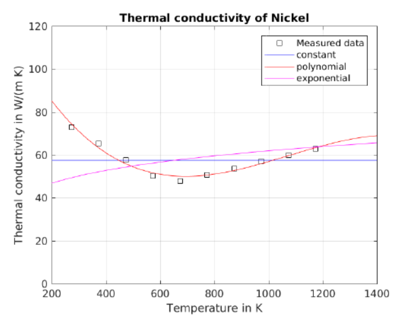

### **33  热物理模型**
&emsp;&emsp;OpenFOAM可以选择很多模型来解释流体的热物理性质，从常数物性到复杂模型。虽然官方指南([cfd.direct/openfoam/user-guide/thermophysical/](http://cfd.direct/openfoam/user-guide/thermophysical/))对模型总结做得很好，但我觉得还是有必要分享一些我对这个主题的见解。
#### **33.1  模型框架**
&emsp;&emsp;就像完全模板化的湍流模型框架，热物理模型框架也是重度模板化。通过检查**OpenFOAM-1.1**源代码（这是作者所拥有源代码中的最早版本），发现这似乎一直都是这样设计的。然而，随着时间的推移，为了适应更多的模型，框架得到了扩展；而且框架更细致，例如该框架现在也适应固体热物理模型。
##### **33.1.1 基类**
&emsp;&emsp;与湍流模型框架类似，有一个基类层次结构和一个类模板的层次结构。图81显示了热物理模型框架基类的类层次结构。\
&emsp;&emsp;最上面的是类**basicThermo**，它仅从**IOdictionary**派生。**basicThermo**代表所有**OpenFOAM**热物理模型的最基本共同特性。这个类保存了一个压力场的引用，而且包含温度场以及层流热扩散系数。

<div align='center'>

\
图81：OpenFOAM-7中热物理建模框架基础的类层次。
</div>

&emsp;&emsp;接下来派生的类是**fluidThermo**和**solidThermo**。**solidThermo**类仅由**basicTherm**类派生，它包含一个密度场。**solidThermo**类将从**basicThermo**提供的导热系数**kappa**（）扩展为各向异性导热系数**Kappa**()。各向异性热传导是只有固体才具有的性质。\
&emsp;&emsp;另一方面，类**fluidThermo**也派生自类**compressibleTransportModel**，它没有在图81中显示。
**fluidThermo**没有自己的数据成员，但是它提供了与流体相关的方法，例如粘度的使用。\
&emsp;&emsp;从**fluidThermo**出发，推导出两个类**rhoThermo**和**psiThermo**，分别模拟了基于密度和基于可压缩的热力学性质。\
&emsp;&emsp;本节中讨论的类是基类，因为**OpenFOAM**的求解器使用这些类。参见清单201和202，其中创建了热物理模型，并用于访问温度场。
```
Info<< "Reading thermophysical properties\n" << endl;

autoPtr<rhoThermo> pThermo(rhoThermo::New(mesh));
rhoThermo& thermo = pThermo();
thermo.validate(args.executable(), "h", "e");

volScalarField rho
(
    I0object
    (
        "rho",
        runTime.timeName(),
        mesh,
        IOobject:: NO_READ,
        IOobject::NO_WRITE
    ),
    thermo.rho()
);

volScalarField& p= thermo.p();
```
清单201：*buoyantPimpleFoam*的**createFields.H**文件的摘录。注意热物理模型的创建和使用。

```
// Initialise solid field pointer lists
PtrList<solidThermo> thermos (solidRegions.size ());

// Populate solid field pointer lists
forAll (solidRegions, i)
{
    Info<< "*** Reading solid mesh thermophysical properties for region "
        << solidRegions[i].name() << nl < endl;

    Info<< "    Adding to thermos\n" << end1;
    thermos.set(i, solidThermo::New(solidRegions[i]));

    Info<<"     Adding to radiations\n" << endl;
    radiations.set(i, radiationModel::New(thermos[i].T()));
```
清单202：*chtMultiRegionFoam*的**createSolidFields.H**文件的摘录。注意热物理模型的创建和使用。

**一个关于压力场的有趣观察**\
&emsp;&emsp;在清单201中，我们看到求解器对压力场的引用是由热学模型提供的，参见清单的第20行。由于只有basicThermo模型引用了压力场，而**basicThermo**模型将温度场作为一个场，即**basicThermo**“拥有”温度场，而只引用了压力场。因此。由于热物理模型能够在其构建后立即提供压力场，因此我们将注意力转移到热物理模型的基类上。\
&emsp;&emsp;看一下**basicThermo**类的构造函数，压力场似乎需要已经存在，请参见清单203中的第19行。方法**lookupOrConstruct**()强烈地提醒我们**OpenFOAM**的对象注册提供的各种**lookup***()方法，请参阅57.7节。但是，这个类不是这样的:**lookupOrConstruct**()方法是由**basicThermo**类本身提供的，参见清单204。这实际上是处理压力场的一种很优雅的方法。\
&emsp;&emsp;这种方法使得**OpenFOAM**的设计者不必考虑热物理模型中的压力场。例如，在多相求解中，有两个或两个以上的热物理模型被建立。每个阶段一个，第一个热物理模型的构造函数创建压力场，而所有后续的构造函数调用都会导致从对象注册表进行查找。
```
Foam::basicThermo::basicThermo
(
    const fvMesh& mesh,
    const word& phaseName
)
:
    I0dictionary
    (
        IOobject
        (
            phasePropertyName(dictName, phaseName),
            mesh.time().constant(),
            mesh,
            IOoblect::MUST_READ_IF_MODIFIED,
            IOobject::NO_WRITE
        )
    ),
    phaseName_(phaseName),
    p_(lookup0rConstruct(mesh, "p")),
    T_
    (
        IOobject
        (
            phasePropertyName("T"),
            mesh.time().timeName(),
            mesh,
            I0object::MUST_READ,
            IOobject::AUTO_WRITE
        ),
        mesh
    ),
```
清单203：类**basicThermo**的构造函数的摘录。
```
Foam::volScalarField& Foam::basicThermo::lookup0rConstruct
(
    const fvMesh& mesh,
    const char* name
) const
{
    if (!mesh.objectRegistry::found0bject<volScalarField>(name))
    {
        volscalarField* fPtr
        (
            new volScalarField
            (
                IOobject
                (
                    name,
                    mesh.time().timeName(),
                    mesh,
                    IOobject::MUST_READ,
                    IOobject::AUTO_WRITE
                ),
                mesh
            );
            // Transfer ownership of this object to the objectRegistry
            fPtr->store(fPtr);
    }
    return mesh.objectRegistry::lookup0bjectRef<volScalarField>(name);
}
```
清单204：类**basicThermo**的**lookupOrConstruct**()方法。
##### **33.1.2 类模板**
**heThermo**\
热物理模型就是模拟流体或固体随温度变化的行为。在求解器中要充分容纳热物理模型就需要包含能量守恒方程，这意味着我们需要为求解器提供一个能量场。\
&emsp;&emsp;这个能量场既可以是比焓也可以是比内能。使用比焓求解能量守恒方程从**OpenFOAM-1.1**就开始了，内能场从**OpenFOAM-1.6**开始亮相。\
&emsp;&emsp;**OpenFOAm-2.2.0**开始，**heThermo**类开始分别提供比焓和比内能。这是因为它们有一样的物理单位，且紧密关联。

<div align='center'>

\
图82：OpenFOAM-7中热物理建模框架模板化类的类层次。
</div>

&emsp;&emsp;图82显示了围绕**heThermo**类的类层次结构，**heThermo**类满足了流体和固体的热物理建模需要。由于对热能的表征与模拟介质是流体还是固体无关，因此这个类同时为它们服务。\
&emsp;&emsp;如果我们比较图81和82，可以看到类**heThermo**提供了**Cp**()和**kappa**()方法，它们是类**basicThermo**中的抽象方法。此外，类**heSolidThermo**现在提供了方法**Kappa**()，它是**solidThermo**类中的一个抽象方法。
#### **33.2  模型选择**
热物理模型的框架需要我们对七个类别都选择一个模型，参考清单205中的示例。如果您不确定可用选项，只需应用*banana测试*，即输入荒谬值，**OpenFOAM**会告诉你有效的选项。
```
thermoType
{
    type            hePsiThermo;
    mixture         pureMixture;
    transport       sutherland;
    thermo          janaf;
    equation0fState perfectGas;
    specie          specie;
    energy          sensibleInternalEnergy;
}
```
清单205:在**constant**目录中的**thermophysicalProperties**文件中热物理模型的选择。\
&emsp;&emsp;**thermoType**中唯一没有经过*banana test*的条目是关键字specie的条目，因为这是唯一可用的选项。

#### **33.3  输运模型**
输运模型包括流体粘度、导热系数和扩散系数的计算。
##### **33.3.1 const**
constantTransport模型提供常数属性。该模型从其系数字典中读取动态粘度$\mu$和Prandtl数*Pr*。

$$
\kappa=\frac{C_{p} \mu}{Pr}\tag{34}
$$
##### **33.3.2 Sutherland**
Sutherland输运模型由Sutherland公式[58]计算粘度。

**粘度**\
Sutherland公式通过两个模型参数$A{s}$和$T{s}$计算动态粘度$\mu$。

$$
\mu=A_{s}\frac{\sqrt{T}}{1+T_{s}/T}\tag{35}
$$
<div align='center'>

\
图83：氮的动态粘度:将模型系数与[14]中报告的数据进行拟合，并与[2]中报告的值进行比较。
</div>

**热导率**\
对于导热系数，我们使用了修正的Eucken相关[52]，它从粘度和其他性质计算导热系数。这是可以做到的，因为导热系数的温度依赖性与粘度的温度依赖性大致相同[16,21,22]。

$$
\kappa=\mu c_{v}\left(1.32+\frac{1.77 R_{s}}{c_{v}}\right)\tag{36}
$$
&emsp;&emsp;注意(36)中的R是比气体常数。如果我们看一下清单206中的实际源代码，我们可能会认为我们需要通用的气体常数R。然而，事实并非如此。更多信息见第33.6.1节。\
&emsp;&emsp;清单206的第8行中，我们看到Eq.(36)中修改后的Eucken关系式通过C++和OpenFOAM实现。
```
template<class Thermo>
inline Foam:;scalar Foam::sutherlandTransport<Thermo>::kappa
(
    const scalar p, const scalar T
) const
{
    scalar cv_ = this->cv(p, T);
    return mu(p, T)*Cv_*(1.32 + 1.77*this->R()/Cv_);
}
```
清单206:在**sutherlandTransport**类中**kappa**方法。\
&emsp;&emsp;在图84中，我们将Sutherland模型返回的导热系数与文献[14,2]报道的数据进行了比较。对于比热容，我们使用了**JANAF**模型和**OpenFOAM**的氮模型系数，可以在<strong>$FOAM_ETC/thermoData/thermoData</strong>文件中找到。Sutherland模型的值与文献报告数据之间的良好拟合表明了改进的Eucken关系式的有效性。
<div align='center'>

\
图84：氮的热导率:该模型使用与粘度模型相关的改进Eucken，由[14]中报告的粘度数据拟合得到，该模型与[2,14]中报道的热导率值进行了比较。
</div>

**陷阱：标准单位**\
当您为Sutherland模型拟合模型参数时，请确保使用正确的值。**OpenFOAM**通常使用**SI**单位进行所有的计算。因此,对于动态粘度合适的单位是帕斯卡秒**Pa s**。然而，在文献中，我们经常发现动态粘度的值是用微帕斯卡秒$\pmb\mu$**Pa s**$\pmb\mu$**Pa s**表示的。\
&emsp;&emsp;将模型参数与以$\pmb\mu$**Pa s**单位给出的粘度数据进行拟合会导致参数$\pmb{A_{s}}$高达$10^{6}$倍，在拟合模型参数时，请确保使用正确的值。
#### **33.4  thermo**
**thermo**模型处理比热和其他派生属性的计算。
##### **33.4.1  JANAF**
**JANAF**这个名字源于美国陆海空联合热化学工作组，该工作组自20世纪60年代起就发表了许多化合物的热力学性质。我们也发现了对**JANNAF**的引用，这就把**NASA**也带入了缩写。此外，在**JANAE**表下的多项式也被称为*NASA多项式*或*7参数NASA多项式*。\
&emsp;&emsp;在计算机资源受限的时代，特别是内存受限，多项式是使大量实验确定的热力学数据可用来计算的一种非常有效的方法。因此，通过多项式拟合到一个小的、有限数目的多项式系数[13]，大量的数据被减少。此外，在所涉及的计算操作和内存方面，(38)的递归公式被认为是最高效的。\
&emsp;&emsp;**JANAF**模型是OpenFOAM提供的**thermo**模型之一。**JANAF**模型依赖于两组模型系数。当温度低于阈值**Tcommon**时，采用**lowCpCoeffs**;当温度较高时，采用**highCpCoeffs**系数。从数学上讲，**JANAF**模型实现了以下等式:


$$
a=\left\{\begin{array}{ll}
\text { lowCpcoeffs } & T_{\text {low }}<=T<T_{\text {common }} \\
\text { highCpCoeffs } & T_{\text {common }}<=T<=T_{\text {high }}
\end{array}\right.\tag{37}
$$
$$
C_{p}=\left(\left(\left(a_{4} T+a_{3}\right) T+a_{2}\right) T+a_{1}\right) T+a_{0}\tag{38}
$$
**JANAF**模型系数是两组7个系数。使用两个多项式可以覆盖较宽的温度范围。因此，第一个多项式通常覆盖低温区域，200-1000k，而第二个多项式覆盖高温区域，1000-6000 K。这两个多项式被约束以产生**1000 K**的值。此外，低温区域的多项式被*固定*为298.15 K，结合1bar的压力作为标准参考状态。将多项式固定到标准状态可以保证，在标准状态[13]时热力学性质得到精确的再现。\
&emsp;&emsp;一个多项式的前5个系数用于计算比热容$C_{p}$，如上所示。剩余两个系数用于计算焓和熵。在清单207中展示了一个例子：定义**JANAF**模型系数。
```
mixture
{
    thermodynamics
    {
        TloW            200;
        Thigh           6000;
        Tcommon         1000;
        highCpCoeffs    (3.08793 0.00124597 -4.23719е-07 6.74775е-11 -3.97077е-15 -995. 263 5.95961 );
        lowCpCoeffs     (3.6684 -0.000678729 1.65371e-06 -3.29937e-12 -4.66395e-13 -1062.36 3.71583 );
    }
}
```
清单207:在**constant**目录中的**thermophysicalProperties**文件中**JANAF**热物理模型的模型系数。\
在**OpenFOAM**的**etc/thermoData/thermoData**中可以找到大量物种的**JANAF**系数。然而，如果我们想在**OpenFOAM**之外使用**JANAF**模型，例如在**MATLAB/Octave**脚本中，这些系数需要乘以各自种类的特定气体常数。如清单208所示，这是由构造函数自动完成的，参见清单208的第14和15行。
```
template<class EquationOfstate>
Foam::janafThermo <EquationOfState>::janafThermo(const dictionary& dict)
：
    EquationOfState (dict),
    Tlow_(readScalar(dict.subDict("thermodynamics").lookup("Tlow"))),
    Thigh_(readScalar(dict.subDict("thermodynamics").lookup("Thigh"))),
    Tcommon_(readScalar(dict.subDict("thermodynamicg").1ookup("Tcommon"))),
    highCpCoeffs_(dict.subDict("thermodynamics").lookup("highCpCoeffs")),
    lowCpCoeffs_(dict.subDict("thermodynamics").lookup("lowCpCoeffs"))
{
    // Convert coefficients to mass-basis
    for (label coefLabel=0; coefLabel<nCoeffs_ ; coefLabel++)
    {
        highCpCoeffs_[coefLabel] *= this->R();
        lowCpCoeffs_ [coefLabel] *= this->R();
    }
    checkInputData();
}
```
清单208:**janafThermo**类的构造函数\
在图85中，使用**JANAF**模型计算的空气比热容与[62]中的数据进行了比较。
<div align='center'>

\
图85：用**JANAF**模型计算的空气比热容$C_{p}$与文献[62]中的数据进行了比较。
</div>

#### **33.5  状态方程**
状态方程包括流体密度的计算。
##### **33.5.1  rhoConst**
**rhoConst**模型提供了一个恒定的密度。模型从其系数字典中读取密度值。
##### **33.5.2  perfectGas**
该模型采用完全气体模型，从压力和温度这两个状态变量计算密度。这个模型不需要系数字典，因为它使用了流体的三种状态(压力、密度和温度)和比气体常数，这很容易确定。

$$
\rho=\frac{p}{R_{s} T}\tag{39}
$$
**陷阱：零压力**\
在修改算例时，观察到一些相当奇怪的行为。在这个实例中，来自不可压缩算例的文件最终进入可压缩算例，其中将**perfectGas**选择为**equation0fState**。除了由于不可压缩和可压缩情况下压力的不同维度而产生的一个隐现的错误之外，还引发了另一个错误。\
&emsp;&emsp;由于这是不可压缩情况下常见的，内部场的压力值被设置为零。当可压缩求解器启动时，OpenFOAM发布了一个相当神秘的错误消息。
```
Selecting turbulence model type laminar
Selecting laminar stress model Stokes
Creating field dpdt
Creating field kinetic energy K
No MRF models present
No finite volume options present
#0  Foam::error::printStack(Foam::Ostream&) at ??:?
#1  Foam::s1gFpe::sigHandler(int) at ??:?
#2  ? in "/11b/x86_64-1inux-gnu/l1bc.8o. 6
#3  Foam::divide(Foam::Field<double>&, Foam::UList<double> const&, Foam::UList<double> const&) at ??:?
#4  Foam::operator/(Foam::UList<double> const&, Foam::UList<double> const&) at ??:?
#5  ? at ??:?
#6  __libc_start_main in "/11b/x86-64-1inux-gnu/1ibc.so.6"
#7  ? at ??:? Floating point exception (Core dumped)
```
清单209:**rhoPimpleFoam**的一个非常没有信息的错误消息\
&emsp;&emsp;当选择非层流的湍流模型时，错误信息看起来不同。在这种情况下，错误消息的信息量稍微大一些，因为错误发生在湍流模型框架内。如果在那里发生了这样的错误，那么错误消息至少包含发生错误的方法名。\
&emsp;&emsp;在某一时刻，在构建所有必要的模型时，**OpenFOAM**不可避免地要除以密度，在压力为零的情况下，密度为零。在上述情况下，选择层流模型，不需要除以密度。\
&emsp;&emsp;清单209中的错误消息值得注意的一点是，它只包含除数期间发生的一个生成点异常的信息。
#### **33.6  热物理属性**
##### **33.6.1  陷阱：气体常数(s)**
类specie提供了方法**R**()来返回气体常数。
```
//- Gas constant [J/kg/K]
inline scalar R() const;
```
清单210:类**specie**头文件中方法R()的声明
```
inline scalar specie::R() const
{
    return RR/molWeight_;
}
```
清单211:类**specie**头文件中方法R()的实现\
&emsp;&emsp;在清单211中的实现强调了R()方法返回一个指定的气体常数。清单212证实了这一点。
```
//- Universal gas constant (default in [J/Kmol/K])
extern const scalar RR;
```
清单212:在**thermodynamicConstants.H**文件中通用气体常数的声明\
&emsp;&emsp;在这里，对于通用气体常数和比气体常数，**OpenFOAM**没有遵循广泛使用的惯例，将通用气体常数表示为$R$，比气体常数表示为$R_{s}$[48]。
#### **33.7  混合物**
**OpenFOAM**不仅可以处理纯流体，它也可以处理混合物：如一个燃烧求解器对单一气相求解动量和能量的传输，而气相的可以由气体燃料(甲烷)、气态氧化剂(氧气)，气体氧化产品(二氧化碳)和惰性气体(氮气)组成。气相的性质是在逐个网格的基础上评估所有气体物种的混合物得到的。
##### **33.7.1  纯混合物**
对于一个纯流体，一个名为**mixture**的字典包含所有必要子模型的模型定义。
```
mixture
{
    specie
    {
        //
    }
    thermodynamics
    {
        //
    }
    transport
    {
        //
    }
}
```
清单213:对于纯流体的**thermophysicalProperties**文件中的热物理建模的定义
##### **33.7.2  多组分混合物**
**热物理建模**\
使用**multiComponentMixture**模型，我们需要提供一个物种列表，以及每一个物种的热物理模型定义。单独的物种热物理建模定义与纯流体的热物理建模定义遵循相同的模式，见第33.7.1节。
```c++
specie
(
    Ar
    H2
);
Ar
{
    //
}
H2
{
    //
}
```
清单214:对于几种流体混合物的**thermophysicalProperties**文件中热物理建模的定义
**组分**\
**multiComponentMixture**的组成以各组分的质量分数来指定。如果质量分数初始化时都相等，那么用户可以提供一个**Ydefault**场；或每个组分一个质量分数场。在清单214的示例中，一个用户可以将带有组分名称的组分质量分数作为场提供，即**Ar**和**H2**。我们还可以为组分的子集提供特定的质量分数场，在这种情况下**Ydefault**的值应用于其余的组分。\
&emsp;&emsp;在混合物构造时，质量分数被归一化，使得所有质量分数的和等于1。因此，在质量分数域中的值并不一定等于1。\
&emsp;&emsp;混合物的性质是用质量分数计算的，例如，下面我们看到混合物的密度依赖于组分的质量分数和密度。

$$
m_{\operatorname{mix}}=m_{1}+m_{2}\tag{40}
$$
$$
m_{\operatorname{mix}}=\rho_{\operatorname{mix}} V_{C V}\tag{41}
$$
$$
m_{\text {mix }}=\rho_{1} V_{1}+\rho_{2} V_{2}\tag{42}
$$
$$
m_{\operatorname{mix}}=\rho_{\operatorname{mix}}\left(V_{1}+V_{2}\right)\tag{43}
$$
每个物种质量$m_{i}$的关系如下

$$
m_{i}=Y_{i} m_{\operatorname{mix}}=\rho_{i} V_{i}\tag{44}
$$
我们可以推导出混合物密度的关系

$$
m_{\operatorname{mix}}=\rho_{\operatorname{mix}}\left(\frac{Y_{1} m_{\operatorname{mix}}}{\rho_{1}}+\frac{Y_{2} m_{\operatorname{mix}}}{\rho_{2}}\right)\tag{45}
$$
$$
1=\rho_{\operatorname{mix}}\left(\frac{Y_{1}}{\rho_{1}}+\frac{Y_{2}}{\rho_{2}}\right)\tag{46}
$$
$$
\rho_{\mathrm{mix}}=\frac{1}{\frac{Y_{1}}{\rho_{1}}+\frac{Y_{2}}{\rho_{2}}}\tag{47}
$$
#### **33.8  模型的组合**
注意，模型不能随便组合。
##### **33.8.1  多项式模型**
如果你想使用多项式模型，也就是说，粘度等性质是根据温度由多项式计算出来的，那么对于**transport**，**thermo**和**equationOfState**类别就基本上被限制使用多项式模型。清单215显示了涉及多项式模型的所有可能模型组合。这个列表是通过应用*banana test*和过滤**OpenFOAM**的输出来生成的，用于表示**polynomial**的出现，这对于所有的多项式模型都是通用的。\
&emsp;&emsp;有一些组合只涉及到一到两个多项式模型。
```
hePsiThermo pureMixture           polynomial hPolynomial PengRobinsonGas specie sensibleEnthalpy
hePsiThermo pureMixture           polynomial janaf       PengRobinsonGas specie sensibleEnthalpy
heRhoThermo multiComponentMixture polynomial hPolynomial icoPolynomial   specie sensibleEnthalpy
heRhoThermo multiComponentMixture polynomial hPolynomial icoPolynomial   specie sensibleInternalEnergy
heRhoThermo pureMixture           polynomial hPolynomial PengRobinsonGas specie sensibleEnthalpy
heRhoThermo pureMixture           polynomial hPolynomial icoPolynomial   specie sensibleEnthalpy
heRhoThermo pureMixture           polynomial hPolynomial icoPolynomial   specie sensibleInternalEnergy
heRhoThermo pureMixture           polynomial janaf       PengRobinsonGas specie sensibleEnthalpy
heRhoThermo reactingMixture       polynomial hPolynomial icoPolynomial   specie sensibleEnthalpy
heRhoThermo reactingMixture       polynomial hPolynomial icoPolynomial   specie sensibleInternalEnergy
```
清单215:在constant目录中**thermophysicalProperties**文件的热物理模型选择
#### **33.9  固体:热物理建模**
随着共轭传热(**CHT**)模型的引入，对固体热物理模型的需求出现。在**OpenFOAM**中，**CHT**在**OpenFOAM-1.5**和**OpenFOAM-1.6**两个版本中被引入。**OpenFOAM2.0.0**引入了固体的热物理建模。在此版本之前，所有相关的场，例如比热容或热导率，只是从磁盘读取。\
&emsp;&emsp;现有的固体模型是流体模型的一个子集。有些模型可以同时用于流体和固体，而在其他情况下，则有专门用于固体的模型。
##### **33.9.1  transport**
与流体的热物理模型相似，固体的**transport**模型负责提供热导率。然而，不同于流体，没有提供粘度。

**constant**\
**constant**模型是最简单的模型。它只取一个模型参数，即热导率。
```
transport
{
    kappa   57.4781;
}
```
清单216:在**constant**目录**thermophysicalProperties**文件中**constant**输运模型的模型系数

**polynomial**\
**polynomial**模型以多项式系数作为模型参数。
```
transport
{
    kappaCoeffs<8> (127.821 -0.267 2.844e-04 -8.84e-08 -1.3e-08 9.3e-12 -3.6e-15 5.6e-19);
}
```
清单217:在**constant**目录**thermophysicalProperties**文件中**polynomial**输运模型的模型系数

**exponential**\
**exponential**模型需要三个模型参数:常系数$\kappa_{0}$、指数$n_{0}$和参考温度$T_{ref}$。

$$
\kappa=\kappa_{0}\left(\frac{T}{T_{\mathrm{ref}}}\right)^{n_{0}}\tag{48}
$$
```
transport
{
    kappa0   0.166;
    n0       1.6187e-12;
    Tref     0.17385;
}
```
清单218:在**constant**目录**thermophysicalProperties**文件中**exponential**输运模型的模型系数

**constant-anisotrpic**\
固体材料的一种特殊情况是各向异性的特性，例如，纤维复合材料具有独特的二维内部结构，因为它们是由注入树脂的织物层制成的。这可能会导致性能的变化，这取决于我们考虑的是纤维平面上的材料性能还是垂直于纤维平面的材料性能。木材是固体材料表现出各向异性特性的另一个突出例子。\
&emsp;&emsp;**constAnIso**模型允许用户指定热传导性**kappa**为一个向量。
```
transport
{
    kappa   (42.0 48.0 42.0);
}
```
清单219::在**constant**目录**thermophysicalProperties**文件中**constant**输运模型的模型系数\
&emsp;&emsp;除了热导率矢量形式外，用户还必须提供一个坐标系统。这是由于***chtMultiReqionFoam***求解器需要读取坐标系统。当实体的相关局部坐标与仿真域的全局坐标系不对齐时，这是有意义的。

**陷阱：相变**\
有些固体金属会发生相变，其结晶结构会发生变化，例如，当铁被加热时，会从铁素体变成奥氏体。图86显示了镍的导热系数，随着温度的升高而降低，在某一点(其相变)随着温度的升高而升高[27]。\
&emsp;&emsp;从现有的模型。只有**polynomial**模型能够合并图86中所示的那种转换。指数模型只描述了严格单调的增加或减少，而不是从一个到另一个的过渡。
<div align='center'>

\
图86：镍的热导率:来自文献[27]以及可用的**OpenFOAM**拟合模型的数据
</div>

##### **33.9.2  thermo**
与流体的情况类似，**thermo**模型负责提供比热容、熵和各种焓。\
&emsp;&emsp;流体提供的是用焓或内能来表示的模型，与之相反，固体中能量的热动力学模型仅仅是基于焓。

**hConst**\
**hConst**模型提供常数值。它表示比热容$C_{p}$和标准生成焓$H_{f}$。

**hPower**\
**hPower**模型根据方程(49)计算比热容。模型以方程(49)的模型参数和标准焓$H_{f}$作为输入。

$$
C_{p}(T)=c_{0}\left(\frac{T}{T_{\text {ref }}}\right)^{n_{0}}\tag{49}
$$
**hPolynomial**\
**hPolynomial**模型使用用户提供的多项式系数来计算其属性。并以标准生成焓$H_{f}$和标准熵$S_{f}$作为模型参数。
##### **33.9.3  equationOfState**
**rhoConst**\
对于固体的热物理模型，唯一有效的状态方程是**rhoConst**。
##### **33.9.4  energy**
**sensibleEnthalpy**\
对于固体热物理模型的能量输运，唯一有效的模型是**sensibleEnthalpy**。
##### **33.9.5  Model combination**
清单220显示了**OpenFOAM-7**中固体的可用模型。固体模型的选择只是流体模型的一个小子集。
```sh
heSolidThermo multiComponentMixture constIso    hConst      rhoConst specie sensibleEnthalpy
heSolidThermo pureMixture           constAnIso  hConst      rhoConst specie sensibleEnthalpy
heSolidThermo pureMixture           constIso    hConst      rhoConst specie sensibleEnthalpy
heSolidThermo pureMixture           exponential hPower      rhoConst specie sensibleEnthalpy
heSolidThermo pureMixture           polynomial  hPolynomial rhoConst specie sensibleEnthalpy
```
清单220:固体可用的热物理模型；用**chtMultiRegionFoam**求解器的*banana test*确定。