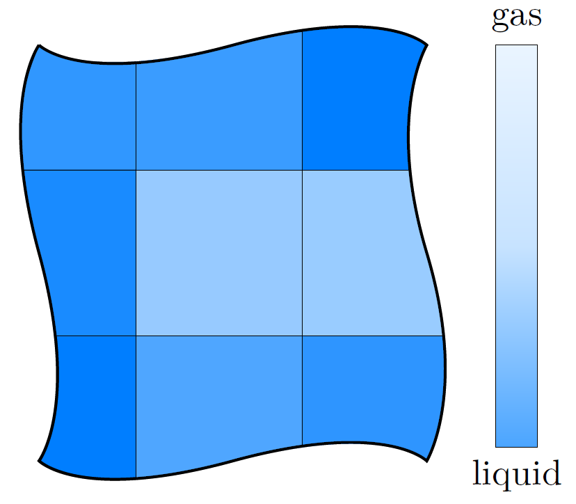

### 35 欧拉多相流模型

在欧拉二相流模型中，尽管其中一相可能由分散相元素（如气泡、液滴或颗粒等）组成，这两相仍均被看成是连续的。在该类模拟中，这两相可被区分为连续相和分散相。这些名称表示其物理状态。然而，在（欧拉）数学描述中，两相皆是连续的。

求解两个动量方程时（每相一个方程），每个相都有自己的速度场。但是，仅存在一个压力场，因此两相压力相同；该规则同样适用于VOF方法。由于须求解两个连续性方程[^99]和两个动量方程，该方法通常被称为*双流体模型*。

多相流的欧拉描述并不局限于两相流，但是，为简单起见，仅对两相流的情况进行讨论。

\
(a) 连续液体中的分散气泡。 

\
(b) 连续介质法。

图像89：建模方法，以气液两相系统为例。

由于分散相元素被看作连续相，其性质取计算域内每个单元的平均值。因此，分散相的性质是分散物质的平均性质。如果所有分散相元素均具有相同的性质（如直径、密度等），则该分散相称为*单分散相*。仅在单分散性的情况下，对单元取平均不会引入额外误差。如果分散相元素性质是变化的（如存在一个直径范围），则该分散相称为*多分散相*。为正确处理多分散性，须对模型进行额外的考虑。

#### 35.1 相模型类

面向对象程序设计的其中一个优势是，源代码中的类结构能反映现实世界事物的性质和关系。

OpenFOAM中各种二相流求解器和多相流求解器的相模型类，即是面向对象程序设计技术的一个应用实例。对于流体力学中的多相问题，我们区分了不同的相。

此处违反了不引用*Wikipedia*的不成文规则。

>*相（物质）是一种物理上独特的物质形态，例如普通物质的固态、液态和气态，也被称为“宏观状态”。*<http://en.wikipedia.org/wiki/Phase>

在流体力学中，相是一个常用术语。当我们希望代码能够尽可能相近地描述现实时，须将相的概念引入到源代码中。从程序设计的角度来看，相的性质（如粘度、速度等）是很容易实现的。相的粘度无非是一个场量，速度则是另一个场量。

面向对象的方法允许将相的概念转化为编程语言。其基本思路是，相具有粘度，也具有速度。我们现在创建一个名为`phaseModel`的类，为符合需要，该类须具有粘度、速度以及相所需的其他一切。

相模型类遵循面向对象程序设计的最佳实践准则：隐藏内部数据，并通过类方法提供访问途径（数据封装，见<http://www.tutorialspoint.com/cplusplus/cpp_data_encapsulation.htm>）。

**不使用相**

OpenFOAM单相求解器（如*simpleFoam*）并不使用相的概念。由于仅须处理一套温度场和速度场，因此相的概念是不需要的。在单相求解器中，相的性质（粘度、速度、密度等）通过考虑的物理关系相互关联，但相的概念是缺失的。

##### 35.1.1 OpenFOAM-2.2中相模型的对比

本节中，我们将对*twoPhaseEulerFoam*和*multiphaseEulerFoam*这两个求解器中相模型类的实现进行比较。

***twoPhaseEulerFoam***

*twoPhaseEulerFoam*-2.2.x中的相模型类收集了相的性质，并提供了访问这些性质的接口。清单225展示了相模型类头文件的摘要。该清单在语法上是正确的，但删除了所有预处理器指令（例如`#include`语句）。此外，为减少行数，删除了大部分注释并调整了格式。清单225的目的是通过实际源代码来展示类的数据成员和方法。

```cpp
namespace Foam
{

class phaseModel
{
    // Private data
        dictionary dict_;
        word name_;
        dimensionedScalar d_;
        dimensionedScalar nu_;
        dimensionedScalar rho_;
        volVectorField U_;
        autoPtr<surfaceScalarField> phiPtr_;

public:
    // Member Functions
        const word& name() const { return name_; }

        const dimensionedScalar& d() const { return d_; }

        const dimensionedScalar& nu() const { return nu_; }

        const dimensionedScalar& rho() const { return rho_; }

        const volVectorField& U() const { return U_; }

        volVectorField& U() { return U_; }

        const surfaceScalarField& phi() const { return phiPtr_(); }

        surfaceScalarField& phi() { return phiPtr_(); }
};

} // End namespace Foam
```
清单225：`phaseModel.H`文件精简版

*twoPhaseEulerFoam*-2.2.x的相模型类包含了不可压缩二相流求解器所需的所有相性质。局限于二相流问题将导致一个重要结果，该求解器则利用了该结果。查看类的成员，可见不存在体积分数场。在二相流问题中，一个体积分数场（`alpha1`）是足够的，因为另一相的体积分数场可即时得出（`alpha2 = 1 - alpha1`）。因此，可以将体积分数与其他的相信息分开处理。

另一缺失的项是压力。大部分二相流或多相流欧拉求解器对所有相假设或使用同一压力场。因此，压力与相无关，可单独处理。

***multiphaseEulerFoam***

*twoPhaseEulerFoam*和*multiphaseEulerFoam*所使用的相模型类的一个差异直接来源于二相流情况下的简化。当要处理任意数量的相时，每个相都必须跟踪其体积分数。因此，体积分数必须包含在相模型中。

直接方法可以是在数据成员中添加另一个引用。由于体积分数场是标量场，因此这是对一个`volScalarField`的引用。*multiphaseEulerFoam*选择了一个更巧妙的方法，展示了另一种面向对象编程技术的应用。

*multiphaseEulerFoam*的相模型类派生自`volScalarField`类。因此，除去其他方面不谈，相模型类其本身还是体积分数场。

清单226展示了*multiphaseEulerFoam*相模型类头文件的精简版。同样，删除了文件的大部分内容，仅保留类的数据成员和方法。

```cpp
namespace Foam
{

class phaseModel
:
    public volScalarField
{
    // Private data
        word name_;
        dictionary phaseDict_;
        dimensionedScalar nu_;
        dimensionedScalar kappa_;
        dimensionedScalar Cp_;
        dimensionedScalar rho_;
        volVectorField U_;
        volVectorField DDtU_;
        surfaceScalarField phiAlpha_;
        autoPtr<surfaceScalarField> phiPtr_;
        autoPtr<diameterModel> dPtr_;

public :

    // Member Functions
        const word& name() const { return name_; }

        const word& keyword() const { return name(); }

        tmp<volScalarField> d() const ;

        const dimensionedScalar& nu() const { return nu_; }

        const dimensionedScalar& kappa() const { return kappa_; }

        const dimensionedScalar& Cp () const { return Cp_; }

        const dimensionedScalar& rho () const { return rho_; }

        const volVectorField& U() const { return U_; }

        volVectorField& U() { return U_; }

        const volVectorField& DDtU() const { return DDtU_; }

        volVectorField& DDtU() { return DDtU_; }

        const surfaceScalarField& phi() const { return phiPtr_(); }

        surfaceScalarField& phi() { return phiPtr_(); }

        const surfaceScalarField& phiAlpha() const { return phiAlpha_; }

        surfaceScalarField& phiAlpha() { return phiAlpha_; }

        void correct();

        bool read(const dictionary& phaseDict);
};

} // End namespace Foam
```
清单226：`phaseModel.H`文件精简版

类关键字和类名后面的语句用于指示类的派生。类名（`phaseModel`）和其基类名（`volScalarField`）用冒号（:）分隔。基类名（`volScalarField`）前缀有可见性说明符（`public`）。这是一个类定义的范例。此处定义的类（`phaseModel`）派生自基类（`volScalarField`）。

```cpp
class phaseModel : public volScalarField
{
    /* some c++ code */
}
```

该示例强调，`phaseModel`类派生自`volScalarField`类。仅该信息并不能证明相模型就是其本身的体积分数场。然而，看一眼实现文件中的构造函数，就很清晰了。

在清单227中可见，构造函数初始化列表中的第一条指令读取对应相的体积分数场。这证明相模型实际上就是它自己的体积分数场。为解释得出该结论的理由，我们尽可能多地参考了涉及继承概念的C++教科书和在线资源，例如<http://www.learncpp.com/cpp-tutorial/114-constructors-and-initialization-of-derived-classes/>和[57]。

```cpp
// * * * * * * * * * * * * * * * * Constructors * * * * * * * * * * * * * * //
Foam::phaseModel::phaseModel
(
    const word& name,
    const dictionary& phaseDict,
    const fvMesh& mesh
)
:
    volScalarField
    (
        IOobject
        (
            " alpha " + name,
            mesh.time().timeName(),
            mesh,
            IOobject::MUST_READ,
            IOobject::AUTO_WRITE
        ),
        mesh
    ),
    name_(name),
    // code continues
```
清单227：相模型构造函数的开头数行。

除了作为其本身的体积分数场，*multiphaseEulerFoam*的相模型类还扩展了几个带有热力学模拟信息的场。

我们还可发现相模型将被赋予更重要作用的雏形。*twoPhaseEulerFoam*的相模型类只是一个信息载体。*multiphaseEulerFoam*的相模型具有一个名为`correct()`的方法。在众多模型中，`correct()`方法被用于每个时间步内执行的操作。然而，在*multiphaseEulerFoam*-2.2.x中，该方法为空。

OpenFOAM-2.1.0之后，`diameterModel`类被引入到了*multiphaseEulerFoam*和*compressibleTwoPhaseEulerFoam*中。*multiphaseEulerFoam*的相模型使用直径模型来跟踪分散相的直径。除了使用恒定直径之外，直径模型还提供了根据热力学参数来计算分散相元素直径的选择。因此，数据成员`dimensionedScalar d_`被直径模型的引用（`autoPtr<diameterModel> dPtr_`）所替代。

##### 35.1.2 OpenFOAM-2.3中相模型的对比

本节将比较两个求解器*twoPhaseEulerFoam*和*multiphaseEulerFoam*中相模型类的实现。

**关于*multiphaseEulerFoam*的解释**

OpenFOAM-2.2.x和OpenFOAM-2.3.x中用于*multiphaseEulerFoam*的相模型类在类的方法和成员上相差无几。清单228显示，*multiphaseEulerFoam*中`phaseModel`类的头文件仅在版权声明上有差别。实现文件则显示出略微更大些的差异[^100]。但是，该类的行为在OpenFOAM-2.2.x和OpenFOAM-2.3.x中几乎是相同的。

```
user@host:~/OpenFOAM$ diff
  OpenFOAM-2.2.x/applications/solvers/multiphase/multiphaseEulerFoam/phaseModel/phaseModel/
    phaseModel.H
  OpenFOAM-2.3.x/applications/solvers/multiphase/multiphaseEulerFoam/multiphaseSystem/
    phaseModel/phaseModel.H
5c5
<     \\  /    A nd           | Copyright (C) 2011 OpenFOAM Foundation
---
>     \\  /    A nd           | Copyright (C) 2011-2013 OpenFOAM Foundation
```
清单228：对于OpenFOAM-2.2.x和截至2014年5月的OpenFOAM-2.3.x版本[^101]中*multiphaseEulerFoam*求解器`phaseModel.H`文件的*diff*输出。

***twoPhaseEulerFoam***

*twoPhaseEulerFoam*-2.3.x的两相流模型大量运用了抽象。相模型类与两相流系统类被结合使用。

```cpp
namespace Foam
{

class phaseModel
:
    public volScalarField,
    public transportModel
{
    // Private data
        const twoPhaseSystem& fluid_;
        word name_;
        dictionary phaseDict_;
        scalar alphaMax_;
        autoPtr<rhoThermo> thermo_;
        volVectorField U_;
        surfaceScalarField alphaPhi_;
        surfaceScalarField alphaRhoPhi_;
        autoPtr<surfaceScalarField> phiPtr_;
        autoPtr<diameterModel> dPtr_;
        autoPtr<PhaseCompressibleTurbulenceModel<phaseModel>> turbulence_;

public:

    // Member Functions
        const word& name() const { return name_; }

        const twoPhaseSystem& fluid() const { return fluid_; }

        const phaseModel& otherPhase() const;

        scalar alphaMax() const { return alphaMax_; }

        tmp<volScalarField> d() const;

        const PhaseCompressibleTurbulenceModel<phaseModel>&
            turbulence() const;

        PhaseCompressibleTurbulenceModel<phaseModel>&
            turbulence();

        const rhoThermo& thermo() const { return thermo_(); }

        rhoThermo& thermo() { return thermo_(); }

        tmp<volScalarField> nu() const { return thermo_−>nu(); }

        tmp<scalarField> nu(const label patchi) const { return thermo_−>nu(patchi); }

        tmp<volScalarField> mu() const { return thermo_−>mu(); }

        tmp<scalarField> mu(const label patchi) const { return thermo_−>mu(patchi); }

        tmp<volScalarField> kappa() const { return thermo_−>kappa(); }

        tmp<volScalarField> Cp() const { return thermo_−>Cp(); }

        const volScalarField& rho() const { return thermo_−>rho(); }

        const volVectorField& U() const { return U_; }

        volVectorField& U() { return U_; }

        const surfaceScalarField& phi() const { return phiPtr_(); }

        surfaceScalarField& phi() { return phiPtr_(); }

        const surfaceScalarField& alphaPhi() const { return alphaPhi_; }

        surfaceScalarField& alphaPhi() { return alphaPhi_; }

        const surfaceScalarField& alphaRhoPhi() const { return alphaRhoPhi_; }

        surfaceScalarField& alphaRhoPhi() { return alphaRhoPhi_; }

        void correct();

        virtual bool read(const dictionary& phaseProperties) ;

        virtual bool read() { return true; }
};

} // End namespace Foam
```
清单229：`phaseModel.H`文件精简版

*twoPhaseEulerFoam*-2.3.x中相模型类的数据成员包含对两相流模型类的引用。这使得相模型类能够获知另一相。数据成员还包含对湍流模型和热物理模型的引用。这是目前为止我们在OpenFOAM多相流求解器中观察到的最大规模的泛化。


#### 35.2 相系统类

在多相流求解器中，我们不仅可以对物理相（例如水）进行抽象，还可以对多相流系统（即所涉及相的整体）进行抽象。同样，*multiphaseEulerFoam*是该想法的先驱。自推出*multiphaseEulerFoam*以来，便存在名为`multiphaseSystem`的类。*twoPhaseEulerFoam*-2.3则引入了`twoPhaseSystem`类。该类最明显的功能是实现相的连续性方程。在两个求解器中，连续性方程的求解都隐藏在`fluid.solve()`函数内。

##### 35.2.1 `twoPhaseSystem`类

现在，我们将对`twoPhaseSystem`类进行详细研究。该类随*twoPhaseEulerFoam*-2.3引入，似乎是`multiphaseSystem`类中引入的想法的延续。我们着重关注`twoPhaseSystem`类，因为自OpenFOAM-2.1到OpenFOAM-2.3，`multiphaseSystem`类实际上并没有发展。头文件和实现文件基本上是相同的。

**相模型**

该类中的两个数据成员为涉及的两个相模型`phase1_`和`phase2_`。该类提供访问这些相模型的方法。还有一种方法为访问另一相。由于仅涉及两个相，因此该操作是可行的。

**相对模型（Phase pair models）**

为了涵盖所有可能的流动情况，动量交换模型成对分开地进行定义，即分散在水中的空气（气泡流）所受阻力，以及分散在空气中的水（液滴流）所受阻力。

`phasePair`类和`orderedPhasePair`类提供了一种优雅的方式以应对该情况。这些相对模型用于将界面动量交换模型相混合。

**动量交换模型**

该类含有界面动量交换模型的成员变量。清单230显示了该类中与动量交换模型相关的成员。模板化类`BlendedInterfacialModel<>`为所有动量交换模型提供其所需的功能。正如类名所示，该类含有混合的功能。该类的模板参数代表任一界面动量交换模型。

```cpp
        //- Drag model
        autoPtr<BlendedInterfacialModel<dragModel> > drag_;
        //- Virtual mass model
        autoPtr<BlendedInterfacialModel<virtualMassModel> > virtualMass_;
        //- Heat transfer model
        autoPtr<BlendedInterfacialModel<heatTransferModel> > heatTransfer_;
        //- Lift model
        autoPtr<BlendedInterfacialModel<liftModel> > lift_;
        //- Wall lubrication model
        autoPtr<BlendedInterfacialModel<wallLubricationModel> > wallLubrication_;
        //- Wall lubrication model
        autoPtr<BlendedInterfacialModel<turbulentDispersionModel> > turbulentDispersion_;
```
清单230：`twoPhaseSystem.H`中`twoPhaseSystem`类的动量交换成员声明

仅动量交换模型本身就很棒了，但我们真正想要的是对动量方程的作用。因此，`twoPhaseSystem`类提供了各个力项或相应系数的访问方法。[45.6](./45.xx.md#456-xx)节展示了这些力项和系数的实际作用。

```cpp
        //- Return the drag coefficient
        tmp<volScalarField> dragCoeff() const;
        //- Return the virtual mass coefficient
        tmp<volScalarField> virtualMassCoeff() const;
        //- Return the heat transfer coefficient
        tmp<volScalarField> heatTransferCoeff() const;
        //- Return the lift force
        tmp<volVectorField> liftForce() const;
        //- Return the wall lubrication force
        tmp<volVectorField> wallLubricationForce() const;
        //- Return the wall lubrication force
        tmp<volVectorField> turbulentDispersionForce() const;
```
清单231：`twoPhaseSystem.H`中`twoPhaseSystem`类的动量交换系数访问方法声明

##### 35.2.2 `multiphaseSystem`类

*multiphaseEulerFoam*求解器采用`multiphaseSystem`类。该类似乎是`twoPhaseSystem`类的前身。

**相对（Phase pair）**

`multiphaseSystem`类声明了一个嵌套类`interfacePair`。嵌套类是在另一类中定义的类。因此，嵌套类对于外部是隐藏的[^102]。相对类用于处理表面张力和阻力。根据定义，表面张力是一组相对的性质。

#### 35.3 湍流模型

##### 35.3.1 建模策略

湍流模型问题可以用下列方式解决。这些方法按其预期计算成本排序。前两种方法计算成本大致相同，而后一种方法在内存和计算时间上绝对是更加昂贵的。但是，每种方法都有其优点和缺点以及适用的算例。

**仅连续相** 该模型求解连续相的湍流特性，并假设连续相和分散相的湍流性质之间存在代数关系。湍流对分散相的影响也可以全部忽略。《Fluent理论指南》[7]中指出：[...] *当次相的浓度极小时，模型适用。在这种情况下，粒子间碰撞可忽略，次相随机运动中的主导过程是主相湍流作用。* 在Fluent中，该方法被称为*分散湍流模型（dispersed turbulence model）*。

**混合物** 该方法对所有相的混合物求解湍流模型，也就是说，在湍流模型中加入混合物速度和混合物密度。每个相的湍流量通过混合物和相应相的密度比计算得出。《Fluent理论指南》[7]对该模型的适用性阐述如下：[...] *当各相分离时，即对于分层（或几乎分层）的多相流，以及各相密度比接近1时，模型适用。*

**分相** 在该情况下，每个相都具有其本身的湍流特性。由于对每个相都要求解额外的输运方程，因此该模型的计算量是最大的。《Fluent理论指南》[7]指出：[...] *当各相之间的湍流传递起主导作用时，模型适用。*

##### 35.3.2 在OpenFOAM中的实现

[32.1](./32.Turbulence_Models.md#321-组织方式)节讨论了湍流模型在OpenFOAM中的实现框架。现在，我们将了解多相湍流和OpenFOAM湍流模型框架。

旧框架（见[32.1.1](./32.Turbulence_Models.md#3211-旧组织方式)节）仅允许使用前两种所述策略，因为多相流求解器仅能采用一种湍流模型。湍流模型通常是求解器中的全局对象，网格以及运行时对象也是如此。

新框架具有更大的灵活性。在欧拉多相流求解器中，湍流模型已被移至相模型内。因此，各相均具有其各自的湍流模型。[35.3.1](#3531-建模策略)节中所讨论的三种建模策略皆可使用。*twoPhaseEulerFoam*在新框架内的湍流模型将在[45.4](./45.xx.md#454-xx)节中进行讨论。

#### 35.4 界面动量交换

动量方程右侧含有两类源项。第一项$\mathbf{F}\_{q,i}$是作用在$q$相上的力密度。第二项为力（密度）系数$K\_{qp,i}$与$q$相和$p$相之间相对速度$\mathbf{u}\_{R} = \mathbf{u}\_{p} − \mathbf{u}\_{q}$的乘积。

OpenFOAM中，界面动量传递模型以返回力或力系数的方式进行实现[^103]。对力和力系数进行区分是为方便起见。跟速度直接成比例的项（如阻力）与跟速度间接成比例的项（如虚拟质量力，它与相对速度的时间导数成正比）在处理方式上可能有差异。直接正比于速度的项，其数值上的处理方式与其他项不同。

由阻力、升力和虚拟质量引起的界面动量传递基于单个气泡上的作用力。当液相的湍流涡旋与大量气泡进行相互作用时，可观察到湍流扩散力。这种相互作用往往会分散气泡群[44]。图像90给出了液相和气相间不同动量交换原理的示意图。

\
(a) 阻力；黑色箭头表示相对速度。

\
(b) 升力

\
(c) 虚质量；紫色箭头表示相对加速度。

\
(d) 湍流扩散

图像90：建模方法，以气液两相系统为例。

#### 35.5 直径模型

如前一节所述，直径模型在某个时候被添加到了多相模型中。自*multiphaseEulerFoam*引入2.1.0版以后，它便提供两个直径模型（恒定和等温）。另一个直径模型则随*twoPhaseEulerFoam*-2.3引入，仅在*twoPhaseEulerFoam*中可用。

<table>
    <tr align="center">
        <th>OpenFOAM</td> 
        <th>Constant, no model</td>
        <th>Constant</td>
        <th>Isothermal</td>
        <th>IATE</td>
    </tr>
    <tbody align="center">
        <tr>
            <th colspan="5"><i>twoPhaseEulerFoam</i></th>    
        </tr>
        <tr>
            <td>2.0.x</td>   <td>x</td>      <td></td>       <td></td>       <td></td>
        </tr>
        <tr>
            <td>2.1.x</td>   <td>x</td>      <td></td>       <td></td>       <td></td>
        </tr>
        <tr>
            <td>2.2.x</td>   <td>x</td>      <td></td>       <td></td>       <td></td>
        </tr>
        <tr>
            <td>2.3.x</td>   <td>x</td>      <td>x</td>      <td>x</td>      <td>x</td>
        </tr>
    </tbody>
    <tbody align="center">
        <tr>
            <th colspan="5"><i>multiphaseEulerFoam</i></th>    
        </tr>
        <tr>
            <td>2.1.x</td>   <td></td>       <td>x</td>      <td>x</td>      <td></td>
        </tr>
        <tr>
            <td>2.2.x</td>   <td></td>       <td>x</td>      <td>x</td>      <td></td>
        </tr>
        <tr>
            <td>2.3.x</td>   <td></td>       <td>x</td>      <td>x</td>      <td></td>
        </tr>
    </tbody>
</table>

表4：欧拉多相流求解器中的直径模型概览

##### 35.5.1 无模型

*twoPhaseEulerFoam*旧版本(≤ 2.2.*x*)不对分散相元素的直径使用模型。在所有这些版本中，相直径均为`dimensionedScalar`类型的标量，从`transportProperties`字典中读取。

##### 35.5.2 恒定直径

在可变直径的框架中，`constantDiameter`直径模型是恒定直径的实现。

在内部，直径仍然是一个标量，从`phaseProperties`或`transportProperties`中读取。但是，相模型将直径作为场量返回。清单232显示了`volScalarField`的返回。私有变量`d_`的类型为`dimensionedScalar`。

```cpp
Foam::tmp<Foam::volScalarField>
Foam::diameterModels::constant::d()
const
{
    return tmp<Foam::volScalarField>
    (
        new volScalarField
        (
            IOobject
            (
                "d",
                phase_.U().time().timeName(),
                phase_.U().mesh()
            ),
            phase_.U().mesh(),
            d_
        )
    );
}
```
清单232：对`constantDiameter`中的直径进行访问。

##### 35.5.3 等温模型

气泡直径随环境压力的变化而变化。`isothermalDiameter`模型通过假设等温变化来实现该行为。

通常，使用理想气体定律$\eqref{eq52}$来控制气体状态。

$$
pV = nRT
\tag{52}
\label{eq52}
$$

在等温状态的假设下

$$
pV = const
\tag{53}
\label{eq53}
$$

接下来引入气泡体积

$$
V = \frac{d^{3} \pi}{6}
\tag{54}
\label{eq54}
$$

因此，得到关系式

$$
p\_{1} d^{3}\_{1} \frac{\pi}{6} = p\_{2} d^{3}\_{2} \frac{\pi}{6}
\tag{55}
\label{eq55}
$$

得到等温直径模型

$$
d_{2} = \sqrt[3]{d_1 \frac{p_{1}}{p_{2}}}
\tag{56}
\label{eq56}
$$

对于`isothermalDiameter`模型，用户须指定参考压力和直径。清单233展示了`isothermalDiameter`类的`d()`方法。参考压力`p0_`和直径`d0_`为该类的私有数据成员[^104]。局部直径通过公式$\eqref{eq56}$计算得出（第10行）。

```cpp
Foam::tmp<Foam::volScalarField>
Foam::diameterModels::isothermal::d()
const
{
    const volScalarField& p = phase_.U().db().lookupObject<volScalarField>
    (
        "p"
    );

    return d0_*pow(p0_/p, 1.0/3.0) ;
}
```
清单233：`isothermalDiameter`类的`d()`方法。

##### 35.5.4 IATE

IATE表示界面面积输运方程（interfacial area transport equation）。该模型以[33]为根据。IATE直径模型用于求解界面曲率`kappai_`的输运方程。

>求解相的单位体积界面曲率，而不是单位体积界面面积，以避免由相分数和单位体积界面面积一致性要求导致的稳定性问题。\
`IATE.H`中的类说明

第[64](./64.xx.md#64-xx)节中，我们从[33]中的方程出发，对OpenFOAM使用的控制方程进行了推导。

#### 35.6 热物理模型

对于热物理性质，例如密度、动力粘度和比热容，多相流模拟中的每个相都被指定了各自的一组模型。可用模型的集合在第[33](./33.Thermophysical_modelling.md#33--热物理模型)节中进行讨论。本节重点关注
与多相流模拟相关的热物理模型的使用。

##### 35.6.1 边界条件中热物理性质的使用说明
If we want to specify a massflow boundary condition in a multiphase simulation, we need to specify which density is to be used for computing the velocity BC from the mass flow. Listing 234 shows an example, of how we can specify massflow BCs. Note, the entry rho, which tells OpenFOAM which density to used to compute the actual velocity BC.
如果要在多相流模拟中设定质量流量边界条件，则须明确从质量流量计算速度边界条件时所使用的密度。清单234展示了一个质量流量边界条件设定的例子。注意`rho`条目，OpenFOAM从该项获知用于计算实际速度边界条件的密度。

```
boundaryField
{
    inlet
    {
        type                flowRateInletVelocity;
        massFlowRate        0.2;
        rho                 thermo:rho.air;
        extrapolateProfile  no;
        value uniform       (0 0 0);
    }
    // ...
}
```

清单234：在`U.air`文件中设定质量流量边界条件，此处须指定相-密度。

在多相流求解器中，对密度场的访问通常由相模型类处理。因此，与可压缩单相流求解器（如*rhoPimpleFoam*）不同，多相流求解器不会建立注册的密度场。密度的访问通过相模型的热物理模型来进行，这体现在我们引用相密度的方式，例如指定质量流量边界条件时。

注意，在清单234的第7行中，单冒号（:）被用作分隔符。这可能会与双冒号（::）混淆，双冒号（::）在C++中用于分隔命名空间限定符。但是，在某种意义上这也是一种命名空间，因为前缀`thermo`指示该场量是由热物理模型提供的场量，而不是由求解器管理的场量（如 `p`或`U`）。

##### 35.6.2 热物理量后处理的说明

对热物理量进行后处理时，例如输出气体密度场（如清单235所示），[35.6.1](#3561-边界条件中热物理性质的使用说明)节同样适用。此处同样使用单冒号（:）来分隔限定符`thermo`和场量名`rho.air`。使用双冒号或仅使用场量名将会导致错误。

```
writeObjects1
{
    type        writeObjects;
    libs        ("libutilityFunctionObjects.so");
    objects     (
                    thermo:rho.air
                );
    writeOption anyWrite;
}
```
清单235：使用函数对象`writeObjects`将气体密度场写入磁盘