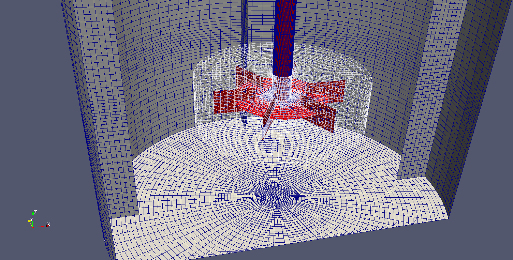
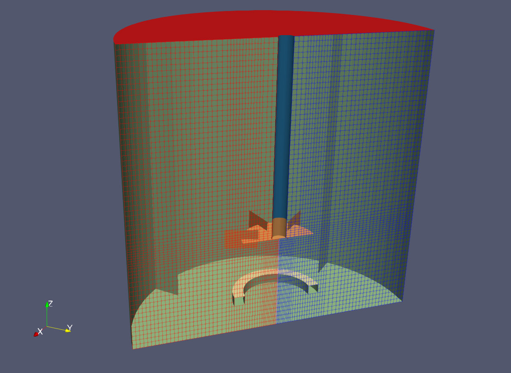

### 38 MRF多参考系模型方法

​	**MRF**方法允许在没有实际旋转网格的情况下模拟旋转机械。通过使用多参考坐标系，可以用静态网格来模拟问题。与动网格模拟相比，尽管这种简化会带来一定的建模误差，但它降低了复杂性和计算更快，同时在全尺度上保证足够的精度，在合适的条件下该方法是合理的。MRF方法的理论背景参见第65节。

#### 38.1用法

​	**MRF**方法应用于单元区。这在**MRFProperties**的字典中通过**cellZone**关键字清楚地表明了这一点，参见列表 243。除了在哪使用**MRF**方法，我们还可以使用**MRF**的***active***关键字启用/禁用它。

​	另一个重要的输入是非旋转面的列表(恰当的名字是**nonRotatingPatches**)，当固体的旋转时， 根据参照系的旋转应用到所有面patches。然而，可能有这种算例，patches在MRF单元区内，实际上它们是静止的，因此可以选择从**MRF**方法的使用中排出单独的patches。

​		最后，在列表243中，指定了旋转参考系性质。这是通过提供旋转轴(**axis**)和空间中的一个点(**origin**)。origin点必须位于旋转轴上。关键字**omega**用于指定旋转速度。

```
zone1
{
	cellZone 	rotor;
	active 		yes;
	// Fixed patches (by default they 'move' with the MRF zone)
    nonRotatingPatches ();
    origin 	(0 0 0);
    axis 	(0 0 1);
    omega 	 table
                2(
                 (0 0.0)
                 (0.75 20.0)
                );
}
```

​        	 表243：在**MRFProperties**字典中为MRF方法指定必要的输入

​		图97显示了一个搅拌槽网格的单元区域。**MRF**方法所在的单元格区域显示为白色线框。请注意，圆柱形的这个区域与旋转轴对齐。

​		如果我们将圆柱体从最底部延伸到最顶部，那么，定子底部到顶部patches需要输入到非旋转patches列表中。



​     图97：带有Rushton叶轮的导流式搅拌槽。定子patches显示为灰色，转子显示为红色。白色线框指转子区域的边界。对于转子区的所有单元采用**MRF**方法


#### 38.2 避免错误

##### 38.2.1 非旋转patches

**周期性任意匹配网格界面(AMI) 和 MRF**

可以发现，AMI型的 patches要添加到非旋转patches列表中,参见37.4.1

**周期性(Cyclic) patches 和MRF**

可以观察到，当使用cyclic型patches时，例如当模拟半个搅拌槽时，如图98，需要将cyclic型patches添加到**MRFProperties**文件中的非旋转patches列表中。



图98：半个Rushton叶轮的导流式搅拌槽，cyclic型patches显示为彩色线框，所有其他的patches显示为彩色面。


