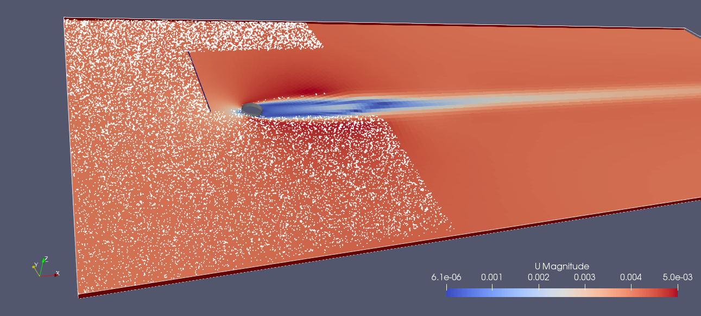

### 40 拉格朗日领域

在OpenFOAM中， 不仅仅可是使用欧拉领域里面的控制体积法（FVM），还有拉格朗日领域也是同样可用的。OpenFOAM所应用的拉格朗日方法涉及的领域包括：

  ·分子动力学

  ·粒子离散方法

  ·喷雾

  ·整体拉格朗日粒子追踪

  ·粒子的化学反应和燃烧

这一章介绍的是拉格朗日粒子追踪中一些普遍的内容。拉格朗日方法背后的基本原理是适用于上面列出的所有模型的，例如，分子和喷雾都是基于particle类的。

 #### 40.1 背景

 ##### 40.1.1 拉格朗日粒子和欧拉流动间的相互作用

拉格朗日粒子和其周围流动（欧拉的）的耦合可以通过它们相互作用的程度来分类。

| 单向      | 双向               | 四向                      |
|---------|------------------|-------------------------|
| 流动作用于粒子 | 流动作用于粒子，粒子也作用于流动 | 流动作用于粒子，粒子作用于流动，粒子间存在碰撞 |
| 如，飘雪    | 如，密集的颗粒流动        | 如，流化床                   |

表格5：拉格朗日粒子和流动（欧拉的）之间耦合程度的分级标准

 **控制相互作用的标准** 

OpenFOAM的拉格朗日模型库可以适应单向、双向和四向的相互作用。

 ##### 40.1.2 粒子追踪

追踪粒子通常有两种方法， _lose-find_  方法和 _face-to-face_ 方法[47,40]。当我们考虑粒子与流场的相互作用时，知道粒子所处的网格是至关重要的。

 _lose-find_ 方法是根据粒子的速度沿着它的轨迹来追踪粒子。然而，粒子处于哪个网格这一信息，在这个过程中是丢失的。因此，该方法被称为 _lose-find_ 。每当我们想知道该粒子所处的网格时，就需要搜寻邻近的网格，直到找到该粒子为止。这种方法可能会带来一些问题[47]。

OpenFOAM所采用的 _face-to-face_ 方法，是追踪粒子到网格表面，然后更新网格信息，并继续追踪粒子[40]。因此，只有在模拟开始时，需要搜索粒子所在位置的网格。在整个模拟过程中，当粒子通过网格表面时网格信息就会更新，因此粒子所处的网格索引是连续更新的。

 **质心追踪** 

随着OpenFOAM-5.0发布，拉格朗日粒子追踪算法被修改为了质心追踪111，可参考相关信息112。质心追踪的应用提高了跟踪算法的鲁棒性。

111https://cfd.direct/openfoam/free-software/barycentric-tracking/
112https://github.com/OpenFOAM/OpenFOAM-dev/commit/371762757dbe3cd38a3841a547a9bc8c1aff0b85

#### 40.2 库


OpenFOAM为实现或使用拉格朗日粒子追踪提供了两种选择。相关的讨论可以在[42]中查看。

 **particle**

在OpenFOAM中，particle类是所有拉格朗日粒子追踪的根源，因为它实现了对粒子本身轨迹（即运动）的追踪。

##### 40.2.1 基础的 solidParticle类

拉格朗日粒子追踪的基础选择是solidParticle类，该类是由particle类派生而来的。solidParticle类在其父类中添加了少量的内容，其中两个附加的数据成员是粒子的直径和速度。soildParticle类中最重要的两个类函数是move()和hitWallPatch()。这两个函数可以实现粒子的拖曳（通过在move()中修改粒子的速度）和壁面相互作用（即撞壁，通过在hitWallPatch()修改粒子的速度）。这对于单向和双向耦合模拟来说已经足够了。


##### 40.2.2 中介的 parcels类
在OpenFOAM中，intermediate 库是拉格朗日粒子追踪中最高度完成化的库113，它在$FOAM_SRC/lagrangian.路径下。这个库包含一些高度模板化的类，这些类提供了一个通用的框架来实现一系列拉格朗日粒子追踪中的附加模型。例如碰撞模型、传热模型和化学反应。这个intermediate库最早是在OpenFOAM-1.5beta发布的114。

particle类依旧是拉格朗日粒子追踪的基础，尽管它隐藏在很多模版层之下，Listing 249和250展示了一个基本的OpenFOAM模版的例子。

```
namespace Foam
{
    typedef ReactingMultiphaseParcel
    <
        ReactingParcel
        <
            ThermoParcle
            <
                KinematicParcle
                <
                    particle
                >
            >
        >

    >basicReactingMultiphaseParcle;

/* the rest of the code ...*/
```

Listing 249: 在basicReactingMultiphaseParcel.H文件中ReactingMultiphaseParcel类的定义。

KinematicParcel类作为一个例子，可以让我们了解在尝试理解C++时所会面临的困难。KinematicParcle 是一个模板类，ParcleType是其模版参数。另外，KinematicParcle也是从它的模版参数PrcleType派生出来的。

因此，KinematicParcle是一个围绕ParcelType建立的模板类，然而它也是一个ParcelType（通过继承）。


```
template<class ParcelType>
class KinematicParcel
:
    public ParcelType
{
public

/* the rest of the code ...*/
```

Listing 250: 在KinematicParcel.H中KinematicParcel类的定义。


为了进一步理解particle是拉格朗日例子追踪最底层的说法，我们来看一下OpenFOAM中intermediate库里面最基础的基于parcel的类。Listing 251展示了basicKinematicParcel类的定义，它被作为一个从particle类传递给模版类KinematicParcle的模版参数。从上面的段落我们知道，这意味着basicKinematicParcle是从particle派生出来的，因此它也是一个particle类。

```
namespace Foam
{
    typedef KinematicParcle<particle> basicKinematicParcle;

    template<>
    inline bool contiguous<basicKinematicParcle>()
    {
        return true;
    }
}
```

Lising 251: 在basicKinematicParcle.H中basicKinematicParcle类的定义。

113$FOAM_SRC/lagrangian/intermediate 事实上是一个库，因为它是一个单独的编译单元，被编译到了$(FOAM_LIBBIN)/liblagrangianIntermediate.
114http://www.openfoam.org/download/version1.5beta.php


#### 40.3 云，包含粒子

在OpenFOAM及其类的布局中，单个粒子和所有粒子的整体是有区别的。粒子相关的类定义了单个粒子的特点和行为。但是拉格朗日求解器是需要对所有粒子求解的。虽然粒子们并不是都相同的，但是求解器不需要去处理这些。为了给求解器提供一个接口，OpenFOAM的开发者想到了云。

云115是一个连接求解器和单独粒子之间的类，它确保命令被传递到云中的所有粒子上。

##### 40.3.1 管理这一切的代码

这一节是OpenFOAM区分大小写的众多例子之一。Cloud类和cloud类是完全不同的内容。当然，Cloud类是从cloud类派生的，因此每一个Cloud类都是一个cloud类，但是，反之则不然。永远记住：大小写很重要。

 **The Cloud** 

描述一个类最好的方法是查看实际定义它的代码。Listing 252 展示了Cloud类是从哪些类派生的。查看继承实际上可以告诉我们，Cloud类是什么，因为一个继承关系是“是一个”关系。如果A是从B派生的，那么A“是一个”B。

从Listing可以看出，Cloud是一个cloud和一个IDLList。这就提出了两个新的问题，什么是一个cloud以及IDLList?


```
template<class ParticleType>
class Cloud
:  
    public cloud,
    public IDLList<ParticleType>
{
    // code
}
```
Listing 252: 在Cloud.H中Cloud的定义

在接下来的段落我们可以看到，来自两个基类的继承就是一个工作分类应用的例子。我们将看到，cloud继承是负责输入和输出（I/O）的，然而 IDLList 是处理形成云的单个粒子的管理。

 **the cloud** 

cloud类是一个类似于网格类的对象注册表116。cloud是从objectRegistry派生的，fvMesh和Time也是。 这使得我们能够通过粒子云注册场。objectRegistry 类是反过来从regIOobject类派生的，regIOobject类又反过来派生自IOobeject。因此，cloud的祖先？允许我们在磁盘117中对粒子云进行读和写。有关I/O和regIOobject类的更详细的讨论，请参阅57.7和57.8小节。

I/O磁盘最常出现在创建或读取场的代码中。通过一个拉格朗日云的祖先？的cloud分支，I/O磁盘通过类似的方法进行控制。如果我们可以把Listing 253的代码嵌入到例如DPMFoam中，在构建KinematicCloud对象之后，那么将拉格朗日数据写入磁盘将会永远被禁用。

```
kinematicCloud.writeOpt() = IOobject::NO_WRITE;
```
Listing 253: 禁止kinematicCloud 写入磁盘

 **The IDLList** 

IDLList 是侵入式双链表。当涉及到对象和数据结构时，编程课往往会教授链表的概念。传统的链表由一个链表类和一个节点类组成。节点类包含一个指针，或者本身就是链表元素。如果节点类是以通用的使用模版的方式实现的，那么一个链表对于所有数据类型都足够了。否则，节点类要具体为链表使用的每个数据类型专门实现。

侵入式链表是链表一种非常高效的实现。但是，实际的布局不同于链表的标准布局Listing118。在插入式链表中，链表元素也用作节点。图99比较了传统链表和插入式链表的布局示意图。


图99：双链表的结构示意图

通常认为，侵入式链表比传统链表更为高效119。使用侵入式链表的一个缺点是，要在列表中使用的数据类型的实现会与列表本身的实现混淆。通常，这(混淆不相关概念的实现)在面向对象设计(OOD)中被认为是一种糟糕的实践。然而，由于性能的提高，侵入式列表被广泛应用于性能优于标准的领域，如电脑游戏或数字运算。

同样，我们可以查看实际的源代码来了解到底发生了什么。图100展示了单链表和侵入式双链表背后的类关系图。这个图实际上是一个很好的例子，说明了C++开发人员通过抽象和封装的方法可以做多少事。SLListBase类和DLListBase类定义了作为单链接和双链接的行为。UILList类和ILLis类差不多是帮助类或者基类。UILList类提供了STL-conforming的迭代器，而ILList类添加了一些成员函数。UILList和LList之为什么是单独的类作者并不知道原因。

对于经典链表（非侵入式链表，无论是单链接还是双链接），从其模版参数LListBase派生的类LList类为具体的非介入链表提供了基类。

图100：

115 不要与云存储、云计算等信息技术(IT)中的“云”混淆
116 事实上，类polyMesh派生自objectRegistry。 fvMesh是由polyMesh派生而来的。求解程序或实用程序中的网格属于fvMesh类的类型。 在你安装的OpenFOAM/include路径下，几乎所有的求解器和应用程序都包含createMesh.H文件。
117 场, 通过 GeometricField 和 DimensionedField 从regIOobject继承的，例如 volScalarField 和其他场。
118 http://www.boost.org/doc/libs/1_43_0/doc/html/intrusive/intrusive_vs_nontrusive.html
119 http://www.boost.org/doc/libs/1_58_0/doc/html/intrusive/performance.html

#### 40.4 云模版

拉格朗日模型的模块化是通过大量的继承和模版实现的。其功能和数据的划分是针对云和粒子本身进行的。这种方法很清楚地表示X类型的粒子需要一个X类型的云向外界提供X的特点（即求解器使用X模型）。更具体地说，如果我们想要求解拉格朗日粒子的热传递，这些粒子本身需要提供合适的数据（温度）和方法（传热），以及云需要提供合适的方法（从粒子到载体相的传热和载体相到粒子的传热）。因此，下面的大多数讨论也适用于粒子。

云和粒子的模版共同建立了一个框架，该框架允许简单地通过结合带有预测功能的模版来创建特定的云和粒子。


##### 40.4.1 基类

 **KinematicCloud** 

这个虚拟抽象类（注意kinematic中的K是小写）指定了模板化类KinematicCloud的行为（注意类名中的大写K）。

 **thermoCloud** 

虚拟抽象类thermoCloud声明了一些抽象方法，即派生类必须实现的方法。

##### 40.4.2 模版

有两种云模版：一种是从基类模版及其模版参数CloudType派生的，另一种是单独从它们的模版参数派生的。在下面的文章中，我们尝试去解释tempest of templates。


 **基类+模版参数** 

此类云模版的一个例子是KinematicCloud类（注意大写K）。这个类是从kinematicCloud（小写K）及其模版参数CloudType派生而来的。基类定义了运动学部分的内容，模版参数允许添加额外的功能。

一个作为模版参数传递的类可以提供数据和方法以及单独的基类。然而，纯抽象方法实际上只能通过单独的基类提供。kinematicCloud（小写k）基类提供了纯虚拟方法nParcles()，它返回粒子包裹的总数。如果是KinematicCloud（大写K）模版类提供了该方法，那么我们就不能实例化basicKinematicCloud，如Listing 256所示, 因为我们不能创建抽象类的对象。

从基类及其模版参数派生云模版的另一个原因是引入选择运行时间的框架的调试机制。Listing 254 展示了基类thermoCloud中的相关示例。这允许debug标志在ThermoCloud类中使用。

```
namespace Foam
{
    defineTypeNameAndDebug(thermoCloud,0);
}
```
Listing 254:在thermoCloud.C的调试机制中引入thermoCloud

 **模版参数** 

类CollidingCloud和MPPICCloud是模板化的云，它们仅从它们的模版参数派生。这两个类都提供了粒子-粒子相互作用的建模。

图101：basicKinematicCloud类的类层次

##### 40.4.3 派生的云

派生的云类实际上是我们在使用的类。最基本的派生云类是basicKinematicCloud，它提供了最小的功能集。如Listing 255所示，basicKinematicCloud是以一个basicKinematicParcel的Cloud作为模版参数121从KinematicCloud模版构建的。拉格朗日模型的双重模版在这里得到了很好的展示。Cloud的模版参数是一个粒子类型basicKinematicParcel。这个粒子类型在Listing256中展示了。basicKinematicParcel是OpenFOAM拉格朗日intermediate库中最基础的粒子类型。

我们注意到，kinematic云是一个描述运动粒子的云。运动学粒子类提供了粒子移动的方法，而运动学云提供了粒子共同移动的方法。这是十分有效的，因为拉格朗日粒子求解器并不作用于单个粒子。


```
namespace Foam{
    typedef KinematicCloud<Cloud<basicKinematicParcel>> basicKinematicCloud;
}
```
Listing 255:在basicKinematicCloud.H文件中basicKinematicCloud的类定义


```
namespace Foam{
    typedef KinematicParcle<particle> basicKinematicParcel;
}
```
Listing 256:在文件basicKinematicParcle.H中basickinematicParcel的类定义。

为了证实上面的声明，即模版让我们可以构建自己定义的拉格朗日模型，我们来看一些派生的云。在Listing 257中有一个云类的定义，它提供了传热的建模。这个类将ThermoCloud模版加入到了已知的KinematicCloud类。结合Listing 258，我们可以看到basicThermoCloud是basicThermoParcels的一个Cloud。同样，云的类型也反映在粒子包裹的类型上。


```
namespace Foam {
    typedef ThermoCloud
    <
        KinematicCloud
        <
            Cloud
            <
                basicThermoParcel
            >
        >
    >basicThermoCloud;
}
```
Listing 257:在basicThermoCloud.H 文件中basicThermoCloud的类定义


```
namespace Foam {
    typedef ThermoParcel <KinematicParcel<particle>> basicThermoParcel;
}
```
Listing 258:在basicThermoParcel.H文件中basicThermoParcel的类定义

120 See https://openfoam.org/release/2-3-0/dpm/
121 读者也许记得，Cloud类有一个模版参数ParticleType

#### 40.5 运行时的后处理

云类提供一些函数来执行运行时的后处理。这些可以在$FOAM_SRC/lagrangian/intermediate/submodels/CloudFunctionObjects中找到。其中云函数对象是计算粒子通过一个确定的面或者计算拉格朗日粒子的体积分数场。有关云函数对象的详细讨论，请参阅40.7.2小节。

#### 40.6 运行的时候

##### 40.6.1 不是错误信息告知的这样？

 **在域外** 

由于OpenFOAM的拉格朗日粒子框架跟踪的是粒子所在的单元格，拉格朗日求解器需要确定每个粒子初始位置的网格标签。OpenFOAM的粒子跟踪算法在[43,40,47] 中有详细描述。

当一个粒子被放置在域外时，即positions文件中的位置在域之外。OpenFOAM就无法找到这个粒子的网格标签。注意，没有找到包含粒子位置信息的网格也可能由其他原因引起，不仅仅是因为它在域外。如Listing 259的错误信息所示，这也可能是由于写入精度不足或域分解或重构的组合造成的。然而，简单地将他们放在域外也是一种可能，特别是当使用脚本创建初始粒子分布时。


```
--> FOAM FATAL ERROR:
    cell, tetFace and tetPt search failure at position (0.0026 0.0026 0.4502)
    for requested cell 0
    If this is a restart of reconstruction/decomposition etc. it is likely that the write 
    precision is not sufficient.
    Either increase 'writePrecision' or set 'writeFormat' to 'binary'

    From function void Foam::particle::initCellFacePt()
    in file /home/user/OpenFOAM/OpenFOAM-2.3.X/src/lagrangian/basic/lnInclude/particleI.H at
    line 758.

FOAM aborting
```
Listing 259:当粒子被定义在域外的拉格朗日模拟开始时，OpenFOAM发出的错误信息；在这种情况下，checkMesh报告一个整体的域边界框(0 0 0)(0.15 0.15 0.45);请注意搜索失败出现的位置（第3行）

#### 40.7 子模型

##### 40.7.1 喷射模型

这是一些插入拉格朗日粒子或者包裹到模拟区域的模型。

 **从基类继承的公用控制参数** 

喷射模型有很多确定常见行为并提供常见数据的基类。常用的控制参数是喷射开始时间（SOI）和入射质量（massTotal）。

 **ManualInjection** 

manualInjection模型可能是最简单的模型。用户只需要提供入射粒子的质量和喷嘴位置。所有粒子包裹都在SOI时喷射。

 **CellZoneInjection** 

cellZoneInjection模型的工作原理和手动注射模型类似。然而，粒子包裹入射位置是由用户提供的cellSet确定的。实际的入射位置在cellSet随机分布。入射的粒子包裹数量由cellSet的网格体积和用户指定的目标粒子包裹密度决定。所有包裹在SOI时立刻全部入射。

 **FieldActivatedInjection** 

fieldActivatedInjection模型也与手动注射模型相关。除了用户提供的入射位置之外，还必须指定一个标量因子以及阈值字段和一个参考场的名称。粒子包裹只在下列关系相关的位置入射：

factor*referenceField[celli]>=thresholdField[celli]

粒子包裹的入射是由从位置文件读取的入射位置控制。所有满足上述条件的位置都是有效的喷射器位置。此外，必须规定每个喷嘴喷射的粒子包裹数量（parcelsPerInjector）。每一个喷嘴注射parcelsPerInjector的粒子数。粒子包裹从SOI开始喷射，直到达到massTotal。

 **PatchInjection** 

patchInjection 模型通过一个面注入粒子包裹，而不是和上面讨论的模型一样通过一个体。该喷射模型实现了拉格朗日粒子的经典入流条件。面上的入射位置是随机选择的，粒子包裹从SOI开始喷射，直到达到massTotal。

##### 40.7.2 云函数对象

与对场的标准函数对象一样，云函数对象是对朗格朗日云的函数对象。从编写时实现的的功能来看，OpenFOAM云函数对象的主要目的是后处理。然而，云函数对象也可以用来积极地影响拉格朗日粒子。

 **PatchPostProcessing** 

此云函数对象可以通过一个特定的面对，所有离开域的粒子进行数据积累。因此，例如，通过这些数据可以生成停留时间分布（RTD）。

 **FacePostProcessing** 

这个云函数对象的作用与PatchPostProcessing云函数对象类似，只是这个作用于设置的面上。

 **VoidFraction** 

该云函数对象可用于创建与粒子相关的体积分数场。因此，VoidFraction这个名字可能会引起误会。

如果我们看一下代码，我们可以清楚地看到粒子的体积分数被计算出来。在Listing 260，我们可以看到这个云函数对象负责计算结果的两种方法。theta场被初始化为0，这在Listing里面没有展现出来。在postMove()方法里，在每个粒子包裹在当前时间步内移动之后调用它，粒子体积就被添加到theta场中。在poseEvolve()方法中，当前时间步完成时在朗格朗日云发展结束后，该方法会被调用，theta场除以网格的体积，即一个每个网格的数值是网格体积的场。

因此，在每个网格中的粒子体积被相加，然后除以网格体积，我们最终得到了粒子的体积分数。


```
template<class CloudType> void Foam::VoidFraction<CloudType>::postMove
(
    // ...
)
{
    volScalarFiedl& theta = thetaPtr_();
    theta[celli] += dt*p.nParticle()*p.volume();
}

template<class CloudType> void Foam::VoidFraction<CloudType>::postEvolve()
{
    volScalarField& theta = thetaPtr_();
    const fvMesh& mesh = this->owner().mesh();
    theta.primitiveFieldRef() /= mesh.time().deltaTValue()*mesh.V();
    CloudFunctionObject<CloudType>::postEvolve();
}
```
Listing 260: VoidFraction.C的两种方法


 **ParticleCollector** 

ParticleCollector 云函数对象可以用于计算遍历一组多边形定义的任意表面，或者由同心圆包围的区域的粒子数。该云函数对象所累计的数据包括粒子的质量和通过表面的质量流率。

计数的粒子可以随意地从模拟中删除。



图102：定义了一组多边形来计数和移除遍历的粒子。在这个圆柱层流绕流的例子中，粒子通过inlet面进入。ParticleCollector云函数对象被设置为移除所有被计数的粒子，在这个图片中可以清楚地看到。