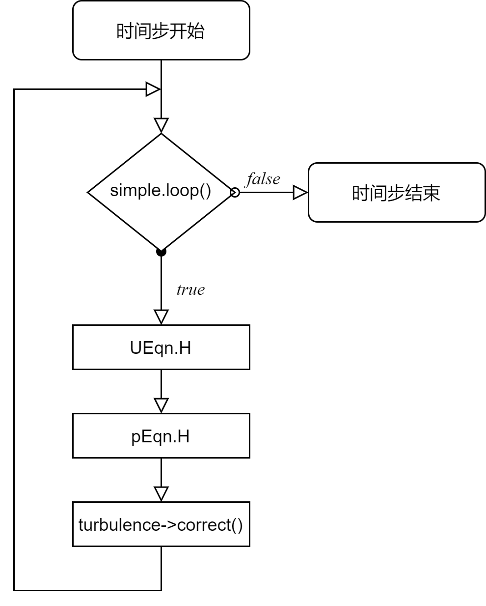

### 41 求解算法

求解纳维斯托克斯方程需要解耦合的速度压力场。 现存几种求解算法能够将方程解耦，来分别计算速度和压力。一种预测-校正策略被用来解耦速度压力的计算。这种方法在许多数值方法的文献中被称为分离求解。\
除了分离求解的方法， 还有一种方法直接求解全耦合-也被称作块耦合-方程系统。一般来说，求解动量方程意味着需要求解三个速度分量方程以及一个由连续方程推导而来的压力方程。除了单独求解这四个离散方程， 全耦合方程组也可以直接被解出来。全耦合求解的方法提供了收敛率提升的可能性，然而，其也会导致更大的内存需求和收敛行为的改变。\
本节将讨论分离求解的方法，因为它是最常用的。 在最后一小节，我们将简要的讨论耦合法。\

#### 41.1 SIMPLE

图 103： SIMPLE算法流程图

图 103 展示了SIMPLE算法流程。 SIMPLE算法先预测速度然后修正压力和速度。这个过程将一直重复，直到满足收敛条件。图103中的标注来源于$\text{simpleFoam}$
   