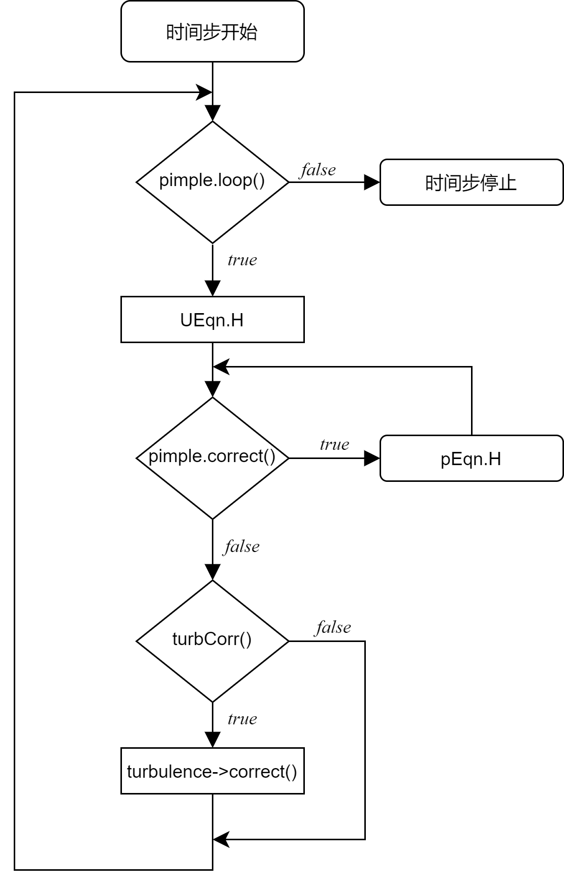

### 42 $\textit{pimpleFoam}$

$\textit{pimpleFoam}$ 是一个使用PIMPLE算法的瞬态不可压缩求解器。PIMPLE算法是PISO和SIMPLE的组合。该求解器在文件$\text{pimpleFoam.C}$中描述如下。

```
使用PIMPLE（合并的PISO-SIMPLE）算法对不可压缩的流进行求解的大时间步长瞬态求解器。

湍流模型是通用的，即可以选择层流、RAS或LES。
```

#### 42.1 控制方程

##### 42.1.1 连续性方程

一般的连续性方程具有以下形式：

<p>
$$
\frac{\partial\rho}{\partial t} + \nabla \cdot (\rho \mathbf{u}) = 0
\tag{64}
$$
</p>

我们假设流体不可压缩：$\rho = const$

<p>
$$
\nabla \cdot \mathbf{u} = 0
\tag{65}
$$
</p>

或者使用其他形式

<p>
$$
div(\mathbf{u}) = 0
\tag{66}
$$
</p>
<p>
$$
\frac{u_i}{x_i} = 0
\tag{67}
$$
</p>

##### 42.1.2 动量方程

从纳维-斯托克斯方程出发，得出$\text{pimpleFoam}$的动量方程。

<p>
$$
\frac{\partial \rho \mathbf{u}}{\partial t} + \nabla (\rho \mathbf{u} \mathbf{u}) + \nabla \cdot \tau = -\nabla p + \mathbf{g}= 0
\tag{68}
$$
</p>

我们假设密度为常数，方程两边同除以$\rho$

<p>
$$
\frac{\partial \mathbf{u}}{\partial t} + \nabla (\mathbf{u} \mathbf{u}) + \frac{1}{\rho}\nabla \cdot \tau = -\frac{\nabla p}{\rho} + \frac{\mathbf{g}}{\rho}
\tag{69}
$$
</p>

最后一项定义成一般源项

<p>
$$
\frac{\partial \mathbf{u}}{\partial t} + \nabla (\mathbf{u} \mathbf{u}) + \frac{1}{\rho}\nabla \cdot \tau = -\frac{\nabla p}{\rho} + \mathbf{Q}
\tag{70}
$$
</p>

切向应力和压力用新符号表示：$\frac{\tau}{\rho} = \mathbf{R}^{eff}\text{ und } \frac{p}{\rho}=p$

<p>
$$
\frac{\partial \mathbf{u}}{\partial t} + \nabla (\mathbf{u} \mathbf{u}) + \nabla \cdot \mathbf{R}^{eff} = -\frac{\nabla p}{\rho} + \mathbf{Q}
\tag{71}
$$
</p>

Boussinesq假说允许我们给切向应力加上雷诺应力。这个切向应力—也就是同时包含切向应力与雷诺应力—这里被写做$\mathbf{R}^{eff}$，也就是有效应力张量。 RAS和LES湍流模型都基于Boussinesq假设。

<p>
$$
\mathbf{R}^{eff} = -\nu^{eff}(\nabla \mathbf{u} + (\nabla \mathbf{u})^T)
\tag{72}
$$
</p>

<p>
$$
R_{ij}^{eff} = -\nu^{eff}(\frac{u_i}{x_j} + \frac{u_j}{x_i})
\tag{73}
$$
</p>

$\tau$的迹满足不可压缩流的连续性方程

<p>
$$
tr(\mathbf{R}^{eff}) = -2\nu^{eff}(\frac{u_i}{x_i})=0
\tag{74}
$$
</p>

<p>
$$
\frac{u_i}{x_i} = \nabla \cdot \mathbf{u} =0
\tag{75}
$$
</p>

因此，我们可以用$\mathbf{R}^{eff}$偏应力部分替代$\mathbf{R}^{eff}$

<p>
$$
\mathbf{R}^{eff} = \underbrace{dev(\mathbf{R}^{eff})}_{偏应力张量} + \underbrace{\frac{1}{3} tr (\mathbf{R}^{eff})\mathbf{I}}_{静水应力张量} 
\tag{76}
$$
</p>

<p>
$$
dev(\mathbf{R}^{eff}) = \mathbf{R}^{eff} - \frac{1}{3} \underbrace{tr (\mathbf{R}^{eff})}_{=0}\mathbf{I} 
\tag{77}
$$
</p>

动量方程可以被改写为

<p>
$$
\frac{\partial \mathbf{u}}{\partial t} + \nabla (\mathbf{u} \mathbf{u}) + \underbrace{\nabla \cdot (dev(\mathbf{R}^{eff}))}_{=div(dev(\mathbf{R}^{eff}))} = -\frac{\nabla p}{\rho} + \mathbf{Q}
\tag{78}
$$
</p>

带入方程72，最终可以得到

<p>
$$
\frac{\partial \mathbf{u}}{\partial t} + \nabla (\mathbf{u} \mathbf{u}) + \nabla \cdot (dev(-\nu^{eff}(\nabla \mathbf{u} + (\nabla \mathbf{u})^T)))= -\frac{\nabla p}{\rho} + \mathbf{Q}
\tag{79}
$$
</p>

##### 42.1.3 实现

动量方程实现在$\text{UEqn.H}$这个文件中。方程79的前两项可以很容易的在代码列表263中读出。

其中第一项是动量的局部导数—由于流体不可压缩，密度不包含在项内—位于列表263的第5行。这里，源代码中的指令与数学符号的读法非常一致。

<p>
$$
\frac{\partial \mathbf{u}}{\partial t}\qquad \Leftrightarrow\qquad \text{fvm::ddt(U)}
$$
</p>

方程79的第二项描述了动量的对流输运。标识符$\text{phi}$不应该导致混淆。为了方便从源代码中读取方程，这里可以用$\text{U}$代替$\text{phi}$，其并不改变方程的含义。源代码中为什么使用$\text{phi}$与求解过程有关。关于$\text{phi}$的详细讨论见第63节。

<p>
$$
\underbrace{\nabla(\mathbf{u}\mathbf{u})}_{div (\mathbf{u}\mathbf{u})} \qquad \Leftrightarrow \qquad \text{fvm::div(phi, U)}
$$
</p>

第三项代表的是动量扩散传输项。动量扩散传输是由层流黏度和湍流引起的。因此，由湍流模型处理这个项。见代码列表263的第7行。

<p>
$$
\underbrace{\nabla\cdot(dev(\mathbf{R}^{eff}))}_{=div(dev(\mathbf{R}^{eff})} \qquad \Leftrightarrow \qquad \text{turbulence->divDevReff(U)}
$$
</p>

方程79的右边两项分别代表压力梯度和源项。

<p>
$$
\underbrace{-\nabla p}_{=-grad\ p} \qquad \Leftrightarrow \qquad \text{-fvc::grad(p))}
$$
</p>

<p>
$$
\mathbf{Q} \qquad \Leftrightarrow \qquad \text{sources(U)}
$$
</p>

```
tmp <fvVectorMatrix > UEqn 
(
    fvm::ddt(U) 
    + fvm::div(phi , U) 
    + turbulence ->divDevReff(U) 
); 

UEqn().relax(); 

sources.constrain(UEqn());

volScalarField rAU (1.0/ UEqn().A()); 

if (pimple.momentumPredictor ())
{ 
    solve(UEqn() == -fvc::grad(p) + sources(U)); 
}
```
列表 263：$\text{pimpleFom}$的$\text{UEqn.H}$文件


#### 42.2 PIMPLE 算法 - 内部机制是怎样的？

这一节我们将要讨论$\text{pimpleFoam}$和$\text{twoPhaseEulerFoam}$, 即两种使用PIMPLE算法的求解器，是如何工作的。代码列表264展示了$\text{pimpleFoam}$的主循环。

第一条指令表示循环所有的时间步。接着是三个$\text{#include}$开头的指令，其主要关于时间步控制。时间步增加以后($\text{runTime ++;}$), PIMPLE循环开始了。

在这个循环里， 首先动量方程被解出($\text{#include "UEqn.H"}$)，然后进入压力修正循环($\text{#include "pEqn.H"}$)。最终，如果有湍流方程的话，PIMPLE循环会对该方程解($\text{turbulence ->correct ();}$)。在每个时间步的结尾数据都会被写出。


```
while (runTime.run()) 
{
    #include "readTimeControls.H" 
    #include "CourantNo.H" 
    #include "setDeltaT.H"
    
    runTime ++;

// --- 压力-速度 PIMPLE 修正循环
    while (pimple.loop())
    { 
         #include "UEqn.H"

         // --- Pressure corrector loop 
         while (pimple.correct ())
         { 
             #include "pEqn.H" 
         }

         if (pimple.turbCorr ())
         {
             turbulence ->correct (); 
         } 
    }
 
    runTime.write ();
}
```

图105展示了PIMPLE算法的流程图。这个算法在每个时间步都会被执行。如果PIMPLE循环只被执行一次，这个算法就和PISO算法基本一致。我们可以从代码列表271得到这个结论。



图105：PIMPLE算法流程图

##### 42.2.1 $\text{readTimeControl.H}$

在代码列表264第三行中，$\text{readTimeControl.H}$被包含在使用了$\text{#include}$的预处理器宏的源码中。这是一种非常常见的方法，可以使OpenFOAM的代码具有结构和秩序。重复使用的代码被写在一个单独的文件中。然后用$\text{#include}$宏把这个文件包含起来。因此，代码的重复就可以避免了。$\text{readTimeControl.H}$文件可能被包含在每个能够使用可变时间步长的求解器中。如果这段代码没有被另外写到一个单独的文件中，这段代码就会在每个可变时间步长的求解器中被发现。维护这段代码，会很累人而且容易出错。

代码列表265显示了$\text{readTimeControl.H}$的内容。第一条指令从$\text{controlDict}$中读取$\text{adjustTimeStep}$参数。如果没有参数（$\text{"adjustTimeStep"}$），那么就会使用默认值。因此，省略$\text{controlDict}$中的参数$\text{adjustTimeStep}$将导致时间步长固定。这是一个非常直接的例子，即只用源代码来确定求解器的行为。在这种情况下，源文件的名称以及变量和函数的名称是不言而喻的。在其他情况下，我们必须深入研究代码，以了解某个命令的作用。

##### 42.2.2 $\text{pimpleControl}$

检查文件$\text{pimpleControl.H}$和$\text{pimpleControl.C}$将加强我们对$\text{pimpleFoam}$内部原理的理解。

###### 求解控制

代码列表266和277展示了$\text{pimpleControl.H}$和$\text{pimpleControl.C}$的部分源码。代码列表266显示了$\text{pimpleControl.H}$中保护数据的声明。


```
    // 受保护数据 
         // 求解控制
            //- PIMPLE最大修正数 
            label nCorrPIMPLE_;

            //- PISO最大修正数 
            label nCorrPISO_;

            //- 当前PISO修正器 
            label corrPISO_;

            //- 标记在最后迭代中是否需要求解湍流 
            bool turbOnFinalIterOnly_;

            //- 收敛标记 
            bool converged_;
```

代码列表266：$\text{pimpleControl.H}$中受保护数据


```
void Foam:: pimpleControl ::read() 
{
    solutionControl ::read(false); 

    // 读入求解控制 
    const dictionary& pimpleDict = dict();

    nCorrPIMPLE_ = pimpleDict.lookupOrDefault <label >("nOuterCorrectors", 1); 

    nCorrPISO_ = pimpleDict.lookupOrDefault <label >("nCorrectors", 1);
    
    turbOnFinalIterOnly_ = pimpleDict.lookupOrDefault <Switch >("turbOnFinalIterOnly", true); 
}
```
代码列表267：读入$\text{pimpleControl.H}$的求解控制

通过阅读代码，我们可以看到PIMPLE字典中的哪个关键词--它是fvSolution字典的一部分（见第11.5节）--与代码中的哪个变量相关联。代码列表266中的三个受保护变量在代码列表267中被赋值。其中一个在代码和字典中都有相同的名字。另外两个有不同的名字。

###### 注意： 没有合理性检查

$\text{nCorrPimple}$和$\text{nCorrPiso}$是两个控制求解算法的变量。如果$\text{fvSolution}$中的PIMPLE字典中缺少相应的关键字及其值，那么就会使用默认值，关于方法$\text{lookupOrDefault()}$背后的细节，详见第57.3节。事实上，用户可以在$\text{fvSolution}$中赋任何值，只要它是合法的。因此，从源代码的角度来看，一个零或负数都是合法的赋值。对于求解算法来说，一个零或负的赋值是完全没有意义的。 

###### 关键字和算法的联系

关键字$\text{nOuterCorrectors}$的值通过代码列表267被赋给变量$\text{nCorrPIMPLE_}$。这个变量控制PIMPLE循环的遍历频率。代码列表268部分显示了$\text{pimpleControl}$类中的函数$\text{loop()}$的定义。这个函数的返回值决定是否进入PIMPLE循环。在清单268的第5行，一个内部计数器被递增 - 具体就是C++的$\text{++}$运算符将1加到运算符所应用的变量上。之后，内部计数器与$\text{nCorrPIMPLE_}$的值进行比较。如果这个内部计数器等于$\text{nCorrPIMPLE_+1}$的总和，那么函数$\text{loop()}$返回$\text{false}$。这个内部计数器被初始化为0。 代码列表269显示了$\text{solutionControl}$类的构造函数。 $\text{pimpleControl}$类是由$\text{solutionControl}$派生的。因此，$\text{pimpleControl}$的每个实例都有一个从$\text{solutionControl}$继承的内部计数器$\text{corr_}$。第9行说明了计数器$\text{corr_}$如何被初始化为零。

关键字$\text{nCorrectors}$的值通过代码267传递给变量$\text{nCorrPISO_}$。这个变量控制PISO循环-或者修正器循环-的遍历频率。代码列表266显示有两个和PISO循环相关的变量，也就是$\text{nCorrPISO_}$和$\text{corrPISO_}$。第一个变量是阈值第二个是计数器。$\text{nCorrPISO_}$读取自$\text{fvSolution}$中关键字$\text{nCorrectors}$的值。这个值告诉求解器修正器循环应该要遍历多少次。修正器循环时PISO循环的特性。因此，最大修正器循环迭代次数被叫做$\text{nCorrPISO_}$。变量$\text{corrPISO_}$在类$\text{pimpleControl}$的构造函数中被声明，详见代码列表271。在那里该变量被初始化为零。 代码列表270显示了$\text{pimpleControl}$类的函数$\text{correct()}$的定义。 该函数的返回值控制是否输入修正器循环。 在第3行中，每次调用此函数时，计数器$\text{corrPISO_}$都会增加。 在第10行中，将计数器的值与校正器循环迭代的最大次数进行比较。

```
bool Foam:: pimpleControl ::loop() 
{
    read(); 

    corr_ ++;

    /* 为简洁省掉的代码 */ 

    if (corr_ == nCorrPIMPLE_ + 1)
    {
        if ((! residualControl_.empty()) && (nCorrPIMPLE_ != 1)) 
        {
            Info << algorithmName_ << ": not converged within " << nCorrPIMPLE_ << " iterations" << endl;
        }  

        corr_ = 0;
        mesh_.data:: remove("finalIteration"); 
        return false;
}
```
代码列表268：$\text{pimpleControl.C}$中的一些内容

```
Foam:: solutionControl :: solutionControl(fvMesh& mesh , const word& algorithmName) 
:
mesh_(mesh), 
residualControl_ (),
algorithmName_(algorithmName), 
nNonOrthCorr_ (0),
momentumPredictor_(true), 
transonic_(false), 
corr_ (0),
corrNonOrtho_ (0) 
{}
```
代码列表269：$\text{solutionControl.C}$中类$\text{solutionControl}$的构造函数


```
inline bool Foam:: pimpleControl :: correct () 
{
   corrPISO_ ++;

    if (debug) 
    {
        Info << algorithmName_ << " correct: corrPISO = " << corrPISO_ << endl; 
    }

    if (corrPISO_ <= nCorrPISO_) 
    {
        return true; 
    }
    else 
    {
        corrPISO_ = 0; 
        return false;
    }
}
```
代码列表270：$\text{pimpleControI.H}$中的内联函数$\text{correct()}$


###### $\text{PIMPLE}$或者$\text{PISO}$算法

代码清单271部分显示了类$\text{pimpleControl}$类的构造函数。首先初始化一些数据。然后调用$\text{read()}$函数。读入求解控制参数后变量$\text{nCorrPIMPLE_}$被测试。如果值为一，那么求解算法就相当于PISO算法。在这个范例中会有相应的信息被打印在终端上。

```
Foam:: pimpleControl :: pimpleControl(fvMesh& mesh) : 
  solutionControl(mesh , "PIMPLE"), 
  nCorrPIMPLE_ (0), 
  nCorrPISO_ (0), 
  corrPISO_ (0),
  turbOnFinalIterOnly_(true), 
  converged_(false)
{ 
    read();

    if (nCorrPIMPLE_ > 1) 
    {
     /* 被简化代码 */ 
    }
    else 
    {
        Info << nl << algorithmName_ << ": Operating solver in PISO mode" << nl << endl; } 
    }
}
```
代码列表271：$\text{pimpleControl.C}$中$\text{pimpleControl}$的构造函数
