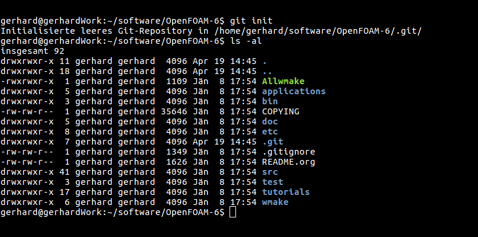
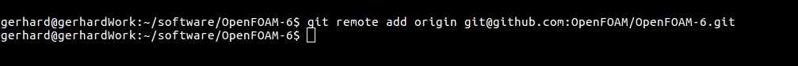
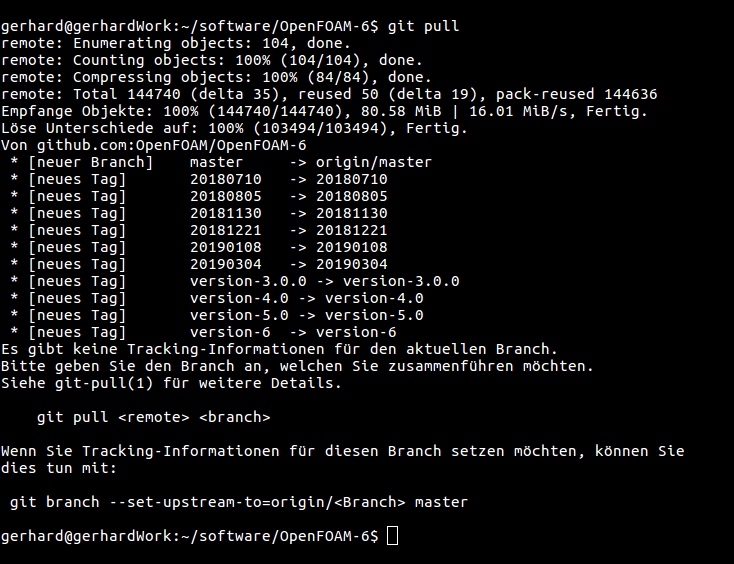
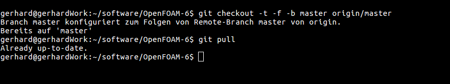

### 5 OpenFOAM-6源安装更新方法
#### 5.1 动机
OpenFOAM-6是一种滚动的点发行版本，即版本号保持不变，但偶尔会有补丁程序发行版。根据OpenFOAM基金会：

*版本6是OpenFOAM开发版本的快照，通过可持续更新，该版本始终是可发布状态。它对可用性、健壮性和可扩展性提出了严格的要求，它为现有代码提供了新功能和重大改进。*

OpenFOAM-6的初始安装遵循所有其他源安装步骤。但是，在安装了后续修补程序版本后，OpenFOAM-6的兼容性、功能和错误与原始的OpenFOAM-6就不相同了。

  
图1 初始化一个新的Git仓库

  
图2 把新的Git仓库指向正确的远程仓库

在过去，我们会使用OpenFOAM-X.Y++的方式来区分不同的版本。 但是，由于OpenFOAM-6就是OpenFOAM-6（但由于持续的更新也不是OpenFOAM-6），因此我们需要找到一种方法来正确的更新OpenFOAM-6的源代码安装。

#### 5.2 使OpenFOAM-6的源码能够被更新
由于OpenFOAM-6源码包是OpenFOAM-6 git存储库的快照，因此更新源包非常容易。基本步骤是：
1. 使用git init初始化新的git仓库
2. 使用git remote将新创建的git仓库的remote-URL指向OpenFOAM-6的远程仓库
3. 使用git pull下载更新
4. 最后使用git checkout更新源包的本地状态

另外，我们可以简单地删除当前安装的OpenFOAM-6，下载最新的源包并重新安装。但是，这是更新OpenFOAM-6不太优雅的蛮力方法。请继续读下去，看看如何优雅的更新。

##### 5.2.1 初始化
使用git init，我们告诉git创建一个新的git仓库。如果我们在已经存在文件的目录中运行此命令，则不会更改任何文件。
运行git init后，我们发现创建了一个新文件夹：.git。文件.gitignore已成为源包的一部分。

##### 5.2.2 指向远程仓库
接下来，我们需要告诉git在哪里可以找到更新。我们通过调用git remote add origin git@github:OpenFOAM/OpenFOAM-6 来做到这一点

  
图3 从远程仓库拉取新的文件
 
  
图4 更新本地安装文件

##### 5.2.3 拉取更新
之后，我们的仓库已被告知，从何处获取更新，现在可以下载它们了。这是通过git pull完成的。

##### 5.2.4 更新本地仓库
之后，将更新下载到我们的仓库中，并更新仓库的本地工作文件。但工作文件（可通过文本编辑器打开和阅读的文件）尚未更新。通过运行git checkout -t -f -b master origin/master应用刚刚下载的更改来更新本地工作文件。

现在，checkout命令将对远程master分支所做的所有更改应用于我们的本地master分支。至此，所有本地文件都已更新，我们可以重新编译源文件。
请注意，我们需要用更新OpenFOAM源代码目录相同的方式更新第三方源代码目录。

#### 5.3 重新编译源包
从源代码更新任何安装的最后一步是重新编译源代码。可以通过运行以下命令方便地完成此操作
```
./ Allwmake - update
```
列表 17: 重新编译更新的源包