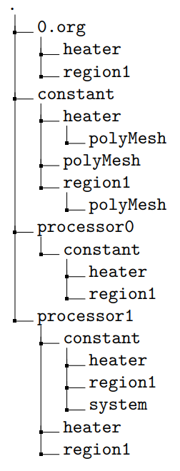

# 51 ParaView

ParaView是一个可视化后处理工具。在OpenFOAM中可以通过`paraFoam`来调用。`paraFoam`是一个调用ParaView以及其他OpenFOAM库的脚本。

## 51.1 选择读取器

后处理OpenFOAM算例有两个选择：可以选择ParaView的原生OpenFOAM读取器（reader）；也可以选择OpenFOAM的读取器模块。这两个读取器基本上一样，有一些差别。
除非强调了要使用ParaView原生读取器，本文都默认选择OpenFOAM读取器（译者注：即通过`paraFoam`）。

### 51.1.1 OpenFOAM的读取器

当我们使用`paraFoam`命令打开ParaView的时候，使用的是OpenFOAM的读取器。`paraFoam`实际上是一个脚本，用来打开ParaView并使用OpenFOAM相关的库。
通过观察发现，当我们运行`paraFoam`命令的时候，会自动创建一个名为`CASE_NAME.OpenFOAM`的文件。当关闭ParaView的时候，该文件就会被删除。该文件用来代表算例，重点是文件的扩展名，文件本身是空的。
因此，如果想要打开ParaView使用OpenFOAM的读取器（译者注：这里指的是使用`paraFoam`打开其他路径下的算例，直接使用ParaView是不行的），我们只需要简单的创建一个扩展名为`*.OpenFOAM`的文件，然后在ParaView中通过`File->Open`菜单打开该文件。
OpenFOAM的读取器模块要早于ParaView的原生读取器模块，只支持读取序列或者网格重构之后的算例。OpenFOAM读取器支持所有OpenFOAM的特性。


### 51.1.2 原生读取器

如果直接启动ParaView，我们无法使用`File->Open`菜单来打开OpenFOAM算例。为了打开OpenFOAM算例，还需要创建一个扩展名为`*.foam`的算例。通过`File->Open`菜单打开该文件，就能让ParaView使用其内置的原生读取器打开OpenFOAM算例。

#### 网格分割后的算例

原生读取器的主要优点是能并行执行。因此我们能够后处理并行计算后未合并的算例，而不需要提前将算例进行网格重构。这样在后处理某个算例的时候我们就能避免数据重复（译者注：网格重构后会包含合并的网格/数据和各进程的网格/数据，即同一个算例就包含了两份数据）。图116展示了一个打开原生读取器的截图。在左侧的Properties面板中，有个下拉菜单`Case Type`，图中其值设置为了`Reconstructed Case`。为了并行读取算例数据，可以将该值设置为`Decomposed Case`。
原生的ParaView读取器在处理复杂字典输入时可能会遇到问题。

图116：使用原生读取器启动ParaView打开OpenFOAM算例

#### 多区域算例

原生读取器另一个方便的特性是它能识别多区域的算例。因此，只需要打开一个算例中的`*.foam`文件，读取器就会自动读入算例中独立的区域。如图117中的示例。

图117：使用原生读取器启动ParaView读取多区域OpenFOAM算例

**陷阱：网格分隔后，constant/polyMesh仍然保留的多区域算例**
实际可能遇到以下让原生读取器难以处理的情况。当从单区域网格创建了多区域算例的网格时，初始网格仍然存在，这时候做网格分解，原生读取器将在`constant`目录中找到初始的单区域网格和各个区域网格，但在`processor*`目录中，仅存在各个区域的网格。
图118（译者注：原文有误）展示了遇到以上问题的算例目录结构示例。该算例的网格通过依次执行`blockMesh`、`topoSet`、`splitMeshRegions`来创建，即分别是初始化网格，创建cellZone然后根据cellZone来讲网格划分为不同的区域。由于没有办法同时分解初试网格和多区域网格，我们需要删除位于`constant/polyMesh`中的初试网格，以使ParaView的原生读取器正常工作。

图118：分解后包含初试网格的多区域算例目录。该目录树通过调用命令`tree -L 3 -d`生成。

## 51.2 查看网格

除了可视化和后处理模拟结果外，ParaView还能用来只显示网格。比如当细化网格后，检查相邻块之间的网格细化过度很重要。

当不选择流场时，ParaView只读取网格信息。所以即便是算例除网格之外的其他部分还没设置好，也是可以可视化网格的。在点击`Apply`按钮之后，ParaView会读取所有的数据，用户需要从表现形式（representation）下拉菜单中选择`Surface with edges`选项。


### 51.2.1 陷阱：网格形状表示

当检查网格的时候，我们希望网格的形状正确表示。然而，ParaView显示各种网格形状的功能似乎有点问题。图120展示了一个例子，其中网格形状没有正确表示。默认情况下，ParaView将多边形分解成了六面体、四面体和其他简单形状。

因此，图120显示的图像错误地显示了一个主六面体网格，许多网格都变形了。


图120：使用ParaView的标准设置查看多面体网格

如果想要正确地选择网格，需要检查Properties面板中`Use VTK Polyhedron`复选框是否勾选。即图115中第2个复选框。如果勾选上该选项，然后读取算例或者勾上该选项，然后通过点击`Apply`按钮刷新ParaView的状态，最终显示的网格如图121所示。现在我们能清楚地看到多面体网格形状。


图121：调整设置查看多面体网格

#### 原生读取器

作者假设导致这个表示网格问题的底层原因来源于ParaView本身，因为ParaView原生的读取器缺少可以比较的选项（译者注：缺少相关的信息表明网格的类型）来调整网格的形状表示。图122展示了使用原生读取器查看该多面体网格的结果，这与图120中的表达形式类似。这两个例子中，多面体都被分解成了六面体以及其他简单形状，但是网格划分有点差别。


### 51.2.2 陷阱：默认流场选择

如果用户在处理网格加密的问题，并且此时还没定义好边界条件，这时候调用ParaView就会崩溃，因为默认会选择压力场。在点击`Apply`按钮之后，ParaView尝试读入所有选择的流场。由于错误定义的边界场，最终会导致程序终止。代码344给出了对应的错误。

```sh
--> FOAM FATAL IO ERROR:
keyword bottom is undefined in dictionary "/home/user/OpenFOAM/user-2.1.x/run/icoFoam/case01
	/0/p::boundaryField"
file:/home/user/OpenFOAM/user-2.1.x/run/icoFoam/case01/0/p::boundaryField from line 25 to
	line 35.
  From function dictionary::subDict (const word& keyword ) const
  in file db/dictionary/dictionary.C at line 461.
FOAM exiting
```

代码344：缺少边界场定义导致网格读取错误

## 51.3 保存动画

### 51.3.1 保存动画-视屏格式

在ParaView中保存动画最直接的方式是选择一个试图，将其以视频文件的形式保存下来。只需要从菜单中选择`File->Save Animation ...`，然后在ParaView要求输入文件名的时候选择一个视频格式。


图123：选择视频文件的文件名

### 51.3.2 保存动画-独立的图片

将ParaView的视图保存为视频文件的格式有时候不能满足要求，比如需要单帧的时候。因此，我们可能需要一个能更好地控制动画制作过程的选项。

基于此，我们从ParaView中保存动画为一系列单独的图片，这些图片会被ParaView自动编号。然后我们就能选择视频编码软件将这些图片创建成动画。


**使用FFmpeg**

这个例子中我们使用`FFmpeg`，它是一个广泛使用的、开源的多媒体库。参考[https://en.wikipedia.org/wiki/FFmpeg](https://en.wikipedia.org/wiki/FFmpeg)和[https://ffmpeg.org/](https://ffmpeg.org/)获取更多信息。

代码345给出了一个例子，用于将ParaView导出的图片创建成动画。这里，我们假设所保存的视图名称为`velField.png`，ParaView自动地插入了编号。调用`FFmpeg`的时候我们使用了`-r`命令行参数，以每秒帧数（frames per second, fps）的形式指定了一个帧率。

命令行参数`-i`指定了生成动画所需要的输入图像。这里我们使用先前使用的文件名来保存各个帧，通过占位符`%04d`来指代编号，该占位符表示固定宽度为4个字符的零填充整数。`FFmpeg`将处理从0开始编号的图像。如果我们想从某个特定帧开始（而不是默认的`velField.0000.png`），那么可以使用命令行参数`--start_number`指定起始编号。代码345中的最后一个命令行参数是生成的视频文件的名称。


```sh
# change to the directory containing the individual images
user@host:∼$ ls
velField.0000.png velField.0012.png velField.0024.png velField.0036.png velField.0048.png
... # output deleted for clarity
user@host:∼$ ffmpeg -r 1 -start_number 19 -i velField.%04d.png velocityField.ogv
```

