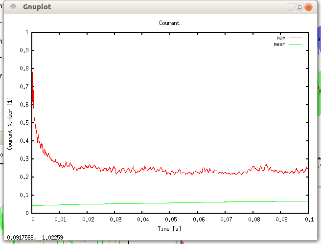
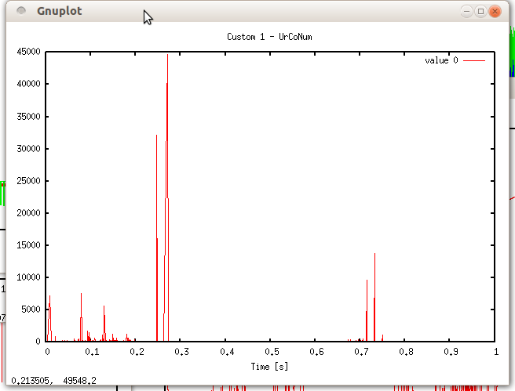
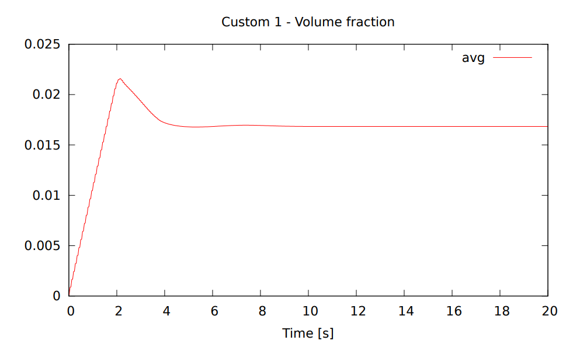
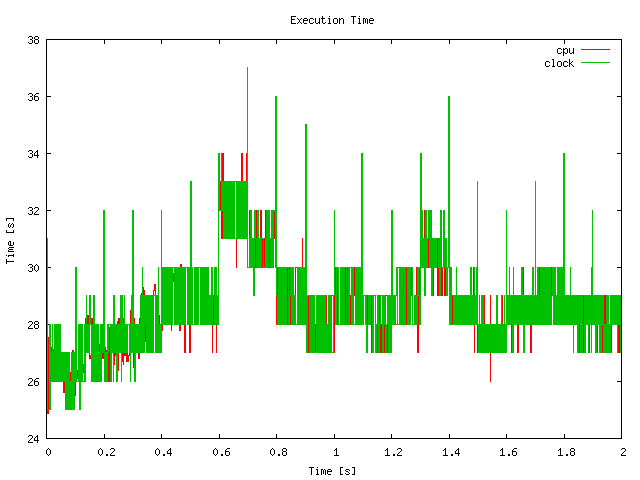
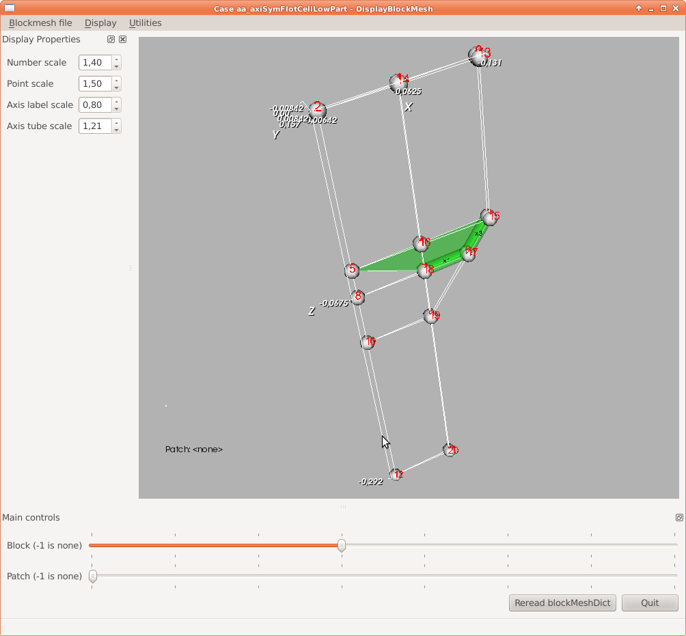

# 53 PyFoam

`pyFoam`是一个有用的Python脚本合集。这些脚本大多数各自执行特定的任务。详细的信息可以查看[http://openfoamwiki.net/index.php/Contrib_PyFoam](http://openfoamwiki.net/index.php/Contrib_PyFoam)。

## 53.1 安装

`pyFoam`的安装参考[http://openfoamwiki.net/index.php/Contrib_PyFoam#Installation](http://openfoamwiki.net/index.php/Contrib_PyFoam#Installation)，主要需要安装Python解释器。可以通过在终端运行`python --version`来检查系统中是否已安装Python解释器。如果结果返回了一个版本号，比如`Python 2.7.3`，那就说明系统中已经安装了Python.。否则会返回一个错误，表示无法找到`python`命令。

有关Python的信息可以查看[https://www.python.org/](https://www.python.org/)和[https://docs.python.org/3/](https://docs.python.org/3/)。

## 53.2 pyFoamPlotRunner

脚本`pyFoamPlotRunner`启动算例计算并实时绘制残差，就像Fluent一样。

```sh
user@host:∼/OpenFOAM/user-2.1.x/run/twoPhaseEulerFoam/columnCase$ pyFoamPlotRunner.py twoPhaseEulerFoam
```

代码352：调用`pyFoamPlotRunner`

### 53.2.1 Plotting options

代码353展示了`pyFoam`提供的绘图选项。

```sh
What to plot
------------
Predefined quantities that the program looks for and plots. Defaults for this
can be set in the [Plotting]-section of the configuration

--no-default            Switch off the default plots
--no-linear             Don't plot the linear solver initial residual
--no-continuity         Don't plot the continuity info
--no-bound              Don't plot the bounding of variables
--with-iterations       Plot the number of iterations of the linear solver
--with-courant          Plot the courant-numbers of the flow
--with-execution        Plot the execution time of each time-step
--with-deltat           Plot the timestep-size time-step
--with-all              Switch all possible plots on
```

代码353：`pyFoamPlot*`工具的绘图选项

## 53.3 pyFoamPlotWatcher

脚本`pyFoamPlotWatcher`用来可视化计算结束后的结果数据（比如残差、时间步、库朗数等）。这需要将求解的输出写入到文件中，参考Section 12.1.1。`pyFoamPlotWatcher`与`pyFoamPlotRunner`实现相同的功能，差别是前者用于可视化已完成的计算结果，而后者用于计算过程中的监控。因此关于`pyFoamPlotWatcher`的特性描述同样也适用于`pyFoamPlotRunner`

```sh
user@host:∼/OpenFOAM/user-2.1.x/run/twoPhaseEulerFoam/columnCase$ pyFoamPlotWatcher.py LOGFILE
```

代码354：调用`pyFoamPlotWatcher`

`pyFoamPlotWatcher`默认绘制残差、连续误差、变量的边界值等曲线。通过选项控制，还能绘制其他曲线（如时间步、迭代信息、库朗数等）。可以使用正则表达式从日志文件中将用户指定的数据提取出来。

代码355展示了使用`pyFoamPlotWatcher`来绘除默认曲线之外的库朗数曲线。这里通过将选项`--end`的值设置为`0.1s`来控制所要处理的求解器输出日志文件的范围。同样还有个`--start`选项能够时候。图像124由代码355中的命令所创建。

```sh
pyFoamPlotWatcher.py LOGFILE --end=0.1 --with-courant
```

代码355：带选项调用`pyFoamPlotWatcher`



图124：使用`pyFoamPlotWatcher`绘制库朗数

### 53.3.1 自定义正则表达式

`pyFoamPlotWatcer`可以使用正则表达式从求解器输出中提取任意数据。这一节通过绘制基于两相相对速度（译者注：即滑移速度）的库朗数来说明这一特性。

**背景说明**（译者注：意译）

`pyFoamPlotWatcher`中没有选项来显示基于两项相对速度`Ur`的库朗数。代码356展示了一些两相流求解器`twoPhaseEulerFoam`的输出行。红色显示的行（译者注：markdown代码块无法显示颜色，这里对应第6行）给出了基于相对速度`Ur`的库朗数。红色显示行的上一行给出了基于混合速度的库朗数。可以参考Section 57.6.4和57.6.4了解一般库朗数以及两相流求解器`twoPhaseEulerFoam`中的库朗数的定义。

```sh
DILUPBiCG: Solving for k, Initial residual = 0.000824921 , Final residual = 1.47595e-06 , No
	Iterations 2
ExecutionTime = 70870.7 s ClockTime = 71186 s
Calculating averages
Courant Number mean: 0.103485 max: 0.422517
Max Ur Courant Number = 0.448791
deltaT = 0.00380929
Time = 72.5848
MULES : Solving for alpha1
MULES : Solving for alpha1
```

代码356：求解器`twoPhaseEulerFoam`的部分输出行

**提取信息**

要想从日志文件中提取信息，我们首先需要创建一个包含正则表达式的文件。

```sh
{"expr":" Max Ur Courant Number = (%f%) ","name":"UrCoNum"}
```

代码357：`customRegexp`文件

如果`pyFoamPlotWatcher`在算例目录下能找到一个名为`customRegexp`的文件，那么就会自动用该文件中的信息进行处理。如果包含正则表达式的文件使用的是其他名称或者位于其他目录，则可以使用选项`--regexp-file=REG_EXP_FILE`来指定文件路径。

代码357包含了以逗号分隔的条目（`"expr"`和`"name"`）。每个条目的值与名称之间使用冒号分隔（如`"name":"UrCoNum"`）。代码357中的第1个条目包含了提取数据的正则表达式，第2个条目给出了所提取数据的名称（其实该条目可以被省略）。



图125：使用`pyFoamPlotWatcher`绘制基于相对速度的库朗数

可以看出有些地方库朗数高的离谱，表明模拟不太顺利。在解决问题的时候可以绘制基于`Ur`的库朗数。这一节的目的就是为了记录这个知识点。

### 53.3.2 复用自定义正则表达式

`pyFoam`的绘图工具（`pyFoamPlotRunner`和`pyFoamPlotWatcher`）支持不同于代码357格式的自定义正则表达式。在0.5.3版本中引入了新的格式，详情请参考[http://openfoamwiki.net/index.php/Contrib_PyFoam#Plotting_with_customRegexp-files](http://openfoamwiki.net/index.php/Contrib_PyFoam#Plotting_with_customRegexp-files)。新格式看起来像OpenFOAM字典。

代码358展示了用于后处理的求解器输出示例。现在的目标是绘制红色标记行（译者注：第5行）的物理量。代码359展示了相应的正则表达式。`pyFoam`的绘图工具添加`--dump-custom-regegexp`选项来从旧格式的正则表达式中生成新格式的自定义正则表达式。代码360对应该操作的结果。

```sh
DILUPBiCG: Solving for beta, Initial residual = 0.000307666, Final residual = 7.36162e -08, No
	Iterations 2
DILUPBiCG: Solving for T, Initial residual = 0.000514273, Final residual = 2.57279e -07, No
	Iterations 1
Concentration = 0.0509085 Min T = 0.00498731 Max T = 0.218343
Bubble load = 0.00623198  Min beta = 0  Max beta = 0.0677904
Time = 19.96
```

代码358：用于后处理的求解器输出片段

```sh
{"expr":"Concentration = (%f%) Min T = (%f%) Max T = (%f%)", "name":"Concentration "," titles
":["avg","min","max"]}
```

代码359：旧格式自定义正则表达式

```sh
Custom01
{
    accumulation first;
    enabled yes;
    expr " Concentration = (%f%) Min T = (%f%) Max T = (%f%)";
    name Custom01_Concentration;
    persist no;
    raisit no;
    theTitle " Custom 1 - Concentration";
    titles
      (
        avg
        min
        max
      );
    type regular;
    with lines;
    xlabel "Time [s]";
}
```

代码360：新格式自定义正则表达式

### 53.3.3 某些符号的特殊处理

注意目前所处理的求解器输出中不包含括号。括号会被当成正则表达式的一部分。为了处理求解器输出中所包含的括号，需要适当地使用转义。对于中括号也是这样。下面的使用正则表达式处理的例子也同样适用于求解器输出包含中括号的情形。

代码361给出了`twoPhaseEulerFoam`的求解输出片段。红色标记行中包含括号（译者注：第5行）。为了使用正则表达式来处理这些行，在正则表达式中需要转义这些括号。代码362给出了对应的正则表达式。注意转义的正则表达式用红色标注了（译者注：markdown无法显示，请参考原文）。

```sh
Time = 19.9957

MULES: Solving for alpha1
MULES: Solving for alpha1
Dispersed phase volume fraction = 0.0168317 Min(alpha1) = 3.92503e-87 Max(alpha1) = 0.2
GAMG: Solving for p, Initial residual = 9.46269e-05 , Final residual = 1.65711e-06 , No
	Iterations 1
time step continuity errors : sum local = 2.08826e-05 , global = 4.51574e-08 , cumulative =
	-0.0334048
```

代码361：`twoPhaseEulerFoam`求解器输出片段

```sh
{"expr":"Dispersed phase volume fraction = (%f%) Min\(alpha1\) = (%f%) Max\(alpha1\) = (%f%)
","name":"Volume fraction","titles":["avg","min","max"]}
```

代码362：提取关于体积分数信息的正则表达式

在正则表达式中不仅仅只有括号有特殊含义。通过网络搜索或者查看关于正则表达式的详细信息就能知道哪些符号需要转义。

### 53.3.4 忽略匹配

代码362中从代码361的第5行中提取了3个数。使用正则表达式可以绘制这三条曲线。如果我们只对第1个数（即平均体积分数）感兴趣，我们可以将第2个和第3个数由`(%f%)`替换为`.+`来忽略第2个和第3个数。看起来没必要这么做，可以直接把后面的删除就不会匹配后面的信息了，但是有时候我们可能对第1个和第3个数感兴趣，这时候我们就需要使用这种方法来忽略第2个数了。

### 53.3.5 生成图像

图124和125是使用`pyFoamPlotWatcher`绘制图像的截图。然而，`pyFoam`绘图工具提供了选项`--hardcoded`可以直接将图像保存到硬盘中。默认保存的是`PNG`格式的图像，可以使用选项`--format-of-hardcopy=HARDCOPYFORMAT`来指定其他格式。

图126展示了使用代码362中的正则表达式挥着的图像。



图126：使用`pyFoamPlotWatcher`基于自定义正则表达式匹配并绘制平均体积分数

### 53.3.6 写入数据

后处理过程中有时候仅仅生成图像是不够的。可以通过`pyFoam`提供的`--write-files`选项将提取的数据保存到硬盘中。这样所提取到的数据就能使用其他程序处理。

### 53.3.7 算例分析

选项`--with-all`生成了许多图像，有助于检查所计算算例的性能。有关绘图的解释，可参考代码353。



图127：利用`pyFoamPlotWatcher`绘制执行时间随时间变化的图像。可以看出将数据写入硬盘可以看出执行时间的明显变化。

## 53.4 pyFoamClearCase

如名称所描述的那样，`pyFoamClearCase`用来清理算例目录。这个脚本会删除出0目录之外的所有目录。通过使用命令行的选项，可以更好地控制`pyFoamClearCase`的行为。一些选项列举如下：

- `--keep-last`：保留最后一个时间步
- `--keep-regular`：保留所有时间步
- `--after==T`：删除t>T的所有时间步
- `--remove-processor`：删除`processor*`目录

通过在终端输入脚本名称来调用脚本。代码363展示了该脚本时如何执行的。其中的选项告诉`pyFoamClearCase`保留最后一个时间步并且删除所有`processor*`目录。

```sh
pyFoamClearCase.py . --keep-last --remove-processor
```

代码363：调用`pyFoamClearCase`

注意脚本名称后面的`.py`，表明这是一个Python脚本，也表明`pyFoamClearCase`是一个可执行脚本而非系统自带的程序。

## 53.5 pyFoamCloneCase

该脚本用来拷贝算例。默认拷贝算例中的`0`、`constant`和`system`目录。此外，可以通过不同的命令行参数来控制脚本的行为，比如可以拷贝最后一个时间步或者`processor*`目录。

## 53.6 pyFoamDecompose

该脚本用于划分求解域。不同于`decomposePar`，该脚本不需要现有的`decomposeParDict`，而是接受命令行参数来生成`decomposeParDict`并调用`decomposePar`。

代码364中给出了包含两个参数的脚本调用。第1个参数是算例的路径。这里用点来表示当前目录。第2个参数是要划分的子求解域的个数。`pyFoamDecompose`从基于该参数创建了一个`decomposeParDict`。第1个参数是必须的，用来告诉脚本新创建脚本的保存路径。第2个参数给定求解域划分的最基本信息，即子求解域的数量。

还有许多额外的参数可以用来控制求解域划分的方式。

```sh
pyFoamDecompose.py . 4
```

代码364：`pyFoamDecompose`的调用

代码365中包含了由代码364中的命令所创建的`decomposeParDict`。

```sh
// * * * * * * * * * //
FoamFile
{
    version 0.5;
    format ascii ;
    root "ROOT";
    case "CASE";
    class dictionary;
    object nix;
}
method scotch;
numberOfSubdomains 4;
scotchCoeffs
{}
```

代码365：由`pyFoamDecompose`命令创建的`decomposeParDict`文件

`pyFoamDecompose`的输出保存在文件`Decomposer.logfile`中。

## 53.7 pyFoamDisplayBlockMesh

如果网格拓扑有问题，在`blockMeshDict`中是很难找到错误的，这时候这个工具就很有用处。`pyFoamDisplayBlockMesh`的功能就像它的名称所描述的那样，它读取`blockMeshDict`并显示网格的拓扑。你可能会想，这不就是在Section15.6.2中（使用`paraView`可视化网格）描述的内容吗。然而，如果所定义的网格有问题，`blockMesh`就不会创建网格，`paraView`也就无法可视化网格块。

`pyFoamDisplayBlockMesh`是一个允许用户可视化错误网格的工具。这对于查找错误的块定义很有用，尤其是网格块多余1个的时候。在图128中展示了该工具的GUI界面截图。主面板中显示了顶点和边。使用最下面的两个滑块可以标记和着色块（block）或者面（patch）。单个块的局部轴显示为标有相应轴名称的管。

图128显示了一个错误的网格定义，`blockMesh`产生了一个错误的信息而不是生成网格。在这个工具的帮助下，很容易找到错误的原因。所标记的块应该位于几何体的右侧，因此编号5的顶点应该不属于此块。



主面板的右边显示了标准网格工具`blockMesh`和`checkMesh`的输出（图中没有显示）。这些工具可以在该工具的菜单中执行。此外，该工具也可以编辑`blockMeshDict`。

## 53.8 pyFoamCaseReport

工具`pyFoamCaseReport`生成算例的汇总信息。信息量的大小可以通过命令行参数来控制。代码366展示了如何创建一个完整的算例汇总信息。其实这些信息都位于算例的字典之内。该工具只提供所选择的信息。

```sh
pyFoamCaseReport.py --full-report .
```

代码366：使用`pyFoamCaseReport`来显示算例汇总信息

