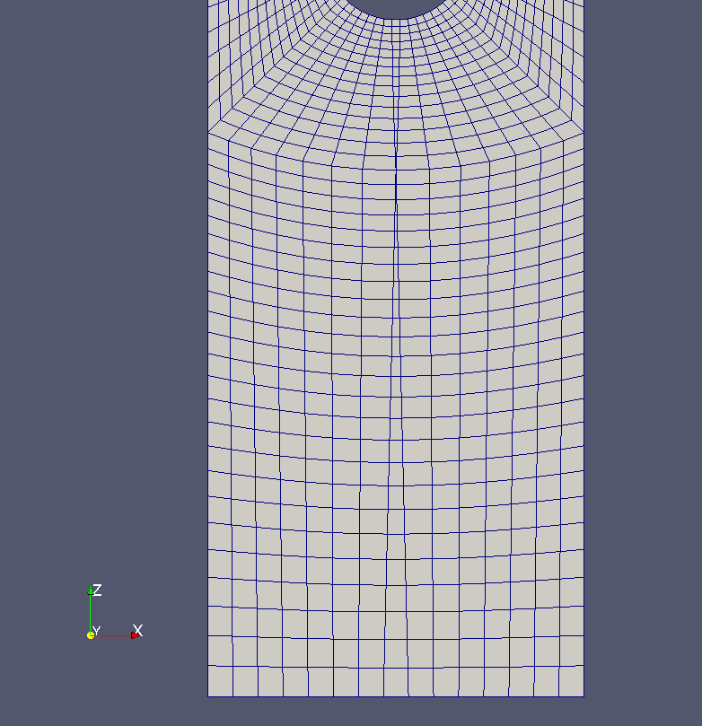

# blockMeshDG

`blockMeshDG`是网格工具`blockMesh`的修改版，允许设置双分级（double grading）。双分级表示可以指定一条边的中间以及两端的离散长度比例。该工具由一个OpenFOAM用户所开发，然后发布到了CFD-Online论坛的OpenFOAM版块上（[https://www.cfd-online.com/Forums/openfoam-meshing/70798-blockmesh-double-grading.html](https://www.cfd-online.com/Forums/openfoam-meshing/70798-blockmesh-double-grading.html)）。也有对应的OpenFOAM Wiki页面（[http://openfoamwiki.net/index.php/Contrib_blockMeshDG](http://openfoamwiki.net/index.php/Contrib_blockMeshDG)）。

**注意**

这个主题已经过期了，OpenFOAM的`blockMesh`中已经包含了这里所讨论的特性，是在OpenFOAM-3.0中引入的，参考[https://openfoam.org/release/3-0-0/](https://openfoam.org/release/3-0-0/)。（译者注：老版本的OpenFOAM有需要还是可以用用的）

## 55.1 安装

下载后的源码解压就可以编译了。所有必要的输入都已经设置好了，以避免该工具与OpenFOAM的标准工具发生冲突。编译脚本最终会创建一个名为`blockMeshDG`的可执行文件。

## 55.2 使用

要区分正常分级和双分级：双分级的膨胀率（expansion ratio）需要设置为负值。如果设置成了正值，会导致应用正常的分级，就像使用OpenFOAM自带标准工具一样。

## 55.3 陷阱

### 55.3.1 非偶数网格

`blockMeshDG`显然在处理非偶数网格的时候有问题。图129展示了当使用15个网格应用双分级时的结果网格。在这种情况下，虽然网格质量很差，使用`checkMesh`也不会报错。但是`checkMesh`的输出中包含了一些提示，说明哪里出了问题。

代码370展示了`checkMesh`的输出片段。很高的网格纵横比（aspect ratio）说明网格哪里出问题了。网格面积和体积的最小和最大值相差了三个数量级也会导致相同的结果。不幸的是，即便是这样`checkMesh`甚至都没给出警告。

```sh
Checking geometry ...
    Max aspect ratio = 81 OK.
    Minimum face area = 3.8395e-08. Maximum face area = 1.68746e-05. Face area magnitudes OK.
    Min volume = 9.59875e-11. Max volume = 4.21864e-08. Total volume = 4.92214e-05. Cell
    volumes OK.
    Mesh non-orthogonality Max: 42.2304 average: 11.7938
    Non-orthogonality check OK.
    Min/max edge length = 3.079e-05 0.00508035 OK.
```

代码370：`checkMesh`的输出片段

唯一解决该问题的方法是使用偶数网格。



图129: 网格双渐变问题