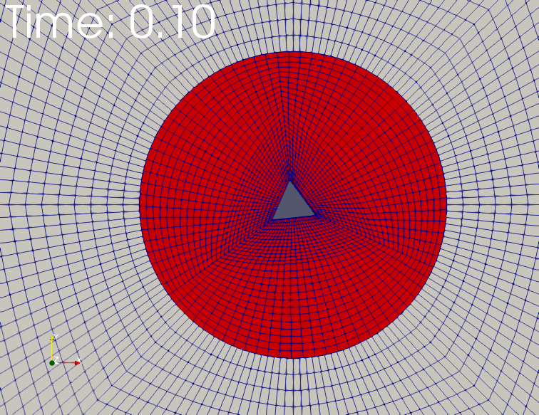

### OpenFOAM协作翻译

1. 目前计划翻译Gerhard Holzinger博士的openFoamUserManual学习资料。
2. 计划每个章节形成一个md文件，利用markdown格式进行相关章节的翻译，相应的图片存储在images文件夹内，链接到md文档中。
3. 采用这种模式预计可以更加方便的进行合作（当然也不一定），希望有兴趣的同学能够一起加入我们。York本项目到本地，完成相应部分翻译工作后提交给我。或者也可以申请进入管理团队，完成相应的翻译和审核工作。
4. 这些只是初步的想法，有什么意见和建议欢迎大家提出来。

### 目前翻译章节认领情况：

1 . Getting help----poplee

2 . Lessons learned----poplee

3 . Install OpenFOAM----bjorn

4 . Updating the repository release of OpenFOAM----poplee

7 . Install third-party software----fanswords

9 . Units and dimensions----Samuel Tu

10 . Files and directories----fanswords

11 . Controlling OpenFOAM----fanswords

12 . Usage of OpenFOAM----zhuobin

13 . Mesh basics----bjorn

14 . Geometry creation & other pre-processing software----bjorn

15 . blockMesh----bjorn

32 . Turbulence-Models----bjorn

33 . Thermophysical modelling----chuanfeng

38 . The MRF method ----skf0558

39 . fvOption framework----skf0558

40 . The Lagrangian world---邵姝婧

49 . functions----skf0558

50 . sample----skf0558

52 . postProcess----skf0558


### 协作翻译MarkDown格式规范

请大家遵循统一的markdown格式，便于后期集中在一起导出PDF格式文件。

1. 关于标题
    * 文章标题为一级标题 
    * 希腊数字标号的为二级标题
    * 阿拉伯数字编号的章节为三级标题
    * 带小数点的阿拉伯数字编号的章节为四级标题
    * 以此类推，完成标题分级
    * 标题的markdown格式为：一级标题前面有一个#， 二级为##， 三级为###，以此类推，注意#后需要有一个空格

2. 关于正文
    * 正文直接编辑即可
    * 使用一个空白行即可完成分段

3. 关于文中的list
    * 文中的list都是代码或者命令
    * 请大家使用代码区块格式进编写
    * 代码区块的标记方式为用三个\`\`\`前后包裹整个代码，格式如下：\`\`\`我是代码\`\`\`
    * 显示效果如下：
```
cd $FOAM_INST_DIR
cd OpenFOAM -2.1. x
git pull
wclean all
./ Allwmake
```

4. 关于图片
    * 文中的图片我都已经导出并保存到主仓库中
    * 文中图片的编号和文章中的不一致，这是由于有一些图像中采用了多个图片引起的，请大家注意
    * 翻译过程中用到的图片，请使用链接进行显示，链接采用相对路径
    * 具体形式为 \!\[图像说明\]\(图像地址\)，示例：\!\[图像1\]\(images/82.PNG\)
    * 显示效果如下，请一定注意后缀名为大写的PNG，如写为小写将导致无法正常显示（血泪）



5. 关于公式
    * 需要插入数学公式时，使用两个美元符 $$ 包裹 TeX 或 LaTeX 格式的数学公式来实现
    * 例如下面代码的显示效果如下，如果感觉有难度，可以先把公式留出来，后面再找熟悉的同学统一来编写
```
$$
\mathbf{V}_1 \times \mathbf{V}_2 =  \begin{vmatrix} 
\mathbf{i} & \mathbf{j} & \mathbf{k} \\
\frac{\partial X}{\partial u} &  \frac{\partial Y}{\partial u} & 0 \\
\frac{\partial X}{\partial v} &  \frac{\partial Y}{\partial v} & 0 \\
\end{vmatrix}
${$tep1}{\style{visibility:hidden}{(x+1)(x+1)}}
$$
```

$$
\mathbf{V}_1 \times \mathbf{V}_2 =  \begin{vmatrix} 
\mathbf{i} & \mathbf{j} & \mathbf{k} \\
\frac{\partial X}{\partial u} &  \frac{\partial Y}{\partial u} & 0 \\
\frac{\partial X}{\partial v} &  \frac{\partial Y}{\partial v} & 0 \\
\end{vmatrix}
${$tep1}{\style{visibility:hidden}{(x+1)(x+1)}}
$$

6. 关于脚注和参考文献
    * 目前先不考虑这些，等所有内容翻译都完成之后，再来统一进行处理